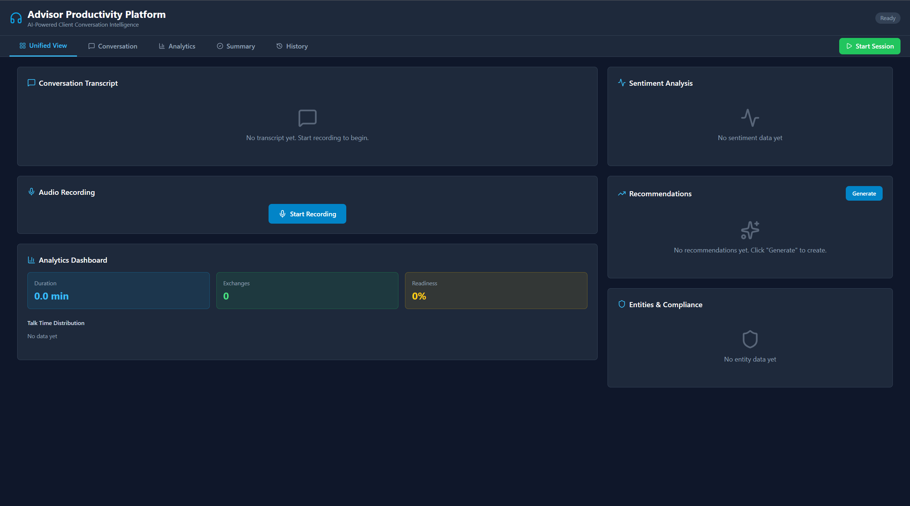

# Advisor Productivity Application

> **AI-powered investment advisor productivity platform** with real-time conversation analysis, sentiment tracking, and intelligent recommendations built on the Microsoft Agent Framework.

[](../framework/)
[](./backend/)
[](./frontend/)
[](LICENSE)



## 🎯 Overview

A sophisticated investment advisor productivity platform that enhances financial advisory sessions through AI-powered analysis. Built on the **Microsoft Agent Framework**, combining real-time speech transcription, sentiment analysis, intelligent recommendations, and compliance-aware summarization.

### Key Features

- 🎤 **Real-time Speech Transcription** - Live audio transcription optimized for financial conversations with speaker diarization
- 💭 **Sentiment Analysis** - Multi-dimensional emotion tracking and investment readiness scoring
- 💡 **Intelligent Recommendations** - Context-aware investment suggestions based on conversation analysis
- 📝 **Smart Summarization** - Investment-focused summaries with action items and follow-ups
- 🔒 **PII Protection** - Automated detection and redaction of sensitive information
- 📊 **Advanced Analytics** - Comprehensive dashboard with multiple view modes
- 👥 **Human-in-the-Loop** - Review and approve AI-generated insights
- 💾 **Session Management** - CosmosDB-backed persistence and history

## 📸 Application Screenshots

> Screenshots will be added as features are implemented

## 🏗️ Architecture

```
advisor_productivity_app/
├── backend/                          # FastAPI Backend
│   ├── app/
│   │   ├── main.py                  # FastAPI application entry point
│   │   ├── agents/                  # AI Agent implementations
│   │   │   ├── speech_transcription_agent.py    # Real-time audio transcription
│   │   │   ├── sentiment_agent.py               # Sentiment & emotion analysis
│   │   │   ├── recommendation_agent.py          # Investment recommendations
│   │   │   ├── summarizer_agent.py             # Conversation summarization
│   │   │   ├── entity_pii_agent.py             # Entity extraction & PII detection
│   │   │   └── planner_agent.py                # Dynamic workflow planning
│   │   ├── models/
│   │   │   └── task_models.py       # Plan, Step, Message models
│   │   ├── persistence/
│   │   │   ├── memory_store_base.py # Abstract persistence interface
│   │   │   └── cosmos_memory.py     # CosmosDB implementation
│   │   ├── services/
│   │   │   ├── task_orchestrator.py # Agent orchestration
│   │   │   └── file_handler.py      # Audio file management
│   │   ├── routers/
│   │   │   ├── orchestration.py     # REST API endpoints
│   │   │   └── transcription.py     # WebSocket for real-time audio
│   │   ├── infra/
│   │   │   ├── settings.py          # Configuration management
│   │   │   └── telemetry.py         # Observability service
│   │   └── helpers/                 # Utility functions
│   ├── data/                        # Extracted transcripts (JSON)
│   ├── uploads/                     # Temporary audio uploads
│   ├── requirements.txt             # Python dependencies
│   ├── .env.example                 # Environment configuration template
│   └── start.ps1                    # Backend startup script
│
├── frontend/                        # React + TypeScript + Vite Frontend
│   ├── src/
│   │   ├── App.tsx                  # Main application component
│   │   ├── main.tsx                 # React entry point
│   │   ├── lib/
│   │   │   └── api.ts               # API client for backend
│   │   ├── components/
│   │   │   ├── AudioRecorder.tsx    # Real-time audio recording
│   │   │   ├── TranscriptView.tsx   # Live transcript display
│   │   │   ├── SentimentGauge.tsx   # Real-time sentiment visualization
│   │   │   ├── RecommendationCard.tsx  # Investment recommendation cards
│   │   │   ├── SummaryView.tsx      # Session summary display
│   │   │   └── AnalyticsDashboard.tsx  # Comprehensive analytics
│   │   ├── pages/
│   │   │   ├── HomePage.tsx         # Main session page
│   │   │   ├── SessionsPage.tsx     # Session history
│   │   │   └── SettingsPage.tsx     # Configuration
│   │   └── contexts/
│   │       └── SessionContext.tsx   # Session state management
│   ├── package.json                 # Node dependencies
│   ├── tailwind.config.js           # TailwindCSS configuration
│   └── vite.config.ts               # Vite build configuration
│
├── docs/                            # Documentation
│   ├── PHASED_IMPLEMENTATION_PLAN.md  # Detailed implementation roadmap
│   ├── ARCHITECTURE.md              # System architecture
│   ├── API.md                       # API documentation
│   └── USER_GUIDE.md                # User manual
│
├── README.md                        # This file
├── deploy.ps1                       # Deployment script
└── Dockerfile                       # Container configuration
```

## ✨ Features

### 🎤 Real-time Speech Transcription Agent
- Live audio transcription via Azure Speech-to-Text
- Financial terminology optimization
- Speaker diarization (Advisor/Client)
- Timestamp and metadata extraction
- WebSocket-based streaming

### 💭 Sentiment Analysis Agent
- Multi-dimensional sentiment tracking (positive, negative, neutral)
- Investment-specific emotion detection (confidence, concern, excitement, hesitation)
- Client comfort level scoring
- Investment readiness assessment
- Real-time sentiment visualization

### 💡 Recommendation Agent
- Context-aware investment recommendations
- Risk tolerance assessment from conversation
- Portfolio optimization suggestions
- Compliance-aware recommendations
- Confidence scoring and rationale

### 📝 Summarization Agent
- Investment-focused conversation summaries
- Action items extraction
- Key decisions and commitments tracking
- Persona-based summaries (advisor, compliance, client)
- Follow-up recommendations

### 🔒 Entity Extraction & PII Agent
- Named entity recognition (companies, securities, amounts)
- PII detection and redaction (names, SSN, account numbers)
- Financial data protection
- Compliance metadata tagging
- Real-time privacy protection

### 📊 Advanced Analytics Dashboard
- Multiple layout modes (Unified, Chat, Analytics, Progress, Kanban)
- Real-time sentiment gauge
- Recommendation cards carousel
- Conversation analytics (talk time, topics, decisions)
- Entity timeline
- Session history and comparison

## 🚀 Getting Started

### Prerequisites

1. **Azure Account** with the following resources:
   - Azure OpenAI Service (GPT-4 deployment)
   - Azure Speech Service
   - Azure Language Service
   - Azure Cosmos DB
   - Azure Application Insights (optional)

2. **Development Tools**:
   - Python 3.11+
   - Node.js 18+
   - PowerShell 7+ (Windows) or Bash (Linux/Mac)
   - VS Code (recommended)

### Quick Start

#### 1. Clone and Setup Backend

```powershell
# Navigate to backend directory
cd advisor_productivity_app/backend

# Create virtual environment
python -m venv venv
.\venv\Scripts\Activate.ps1

# Install dependencies
pip install -r requirements.txt

# Copy environment template
cp .env.example .env

# Edit .env with your Azure credentials
# Configure: AZURE_OPENAI_*, AZURE_SPEECH_*, AZURE_LANGUAGE_*, COSMOS_*
```

#### 2. Setup Frontend

```powershell
# Navigate to frontend directory
cd ../frontend

# Install dependencies
npm install

# Configure backend URL in .env
echo "VITE_API_BASE_URL=http://localhost:8000" > .env
```

#### 3. Run the Application

```powershell
# Terminal 1 - Backend
cd backend
./start.ps1

# Terminal 2 - Frontend
cd frontend
npm run dev
```

Open your browser to `http://localhost:5173`

### Environment Configuration

Create `backend/.env` with the following variables:

```bash
# Azure OpenAI
AZURE_OPENAI_ENDPOINT=https://your-resource.openai.azure.com/
AZURE_OPENAI_API_KEY=your-api-key
AZURE_OPENAI_DEPLOYMENT=gpt-4
AZURE_OPENAI_API_VERSION=2024-08-01-preview

# Azure Speech
AZURE_SPEECH_KEY=your-speech-key
AZURE_SPEECH_REGION=eastus

# Azure Language Service
AZURE_LANGUAGE_KEY=your-language-key
AZURE_LANGUAGE_ENDPOINT=https://your-resource.cognitiveservices.azure.com/

# Azure Cosmos DB
COSMOS_ENDPOINT=https://your-cosmos.documents.azure.com:443/
COSMOS_KEY=your-cosmos-key
COSMOS_DATABASE=advisor_productivity
COSMOS_CONTAINER=sessions

# Application Settings
DATA_DIRECTORY=./data
UPLOADS_DIRECTORY=./uploads
LOG_LEVEL=INFO
```

## 📖 Documentation

- **[Phased Implementation Plan](PHASED_IMPLEMENTATION_PLAN.md)** - Detailed 10-phase development roadmap
- **[Architecture Guide](docs/ARCHITECTURE.md)** - System architecture and design decisions
- **[API Documentation](docs/API.md)** - REST and WebSocket API reference
- **[User Guide](docs/USER_GUIDE.md)** - How to use the application
- **[Development Guide](docs/DEVELOPER_GUIDE.md)** - Contributing and development setup

## 🏗️ Development Phases

### ✅ Phase 1: Foundation Setup (Week 1)
Project structure, core infrastructure, and basic UI

### ⏳ Phase 2: Speech Transcription Agent (Week 2)
Real-time audio transcription optimized for financial conversations

### ⏳ Phase 3: Sentiment Analysis Agent (Week 3)
Multi-dimensional sentiment analysis for investment conversations

### ⏳ Phase 4: Recommendation Agent (Week 4)
AI-powered investment recommendations based on conversation context

### ⏳ Phase 5: Summarization Agent (Week 5)
Investment-focused conversation summarization

### ⏳ Phase 6: Entity Extraction & PII Agent (Week 6)
Extract entities and protect sensitive information

### ✅ Phase 1: Foundation Setup (Week 1) - COMPLETE
Project structure, data models, settings, and core infrastructure

### ✅ Phase 2: Speech Transcription Agent (Week 2) - COMPLETE  
Real-time audio transcription with speaker diarization and financial terminology optimization

### ✅ Phase 3: Sentiment Analysis Agent (Week 3) - COMPLETE
Investment-specific sentiment analysis with readiness scoring and compliance detection

### ✅ Phase 4: Recommendation Engine Agent (Week 4) - COMPLETE
Context-aware investment recommendations with risk alignment and compliance filtering

### ⏳ Phase 5: Summarization Agent (Week 5)
Investment-focused summaries with action items and follow-ups

### ⏳ Phase 6: Entity Extraction & PII Detection Agent (Week 6)
Extract investment entities and detect/redact sensitive information

### ⏳ Phase 7: Advanced UI & Analytics Dashboard (Week 7)
Comprehensive analytics dashboard with multiple view modes

### ⏳ Phase 8: Integration & Orchestration (Week 8)
Integrate all agents with dynamic planning and human-in-the-loop

### ⏳ Phase 9: Deployment & DevOps (Week 9)
Production-ready deployment with monitoring

### ⏳ Phase 10: Testing, Documentation & Refinement (Week 10)
Polish application and prepare for production use

See [PHASED_IMPLEMENTATION_PLAN.md](PHASED_IMPLEMENTATION_PLAN.md) for detailed breakdown.

## 🧪 Testing

```powershell
# Backend tests
cd backend
pytest tests/ -v

# Frontend tests
cd frontend
npm run test

# E2E tests
npm run test:e2e
```

## 📊 Performance Metrics

### Target Metrics
- Transcription accuracy: >95%
- Sentiment analysis accuracy: >85%
- PII detection recall: >98%
- API response time: <500ms (p95)
- WebSocket latency: <100ms
- UI load time: <2s (first contentful paint)

## 🛡️ Security & Compliance

- **PII Protection**: Multi-layer redaction and encryption
- **Audit Trail**: Complete logging of all recommendations and decisions
- **Azure AD Integration**: Enterprise authentication
- **HTTPS Only**: All communication encrypted
- **Compliance**: FINRA, SEC guidelines awareness in recommendations

## 🤝 Contributing

This project follows the patterns established in the Microsoft Agent Framework. When contributing:

1. Follow the MAF agent pattern (inherit from `BaseAgent`)
2. Use async/await for all I/O operations
3. Add comprehensive logging with structlog
4. Write tests for all new features
5. Update documentation

## 📄 License

MIT License - See LICENSE file for details

## 🙏 Acknowledgments

- **Microsoft Agent Framework** - Core orchestration framework
- **Reference Applications**:
  - `deep_research_app` - Workflow patterns
  - `finagent_dynamic_app` - Dynamic planning patterns
  - `multimodal_insights_app` - Multimodal processing patterns
  - `investmentagent` (akshata29) - Investment advisor UX inspiration

## 📞 Support

For questions or issues:
- Review the [documentation](docs/)
- Check the [implementation plan](PHASED_IMPLEMENTATION_PLAN.md)
- Refer to existing applications for patterns

---

**Status**: Phase 4 Complete - Recommendation Engine Agent ✅  
**Progress**: 40% (4 of 10 phases)  
**Version**: 0.4.0  
**Last Updated**: October 7, 2025
