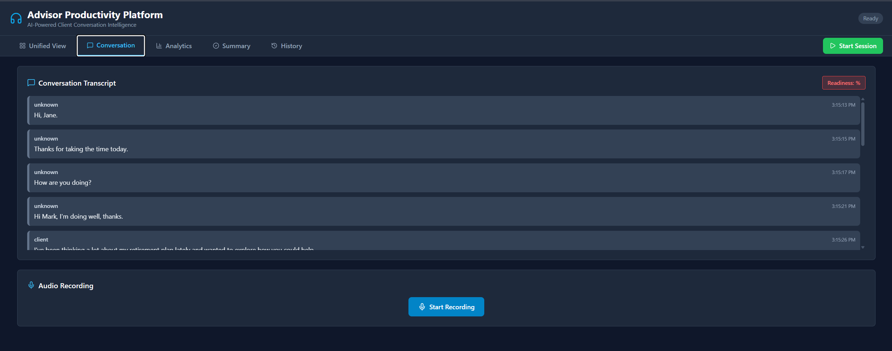
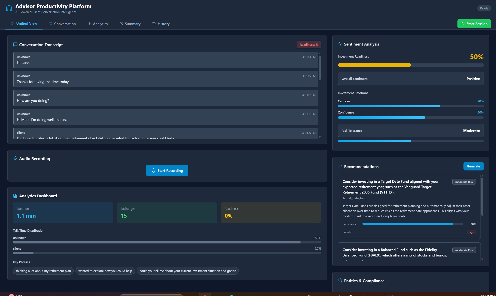
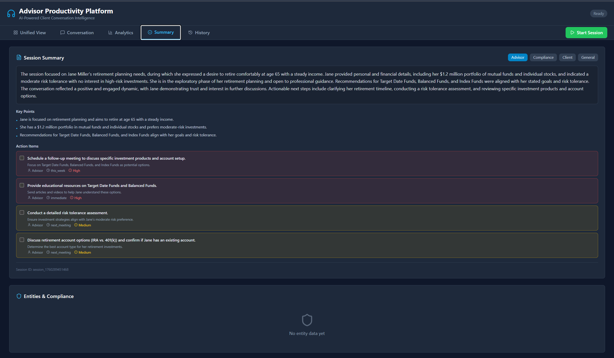
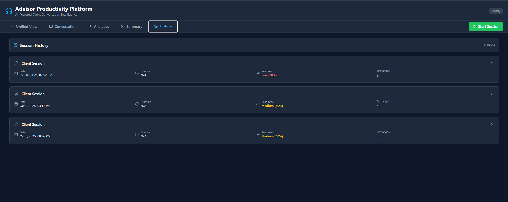

# Advisor Productivity App

## Overview

Advisor Productivity App is a Microsoft Agent Framework (MAF) reference solution that augments investment advisors with real-time meeting intelligence. It captures live conversations, performs financial-domain sentiment analysis, suggests compliant recommendations, and assembles meeting summaries while keeping humans in the loop. The project ships with a FastAPI backend, a React + Vite frontend, and Azure integrations for Speech, OpenAI, Language, Cosmos DB, and Application Insights.

## Key Capabilities

- Real-time transcription with speaker diarization and financial terminology tuning.
- Multi-dimensional sentiment tracking, investment readiness scoring, and compliance triggers.
- Recommendation engine that surfaces risk-aligned investment actions and rationale.
- Meeting summarization with persona-specific views (advisor, client, compliance).
- Entity extraction and PII protection with automatic redaction and audit logging.
- Cosmos DB session history, replay, and analytics dashboards across multiple layouts.
- Human-in-the-loop validation pipeline that lets advisors approve or amend AI output.

## Screenshots








## Solution Architecture

### High-Level Flow

1. Advisor starts or joins a meeting and streams audio to the backend via WebSocket.
2. Speech agent produces live transcripts and pushes events to the orchestrator.
3. Sentiment, recommendation, summary, and PII agents run under MAF coordination.
4. Results stream back to the frontend for real-time visualization.
5. Completed sessions persist to Cosmos DB for compliance and analytics.

### Backend Highlights (`backend/`)

- `app/main.py` hosts the FastAPI service with REST and WebSocket endpoints.
- `agents/` folder contains specialized MAF agents (speech, sentiment, recommendation, summary, entity, planner).
- `services/task_orchestrator.py` wires MAF builders and manages human-in-the-loop checkpoints.
- `routers/transcription.py` handles streaming audio ingest; `routers/orchestration.py` exposes REST APIs.
- `persistence/cosmos_memory.py` provides Cosmos DB storage for sessions and transcripts.
- `infra/settings.py` centralizes configuration; `infra/telemetry.py` emits Application Insights traces.

### Frontend Highlights (`frontend/`)

- React + Vite + TypeScript application styled with Tailwind CSS.
- Real-time views for live conversation, recommendation feed, and analytics dashboards.
- Session history browser, replay support, and compliance review workflows.
- Configurable environment (`.env`) for API base URL and streaming endpoints.

## Agent Orchestration

| Agent | Purpose |
| --- | --- |
| Planner | Decomposes meeting objectives and orchestrates downstream agents.
| Speech Transcription | Streams Azure Speech-to-Text results with diarization metadata.
| Sentiment | Scores emotional tone, confidence, and compliance risk in near real time.
| Recommendation | Generates investment insights with risk alignment and notes.
| Summarizer | Builds persona-targeted summaries and next best actions.
| Entity & PII | Detects investment entities, flags sensitive data, and applies redaction policies.

## Azure & External Dependencies

- **Azure OpenAI** for conversational intelligence (`AZURE_OPENAI_*`).
- **Azure Speech Service** for streaming audio transcription (`AZURE_SPEECH_*`).
- **Azure Language Service** for entity and sentiment enrichment (`AZURE_LANGUAGE_*`).
- **Azure Cosmos DB** for durable session persistence (`COSMOS_*`).
- **Application Insights** (optional) for distributed tracing and monitoring.
- **Azure AD / Easy Auth** (optional) for enterprise authentication.

## Getting Started

### 1. Backend

```powershell
cd advisor_productivity_app/backend
python -m venv .venv
.venv\Scripts\Activate.ps1
pip install -r requirements.txt
copy .env.example .env
# Edit .env with Azure OpenAI, Speech, Language, and Cosmos credentials
uvicorn app.main:app --reload --port 8000
```

### 2. Frontend

```powershell
cd advisor_productivity_app/frontend
npm install
echo "VITE_API_BASE_URL=http://localhost:8000" > .env
npm run dev -- --port 5173
```

Open `http://localhost:5173` to interact with the dashboard.

### Environment Variables

Key settings you should populate in `backend/.env`:

```
AZURE_OPENAI_ENDPOINT=...
AZURE_OPENAI_API_KEY=...
AZURE_OPENAI_DEPLOYMENT=gpt-4o
AZURE_OPENAI_API_VERSION=2024-08-01-preview

AZURE_SPEECH_KEY=...
AZURE_SPEECH_REGION=eastus

AZURE_LANGUAGE_KEY=...
AZURE_LANGUAGE_ENDPOINT=https://<resource>.cognitiveservices.azure.com/

COSMOS_ENDPOINT=https://<account>.documents.azure.com
COSMOS_KEY=...
COSMOS_DATABASE=advisor_productivity
COSMOS_CONTAINER=sessions

APPLICATIONINSIGHTS_CONNECTION_STRING=... # optional
```

## Project Layout

```
advisor_productivity_app/
├── backend/
│   ├── app/
│   │   ├── agents/
│   │   ├── routers/
│   │   ├── services/
│   │   ├── persistence/
│   │   ├── infra/
│   │   └── helpers/
│   ├── data/
│   ├── uploads/
│   ├── requirements.txt
│   └── start.ps1
├── frontend/
│   ├── src/
│   ├── package.json
│   └── vite.config.ts
├── docs/
│   ├── ARCHITECTURE.md
│   ├── API.md
│   ├── USER_GUIDE.md
│   └── PHASED_IMPLEMENTATION_PLAN.md
├── Dockerfile
├── deploy.ps1
└── README.md
```

## Testing

```powershell
# Backend tests
cd advisor_productivity_app/backend
pytest

# Frontend tests
cd ../frontend
npm run test
```

## Deployment Notes

- Container image and PowerShell deployment scripts (`deploy.ps1`, `deploy.bat`) target Azure App Service or container apps.
- Configure Azure Easy Auth to pass authenticated user headers if you require advisor-level access control.
- Enable Application Insights and set `AZURE_TRACING_GEN_AI_CONTENT_RECORDING_ENABLED=true` to capture agent activity in Azure AI Foundry tracing.

## Further Reading

- [Architecture Guide](docs/ARCHITECTURE.md)
- [API Documentation](docs/API.md)
- [Phased Implementation Plan](docs/PHASED_IMPLEMENTATION_PLAN.md)
- [User Guide](docs/USER_GUIDE.md)

---

This application demonstrates how MAF patterns, Azure AI services, and modern React experiences can combine to deliver compliant, advisor-first meeting intelligence.
