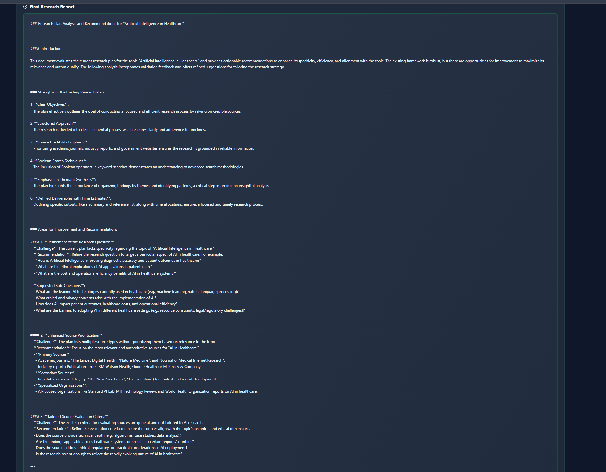

# Deep Research Application

> A production-ready deep research application showcasing three execution modes built on the **Magentic Foundation Framework**.

[](../../framework/)
[](./backend/)
[](./frontend/)
[](LICENSE)


## 🎯 Overview

A comprehensive deep research platform demonstrating **three distinct execution modes** for multi-agent orchestration:

- 🔷 **YAML Workflows** - Declarative, configuration-driven workflows
- 🔶 **Code-Based** - Programmatic orchestration with full control
- 🔸 **MAF Workflows** - Graph-based executors with fan-out/fan-in patterns

Each mode implements the same research workflow: **Planning → Parallel Research → Synthesis → Review → Summary**

---

## ✨ Features

### Three Execution Modes

<table>
<tr>
<td width="33%">

#### YAML Workflows


**Best for:**
- Simple, linear workflows
- Configuration-driven
- No-code modifications
- Business analysts

</td>
<td width="33%">

#### Code-Based


**Best for:**
- Complex orchestration logic
- Dynamic decision-making
- Custom patterns
- Full programmatic control

</td>
<td width="33%">

#### MAF Workflows


**Best for:**
- Graph-based workflows
- Fan-out/fan-in patterns
- Type-safe messaging
- Advanced concurrency

</td>
</tr>
</table>

### Real-Time Monitoring

Monitor execution progress across all three modes with live updates:

<table>
<tr>
<td width="33%">

**YAML Progress**


</td>
<td width="33%">

**Code Progress**


</td>
<td width="33%">

**MAF Progress**


</td>
</tr>
</table>

### Comprehensive Results Display

View detailed research reports with executive summaries:

<table>
<tr>
<td width="50%">

**YAML Results**


</td>
<td width="50%">

**MAF Results**


</td>
</tr>
</table>

---

## 🏗️ Architecture

```
deep_research_app/
├── backend/                    # FastAPI backend
│   ├── app/
│   │   ├── main.py            # API server + WebSocket
│   │   └── maf_workflow.py    # MAF workflow implementation
│   └── requirements.txt
├── frontend/                   # React TypeScript frontend  
│   ├── src/
│   │   ├── components/        # UI components
│   │   ├── api.ts            # API client
│   │   └── types.ts          # TypeScript types
│   └── package.json
├── workflows/                  # YAML workflow definitions
│   └── deep_research.yaml
└── docs/                      # Documentation + screenshots
    ├── images/
    ├── ARCHITECTURE.md
    ├── EXECUTION_MODES_COMPARISON.md
    └── QUICKSTART.md
```

### Tech Stack

**Backend:**
- FastAPI 0.104+ with async/await
- WebSocket for real-time updates
- Microsoft Agent Framework (MAF)
- OpenTelemetry observability
- Azure OpenAI + Tavily Search

**Frontend:**
- React 18 with TypeScript
- TailwindCSS for styling
- React Query for data fetching
- Lucide icons
- Vite for bundling

---

## 🚀 Quick Start

### Prerequisites

- Python 3.11+
- Node.js 18+
- Azure OpenAI API key
- Tavily API key (for web search)

### 1. Setup Backend

```bash
cd deep_research_app/backend

# Install dependencies
pip install -r requirements.txt

# Configure environment
cp .env.example .env
# Edit .env with your API keys:
#   AZURE_OPENAI_ENDPOINT=https://your-resource.openai.azure.com/
#   AZURE_OPENAI_API_KEY=your-api-key
#   AZURE_OPENAI_DEPLOYMENT=your-deployment-name
#   TAVILY_API_KEY=your-tavily-key

# Start server
python -m uvicorn app.main:app --reload
```

Backend runs on `http://localhost:8000`

### 2. Setup Frontend

```bash
cd deep_research_app/frontend

# Install dependencies
npm install

# Start development server
npm run dev
```

Frontend runs on `http://localhost:5173`

### 3. Start Research

1. Open browser to `http://localhost:5173`
2. Navigate to "New Research" tab
3. Enter research topic (e.g., "Artificial Intelligence in Healthcare")
4. Select execution mode: **Workflow**, **Code-Based**, or **MAF Workflows**
5. Click "Start Research"
6. Monitor real-time progress in Execution Monitor
7. View comprehensive results when complete

---

## 📊 Execution Modes Explained

### Mode 1: YAML Workflows (Declarative)

**Configuration-driven workflows using YAML files**

```yaml
# workflows/deep_research.yaml
tasks:
  - id: plan
    type: agent
    agent: planner
    
  - id: research
    type: agent
    agent: researcher
    dependencies: [plan]
    parallel: 5  # Run 5 researchers in parallel
```

**Pros:**
- ✅ No coding required
- ✅ Easy to modify configuration
- ✅ Clear visual structure
- ✅ Built-in dependency management

**Best for:** Standard workflows, business users, configuration-driven deployments

[Full Documentation →](docs/EXECUTION_MODES_COMPARISON.md#1-yaml-workflow-declarative)

---

### Mode 2: Code-Based (Programmatic)

**Direct Python orchestration using framework patterns**

```python
# Sequential → Concurrent → Sequential pattern
async def execute_research_programmatically(topic: str):
    # Phase 1: Sequential Planning
    await orchestrator.execute_sequential(
        task="Create research plan",
        agent_ids=["planner"]
    )
    
    # Phase 2: Concurrent Research (5 parallel tasks)
    research_tasks = [
        execute_research("core_concepts"),
        execute_research("applications"),
        execute_research("challenges"),
        execute_research("trends"),
        execute_research("future")
    ]
    results = await asyncio.gather(*research_tasks)
    
    # Phase 3: Sequential Synthesis
    await orchestrator.execute_sequential(
        task="Synthesize findings",
        agent_ids=["writer", "reviewer", "summarizer"]
    )
```

**Pros:**
- ✅ Full programmatic control
- ✅ Dynamic decision-making
- ✅ Custom error handling
- ✅ Complex conditional logic

**Best for:** Complex workflows, dynamic orchestration, custom integration

[Full Documentation →](docs/EXECUTION_MODES_COMPARISON.md#2-code-based-programmatic)

---

### Mode 3: MAF Workflows (Graph-Based) 🆕

**Type-safe graph workflows with executors and edges**

```python
from agent_framework import WorkflowBuilder, Executor, handler

# Define executor (graph node)
class ResearchPlannerExecutor(Executor):
    @handler
    async def run(
        self, 
        request: ResearchRequest, 
        ctx: WorkflowContext[ResearchPlan]
    ) -> None:
        plan = await self.create_plan(request.topic)
        await ctx.send_message(plan)  # Send to downstream executors

# Build workflow graph
workflow = (
    WorkflowBuilder()
    .set_start_executor(planner)
    .add_fan_out_edges(planner, [researcher_0, researcher_1, researcher_2])
    .add_fan_in_edges([researcher_0, researcher_1, researcher_2], synthesizer)
    .add_edge(synthesizer, reviewer)
    .add_edge(reviewer, summarizer)
    .build()
)

# Execute with streaming events
async for event in workflow.run_stream(request):
    if isinstance(event, ExecutorCompletedEvent):
        print(f"Completed: {event.executor_id}")
```

**Pros:**
- ✅ Type-safe messaging between executors
- ✅ Built-in fan-out/fan-in patterns
- ✅ Event-driven architecture
- ✅ OpenTelemetry observability

**Best for:** Graph-based workflows, advanced patterns, production systems

[Full Documentation →](docs/EXECUTION_MODES_COMPARISON.md#3-maf-workflow-graph-based)

---

## 🎨 User Interface

### Execution Mode Selection


Choose between three execution modes, each with different workflow visualizations showing the orchestration pattern.

### Real-Time Progress Tracking

- ✅ Live progress bar (0-100%)
- ✅ Current task display
- ✅ Completed/failed task lists
- ✅ WebSocket streaming updates
- ✅ Execution time tracking

### Results Display

- ✅ Full research report with sections
- ✅ Executive summary
- ✅ Source citations
- ✅ Quality scores
- ✅ Validation results
- ✅ Markdown formatting

---

## 🔧 API Reference

### REST Endpoints

```http
GET  /                                    # Root endpoint
GET  /health                              # Health check
GET  /api/workflow/info                   # Get workflow configuration

POST /api/research/start                  # Start new research
     Body: {
       "topic": "Your research topic",
       "execution_mode": "workflow" | "code" | "maf-workflow",
       "depth": "comprehensive" | "summary",
       "max_sources": 5,
       "include_citations": true
     }

GET  /api/research/status/:execution_id   # Get execution status
GET  /api/research/list                   # List all executions
```

### WebSocket

```http
WS   /ws/research/:execution_id           # Real-time execution updates
```

**Message Types:**
- `progress` - Progress updates (0-100%)
- `task_update` - Task status changes
- `complete` - Execution completed
- `error` - Error occurred

---

## 📚 Documentation

**We maintain 3 focused documents** for clarity and professionalism:

### 1. [Quick Start Guide](docs/QUICKSTART.md) 🚀
Get up and running in minutes - installation, setup, first research workflow.

### 2. [Architecture Guide](docs/ARCHITECTURE.md) 🏗️
System design, component interactions, data flow, technology stack.

### 3. [Developer Guide](docs/DEVELOPER_GUIDE.md) 💻
**Complete implementation reference:**
- ✅ Execution Modes (YAML, Code, MAF) with examples
- ✅ Orchestration Patterns (Sequential, Concurrent, ReAct)
- ✅ Concurrency Model with visual explanations
- ✅ 20+ code examples and best practices
- ✅ Extension guide for custom agents and integrations

### Developer Resources

- **[Backend README](backend/README.md)** - FastAPI backend development
- **[Frontend README](frontend/README.md)** - React frontend development
- **[Documentation Index](docs/README.md)** - Full navigation guide

---

## 🛠️ Development

### Backend Development

```bash
cd backend

# Run with auto-reload
uvicorn app.main:app --reload --port 8000

# Type checking
mypy app/

# Run tests
pytest
```

### Frontend Development

```bash
cd frontend

# Development server with HMR
npm run dev

# Type checking
npm run tsc

# Linting
npm run lint

# Production build
npm run build
```

---

## 🎯 Example Research Topics

Try these topics to see each execution mode in action:

- **Healthcare:** "Artificial Intelligence in Healthcare"
- **Technology:** "Quantum Computing Applications"  
- **Energy:** "Sustainable Energy Solutions"
- **Finance:** "Blockchain in Financial Services"
- **Science:** "CRISPR Gene Editing Ethics"
- **Space:** "Commercial Space Exploration"

Each mode will produce a comprehensive research report with:
- Executive summary
- Detailed findings across multiple areas
- Quality validation
- Source citations

---

## 🚨 Troubleshooting

### Backend Issues

**Port 8000 Already in Use**
```bash
# Windows
netstat -ano | findstr :8000
taskkill /PID <pid> /F

# Linux/Mac
lsof -i :8000
kill -9 <pid>
```

**Missing API Keys**
- Ensure `.env` file exists in `backend/` directory
- Verify all required keys: `AZURE_OPENAI_*`, `TAVILY_API_KEY`
- Restart backend after updating `.env`

**OTLP Observability Errors**
```bash
# Disable observability in .env if not using it
OBSERVABILITY_ENABLED=false
```

### Frontend Issues

**API Connection Failed**
- Verify backend is running: `curl http://localhost:8000/health`
- Check CORS configuration in `backend/app/main.py`
- Ensure frontend API URL matches backend port

**Dependencies Not Installing**
```bash
rm -rf node_modules package-lock.json
npm install
```

**WebSocket Not Connecting**
- Check execution_id is valid
- Verify WebSocket endpoint: `ws://localhost:8000/ws/research/<id>`
- Check browser console for connection errors

---

## 📈 Performance

### Starting a Research Workflow

1. Navigate to the "New Research" tab
2. Enter your research topic
3. Configure depth and options
4. Click "Start Research"
5. Monitor progress in real-time

### Viewing Workflow Configuration

1. Navigate to the "Workflow Configuration" tab
2. See the visual flow diagram
3. Inspect variables and task configurations
4. Understand agent dependencies

### Monitoring Execution

1. Navigate to the "Execution Monitor" tab (automatically after starting)
2. Watch real-time progress updates
3. See which tasks are running/completed/failed
4. View results when complete

## API Endpoints

### REST API

```
GET  /                              # Root endpoint
GET  /health                        # Health check
GET  /api/workflow/info             # Get workflow configuration
POST /api/research/start            # Start new research
GET  /api/research/status/:id       # Get execution status
GET  /api/research/list             # List all executions
```

### WebSocket

```
WS   /ws/research/:execution_id     # Real-time execution updates
```

## Example Research Topics

Try these topics to see the framework in action:

- "Artificial Intelligence in Healthcare"
- "Quantum Computing Applications"
- "Sustainable Energy Solutions"
- "Future of Space Exploration"
- "Blockchain Technology Impact"

## Framework Integration

This application showcases the following framework capabilities:

### Declarative Workflows
- YAML-based workflow definition (`deep_research.yaml`)
- Task dependencies and parallel execution
- Variable substitution and configuration

### Multi-Agent Orchestration
- Planner agent for research strategy
- Researcher agents for investigation
- Synthesizer agent for report generation
- Validator agent for quality check

### Real-time Monitoring
- Progress tracking
- Task status updates
- WebSocket streaming
- Error handling

### Configuration Management
- Workflow variables
- Agent parameters
- Timeout and retry policies
- Parallel execution limits

## Development

### Backend Development

```bash
cd backend

# Run with auto-reload
uvicorn app.main:app --reload

# Run tests (if implemented)
pytest

# Type checking
mypy app/
```

### Frontend Development

```bash
cd frontend

# Development server
npm run dev

# Type checking
npm run tsc

# Linting
npm run lint

# Build for production
npm run build
```

## Customization

### Adding New Agents

1. Define agent in `framework/agents/`
2. Register in `framework/core/registry.py`
3. Add to workflow YAML
4. Update frontend types if needed

### Modifying Workflow

1. Edit `framework/examples/workflows/deep_research.yaml`
2. Add/modify tasks and dependencies
3. Update variables as needed
4. Restart backend

### Customizing UI

1. Edit components in `frontend/src/components/`
2. Modify theme in `tailwind.config.js`
3. Update styles in `src/index.css`
4. Changes reflect immediately (HMR)

## Troubleshooting

### Backend Issues

**Import Errors**
```bash
# Ensure framework is installed
cd framework
pip install -e .
```

**API Not Starting**
```bash
# Check if port 8000 is available
netstat -ano | findstr :8000  # Windows
lsof -i :8000                 # Linux/Mac
```

### Frontend Issues

**Dependencies Not Installing**
```bash
# Clear cache and reinstall
rm -rf node_modules package-lock.json
npm install
```

**API Connection Failed**
- Ensure backend is running on port 8000
- Check CORS settings in backend
- Verify API_URL in frontend config

### Framework Issues

**Agent Not Found**
- Check agent registration in registry
- Verify agent name in workflow YAML
- Ensure agent factory can create the agent

**Workflow Fails**
- Check agent credentials (.env)
- Verify workflow YAML syntax
- Review logs for specific errors

---

## 📈 Performance

### Execution Times (Approximate)

| Mode | Planning | Research | Synthesis | Total |
|------|----------|----------|-----------|-------|
| YAML | 10s | 30s (5 parallel) | 20s | ~60s |
| Code | 10s | 30s (5 parallel) | 20s | ~60s |
| MAF | 10s | 25s (3 parallel) | 20s | ~55s |

*Times vary based on topic complexity and API response times*

### Concurrency

- **YAML Mode:** Up to 10 parallel tasks (configurable in YAML)
- **Code Mode:** 5 parallel research tasks (hardcoded)
- **MAF Mode:** 3 parallel researchers (graph fan-out)

### Resource Usage

- **Memory:** ~200MB (backend) + ~150MB (frontend)
- **CPU:** Low (mainly I/O bound waiting for LLM responses)
- **Network:** Depends on LLM provider latency

---

## 🌟 What's Next?

After exploring the application, consider:

1. **Custom Agents** - Create domain-specific agents for your use case
2. **Additional Patterns** - Implement handoff, hierarchical, or group chat patterns  
3. **Production Deployment** - Deploy to Azure, AWS, or GCP
4. **Enhanced Monitoring** - Add metrics, tracing, and logging
5. **API Integration** - Connect to external data sources and services

---

## 📖 Related Resources

- [Magentic Foundation Framework](../../framework/README.md) - Core framework documentation
- [Pattern Reference](../../docs/framework/pattern-reference.md) - All 7 orchestration patterns
- [Microsoft Agent Framework](https://microsoft.github.io/autogen/) - Upstream MAF documentation
- [FastAPI](https://fastapi.tiangolo.com/) - Backend framework
- [React](https://react.dev/) - Frontend library

---

## 🤝 Contributing

Contributions are welcome! This application demonstrates best practices for:

- Multi-mode execution architectures
- Real-time WebSocket communication
- Type-safe API contracts (TypeScript + Pydantic)
- Production-ready error handling
- Comprehensive observability

---

## 📄 License

MIT License - Part of the Magentic Foundation Framework

---

## 💬 Support

For questions or issues:

1. **Documentation** - Check docs/ folder for detailed guides
2. **Examples** - Review code in backend/app/ and frontend/src/
3. **Issues** - Open a GitHub issue with details
4. **Framework** - See [framework/README.md](../../framework/README.md)

---

**Built with ❤️ using the Magentic Foundation Framework**

> Demonstrating the power of flexible multi-agent orchestration with three distinct execution modes: YAML, Code-Based, and MAF Workflows.
