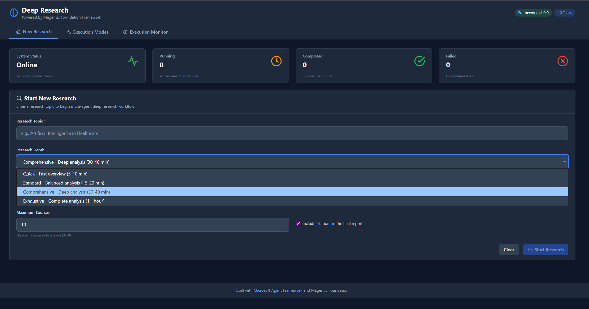
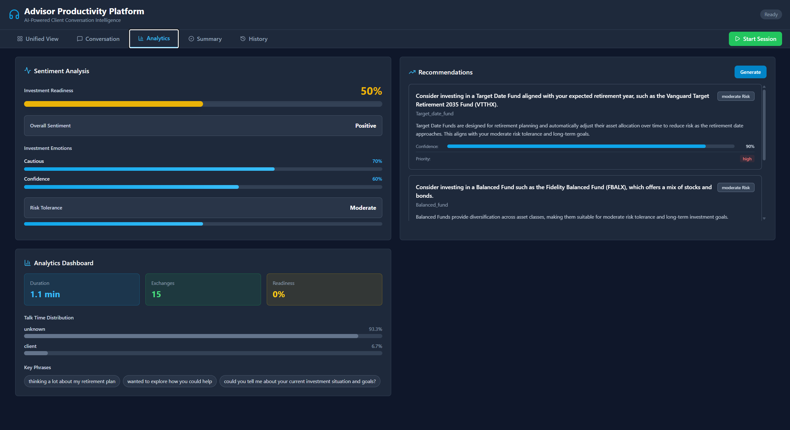
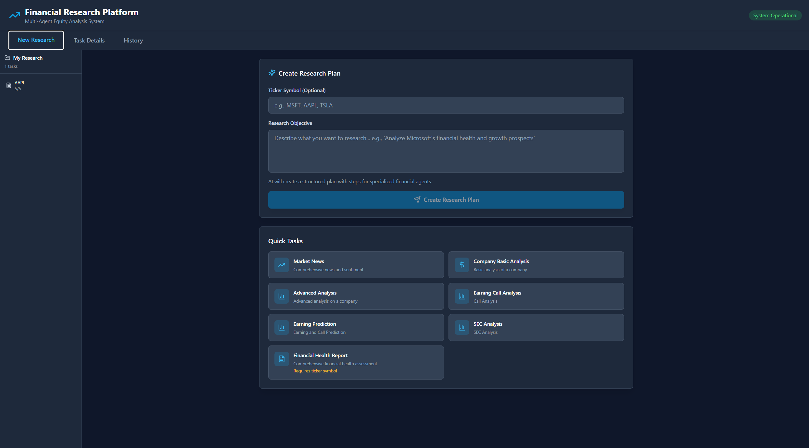
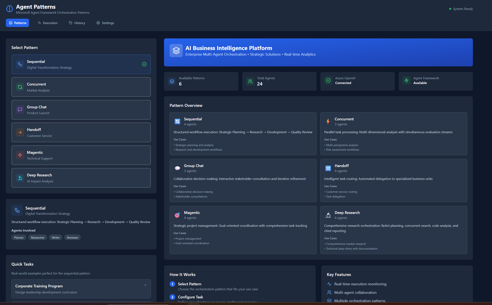
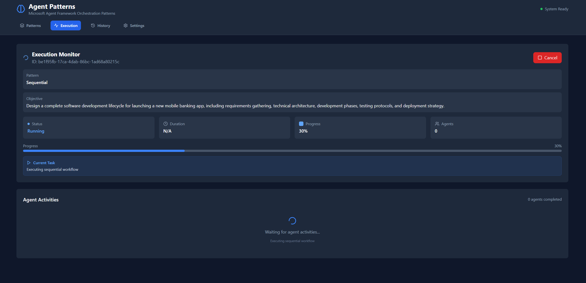

# Microsoft Agent Framework Application Suite


## Overview


This folder centralizes documentation for the Microsoft Agent Framework (MAF) application suite in this repository. Each reference solution highlights a different orchestration pattern, user experience, and integration approach that you can reuse when crafting your own MAF-powered products.This documentation describes the portfolio of reference applications that we have built on top of the Microsoft Agent Framework (MAF). Each solution demonstrates a different orchestration pattern, user experience, and deployment approach that can be reused when assembling your own MAF-powered product.


## Portfolio at a Glance## Portfolio at a Glance


### Deep Research App### Deep Research App

- Multi-stage workflows combining sequential, concurrent, and YAML-defined execution modes- Multi-stage research workflows that mix sequential, concurrent, and hand-off execution modes

- Persistent research history and artifact storage backed by Cosmos DB and Azure Storage- Research persistence, artifact storage, and YAML-driven workflow definitions

- Full-stack reference for planners, agents, and tool adapters running on MAF- End-to-end example of integrating MAF planners, agents, and tool adapters

- Quick links: [README](../deep_research_app/README.md), [Backend](../deep_research_app/backend/), [Frontend](../deep_research_app/frontend/), [Quickstart](../deep_research_app/docs/QUICKSTART.md)- Quick links: [README](../deep_research_app/README.md), [Backend](../deep_research_app/backend/), [Frontend](../deep_research_app/frontend/), [Quickstart](../deep_research_app/docs/QUICKSTART.md)





### Multimodal Insights App### Multimodal Insights App

- Audio, video, and PDF processing with Azure Speech and Document Intelligence- Multimodal analysis that blends image, document, and structured data interpretation

- Step approvals, execution monitor, and Cosmos-backed history for replayable sessions- Task history with replayable runs and OpenTelemetry-based diagnostics

- Demonstrates MCP-enabled enrichment and Azure OpenAI powered analytics- Demonstrates MCP-enabled enrichment for Vision and Retrieval workflows

- Quick links: [README](../multimodal_insights_app/README.md), [Backend](../multimodal_insights_app/backend/), [Frontend](../multimodal_insights_app/frontend/), [Architecture](../multimodal_insights_app/docs/ARCHITECTURE.md)- Quick links: [README](../multimodal_insights_app/README.md), [Backend](../multimodal_insights_app/backend/), [Frontend](../multimodal_insights_app/frontend/), [Architecture](../multimodal_insights_app/docs/ARCHITECTURE.md)


### Advisor Productivity App### Advisor Productivity App

- Real-time meeting intelligence: transcription, summarization, action items, and sentiment insights- Real-time meeting intelligence with transcription, sentiment scoring, recommendations, and summaries

- Cosmos DB history, Application Insights telemetry, and Azure AI content safety integration- Cosmos DB history, Application Insights telemetry, and human-in-the-loop validation checkpoints

- Quick links: [README](../advisor_productivity_app/README.md), [Backend](../advisor_productivity_app/backend/), [Frontend](../advisor_productivity_app/frontend/)- Azure Speech, OpenAI, Language, and PII protection integrated through MAF orchestration

- Quick links: [README](../advisor_productivity_app/README.md), [Backend](../advisor_productivity_app/backend/), [Frontend](../advisor_productivity_app/frontend/)





### FinAgent App

- Equity research copilot featuring sequential, concurrent, and group-chat patterns### FinAgent App

- Financial data adapters for SEC, fundamentals, technicals, and earnings plus Azure OpenAI synthesis- Equity research copilot that applies sequential, concurrent, and group-chat coordination patterns

- Quick links: [README](../finagent_app/README.md), [Backend](../finagent_app/backend/), [Frontend](../finagent_app/frontend/), [Docs](../finagent_app/docs/QUICKSTART.md)- Financial data adapters for SEC, earnings calls, fundamentals, and technical analysis

- Integrated PDF report generation and MCP tool orchestration

### FinAgent Dynamic App- Quick links: [README](../finagent_app/README.md), [Backend](../finagent_app/backend/), [Frontend](../finagent_app/frontend/), [Docs](../finagent_app/docs/QUICKSTART.md)

- ReAct-style planner with human approval gating on every agent step

- Cosmos DB session history, telemetry, and MCP-powered Yahoo Finance integration### FinAgent Dynamic App

- Quick links: [README](../finagent_dynamic_app/README.md), [Backend](../finagent_dynamic_app/backend/), [Frontend](../finagent_dynamic_app/frontend/), [Quickstart](../finagent_dynamic_app/docs/QUICKSTART.md)- Dynamic planning with human approval gates for every agent step

- Cosmos DB session history, detailed task telemetry, and MCP-powered data acquisition

- Illustrates ReAct-style planners running on top of MAF orchestration primitives

- Quick links: [README](../finagent_dynamic_app/README.md), [Backend](../finagent_dynamic_app/backend/), [Frontend](../finagent_dynamic_app/frontend/), [Quickstart](../finagent_dynamic_app/docs/QUICKSTART.md)

### Patterns Sandbox

- Sequential, Concurrent, Group Chat, Handoff, and Magentic/Deep Research builders powered by official MAF workflows

- FastAPI + React experience with execution monitors, run history, and Azure Easy Auth hooks

- Quick links: [README](../patterns/README.md), [Backend](../patterns/backend/), [Frontend](../patterns/frontend/)### Patterns Sandbox

- Six orchestrations (Sequential, Concurrent, Group Chat, Handoff, Magentic, Deep Research) running on official MAF builders

- FastAPI backend with real-time agent activity streaming, optional Cosmos DB history, and Azure Easy Auth hooks

- React dashboard featuring execution monitors, run history, and configurable API settings

- Quick links: [README](../patterns/README.md), [Backend](../patterns/backend/), [Frontend](../patterns/frontend/)

## Implementation Playbooks


- **[Hackathon Curriculum](./hackathon/README.md)** – Guided learning path, pattern labs, and project backlogs aligned with the current portfolio

- **[Deep Research Playbooks](./hackathon/DEEP_RESEARCH_README.md)** – End-to-end walkthroughs for research-centric assistants, including quickstart, patterns, and decision guides

- **[Reference App Overview](./reference-app/overview.md)** – System blueprint for the Deep Research baseline and how it leverages MAF utilities## Architecture and Pattern Guides

- **Patterns & Builders** – Explore practical orchestration examples directly in [patterns/README.md](../patterns/README.md)

- **[MAF Architecture Overview](./framework/architecture.md)** – How the reference apps compose MAF services and shared infrastructure

## Getting Started- **[Pattern Reference](./framework/pattern-reference.md)** – Coordination strategies used across the portfolio with implementation notes

- **[Microsoft Agent Framework Integration](./framework/msft-agent-framework.md)** – Integration touchpoints, extension hooks, and best practices when wiring agents

```bash- **[Deep Research Playbooks](./hackathon/DEEP_RESEARCH_README.md)** – Step-by-step walkthroughs for building research-centric assistants

# Clone the repository- **[Hackathon Curriculum](./hackathon/README.md)** – Hands-on labs that teach pattern selection, agent design, and deployment workflows

git clone https://github.com/akshata29/agents.git- **[Reference App Overview](./reference-app/overview.md)** – Component breakdown for the Deep Research baseline

cd agents

## Getting Started

# Pick an application to explore

cd deep_research_app/backend```bash

# Clone the repository

# Create an isolated environment and install dependenciesgit clone https://github.com/akshata29/agents.git

python -m venv .venvcd agents

.venv\Scripts\Activate.ps1

pip install -r requirements.txt# Pick an application to explore

cd deep_research_app/backend

# Launch the backend (follow each app README for complete setup)

uvicorn app.main:app --reload --port 8000# Create an isolated environment and install dependencies

```python -m venv .venv

.venv\\Scripts\\Activate.ps1

- Frontend projects boot with `npm install && npm run dev` from their respective directoriespip install -r requirements.txt

- Each app folder includes deployment scripts (`deploy.ps1`, Dockerfiles) for Azure App Service or Container Apps

# Launch the backend (follow the app README for full setup)

## Additional Resourcespython app/main.py

```

- [Deep Research Decision Guide](./hackathon/DEEP_RESEARCH_DECISION_GUIDE.md)

- [Deep Research Quickstart](./hackathon/DEEP_RESEARCH_QUICKSTART.md)- Frontend projects boot with `npm install && npm run dev` from their respective directories

- [Deep Research Patterns](./hackathon/DEEP_RESEARCH_PATTERNS.md)- Deployment scripts (`deploy.ps1`, `deploy.bat`, Dockerfiles) are available under each app folder

- [Advanced Topics](./hackathon/08-advanced-topics.md)

## Additional Resources

## Contributing

- [Deep Research Decision Guide](./hackathon/DEEP_RESEARCH_DECISION_GUIDE.md)

We welcome contributions! See the [Contributing Guide](../CONTRIBUTING.md) for coding standards, branching strategy, and release workflow.- [Deep Research Quickstart](./hackathon/DEEP_RESEARCH_QUICKSTART.md)

- [Deep Research Patterns](./hackathon/DEEP_RESEARCH_PATTERNS.md)
- [Advanced Topics](./hackathon/08-advanced-topics.md)

## Contributing

We welcome contributions! Please see the [Contributing Guide](../CONTRIBUTING.md) for details on coding standards, branching, and release processes.
