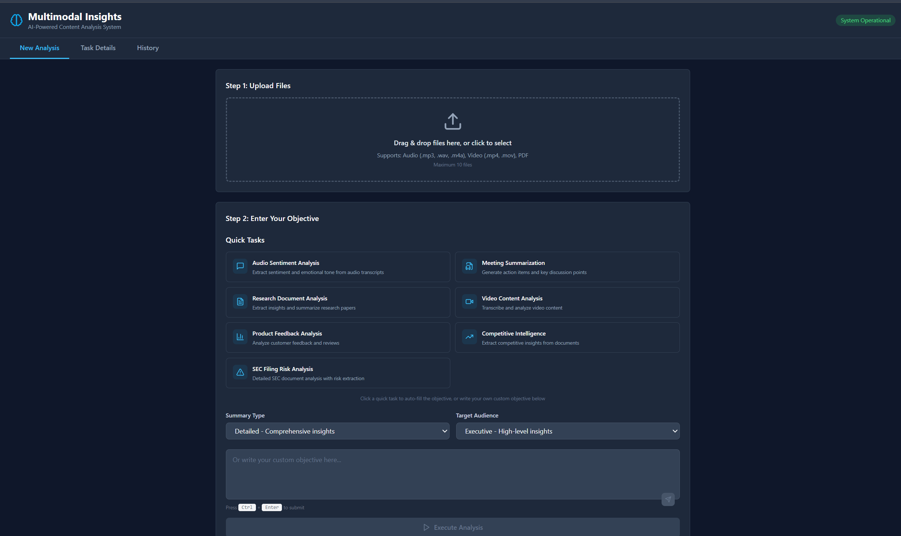

# Microsoft Agent Framework Application Suite

## Overview

This documentation describes the portfolio of reference applications that we have built on top of the Microsoft Agent Framework (MAF). Each solution demonstrates a different orchestration pattern, user experience, and deployment approach that can be reused when assembling your own MAF-powered product.

## Portfolio at a Glance

### Deep Research App
- Multi-stage research workflows that mix sequential, concurrent, and hand-off execution modes
- Research persistence, artifact storage, and YAML-driven workflow definitions
- End-to-end example of integrating MAF planners, agents, and tool adapters
- Quick links: [README](../deep_research_app/README.md), [Backend](../deep_research_app/backend/), [Frontend](../deep_research_app/frontend/), [Quickstart](../deep_research_app/docs/QUICKSTART.md)


### Multimodal Insights App
- Multimodal analysis that blends image, document, and structured data interpretation
- Task history with replayable runs and OpenTelemetry-based diagnostics
- Demonstrates MCP-enabled enrichment for Vision and Retrieval workflows
- Quick links: [README](../multimodal_insights_app/README.md), [Backend](../multimodal_insights_app/backend/), [Frontend](../multimodal_insights_app/frontend/), [Architecture](../multimodal_insights_app/docs/ARCHITECTURE.md)



### Advisor Productivity App
- Conversation intelligence for financial advisors with transcription, sentiment, and recommendation agents
- Cosmos DB backed persistence and human-in-the-loop validation flows
- Real-time WebSocket orchestration pattern showcasing streaming signals
- Quick links: [README](../advisor_productivity_app/README.md), [Backend](../advisor_productivity_app/backend/), [Frontend](../advisor_productivity_app/frontend/)

### FinAgent App
- Equity research copilot that applies sequential, concurrent, and group-chat coordination patterns
- Financial data adapters for SEC, earnings calls, fundamentals, and technical analysis
- Integrated PDF report generation and MCP tool orchestration
- Quick links: [README](../finagent_app/README.md), [Backend](../finagent_app/backend/), [Frontend](../finagent_app/frontend/), [Docs](../finagent_app/docs/QUICKSTART.md)

### FinAgent Dynamic App
- Dynamic planning with human approval gates for every agent step
- Cosmos DB session history, detailed task telemetry, and MCP-powered data acquisition
- Illustrates ReAct-style planners running on top of MAF orchestration primitives
- Quick links: [README](../finagent_dynamic_app/README.md), [Backend](../finagent_dynamic_app/backend/), [Frontend](../finagent_dynamic_app/frontend/), [Quickstart](../finagent_dynamic_app/docs/QUICKSTART.md)


### Patterns Sandbox
- Minimal reference environment for experimenting with individual MAF orchestration patterns
- Includes ready-to-run backend and frontend layers plus containerized deployment scripts
- Ideal starting point for greenfield projects that only need a subset of the larger apps
- Quick links: [README](../patterns/README.md), [Backend](../patterns/backend/), [Frontend](../patterns/frontend/)

## Architecture and Pattern Guides

- **[MAF Architecture Overview](./framework/architecture.md)** – How the reference apps compose MAF services and shared infrastructure
- **[Pattern Reference](./framework/pattern-reference.md)** – Coordination strategies used across the portfolio with implementation notes
- **[Microsoft Agent Framework Integration](./framework/msft-agent-framework.md)** – Integration touchpoints, extension hooks, and best practices when wiring agents
- **[Deep Research Playbooks](./hackathon/DEEP_RESEARCH_README.md)** – Step-by-step walkthroughs for building research-centric assistants
- **[Hackathon Curriculum](./hackathon/README.md)** – Hands-on labs that teach pattern selection, agent design, and deployment workflows
- **[Reference App Overview](./reference-app/overview.md)** – Component breakdown for the Deep Research baseline

## Getting Started

```bash
# Clone the repository
git clone https://github.com/akshata29/agents.git
cd agents

# Pick an application to explore
cd deep_research_app/backend

# Create an isolated environment and install dependencies
python -m venv .venv
.venv\\Scripts\\Activate.ps1
pip install -r requirements.txt

# Launch the backend (follow the app README for full setup)
python app/main.py
```

- Frontend projects boot with `npm install && npm run dev` from their respective directories
- Deployment scripts (`deploy.ps1`, `deploy.bat`, Dockerfiles) are available under each app folder

## Additional Resources

- [Deep Research Decision Guide](./hackathon/DEEP_RESEARCH_DECISION_GUIDE.md)
- [Deep Research Quickstart](./hackathon/DEEP_RESEARCH_QUICKSTART.md)
- [Deep Research Patterns](./hackathon/DEEP_RESEARCH_PATTERNS.md)
- [Advanced Topics](./hackathon/08-advanced-topics.md)

## Contributing

We welcome contributions! Please see the [Contributing Guide](../CONTRIBUTING.md) for details on coding standards, branching, and release processes.
