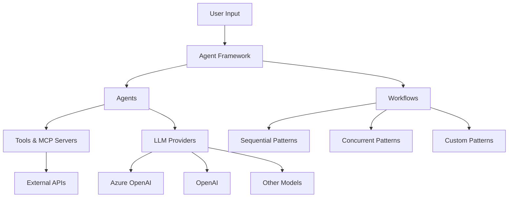

# Microsoft Agent Framework Overview

## 🎯 What is Microsoft Agent Framework?

Microsoft Agent Framework (MAF) is the next-generation framework for building AI agents and multi-agent workflows, combining the best of **Semantic Kernel** and **AutoGen** while adding new enterprise-grade capabilities.

### Key Advantages

- **🔧 Enterprise-Ready**: Thread-based state management, type safety, filters, telemetry
- **🤖 Agent-First**: Simple abstractions for single and multi-agent patterns  
- **🔄 Workflow Control**: Explicit control over multi-agent execution paths
- **🔗 Extensible**: Robust state management for long-running and human-in-the-loop scenarios


## 🏗 Core Architecture



## 🤖 Core Concepts

### 1. Agents

An AI agent uses an LLM to:
- Process user inputs
- Make decisions  
- Call tools and MCP servers
- Generate responses

**When to use agents:**
- Autonomous decision-making needed
- Ad hoc planning required
- Trial-and-error exploration
- Conversation-based interactions
- Unstructured tasks that can't be easily defined in advance

**When NOT to use agents:**
- Highly structured tasks with predefined rules
- Tasks where you can write a simple function
- Need strict adherence to specific sequences

### 2. Workflows  

Workflows express predefined sequences of operations that can include agents as components while maintaining consistency and reliability.

**Key benefits:**
- **Modularity**: Break down into reusable components
- **Agent Integration**: Incorporate multiple AI agents with non-agentic components  
- **Type Safety**: Strong typing with comprehensive validation
- **Flexible Flow**: Graph-based architecture with conditional routing
- **External Integration**: Built-in request/response patterns
- **Checkpointing**: Save/restore workflow states
- **Multi-Agent Orchestration**: Built-in coordination patterns

## 🔧 Installation

```bash
# Python
pip install agent-framework

# .NET  
dotnet add package Microsoft.Agents.AI
```

## 📋 Agent Implementation Requirements

All agents in MAF must implement the `BaseAgent` interface with two required methods:

### Required Methods

```python
from agent_framework import BaseAgent, AgentRunResponse, ChatMessage, Role, TextContent

class CustomAgent(BaseAgent):
    def __init__(self, name: str, description: str):
        super().__init__(name=name, description=description)
        
    async def run(
        self,
        messages: str | ChatMessage | list[str] | list[ChatMessage] | None = None,
        *,
        thread: AgentThread | None = None,
        **kwargs: Any
    ) -> AgentRunResponse:
        """Execute the agent - REQUIRED by MAF."""
        # Process messages and return AgentRunResponse
        pass
    
    async def run_stream(
        self,
        messages: str | ChatMessage | list[str] | list[ChatMessage] | None = None,
        *,
        thread: AgentThread | None = None,
        **kwargs: Any
    ) -> AsyncGenerator[AgentRunResponseUpdate, None]:
        """Stream responses - REQUIRED by MAF."""
        # Yield AgentRunResponseUpdate chunks
        pass
```

### Message Structure

MAF uses a specific message format with `contents` (not `content`):

```python
from agent_framework import ChatMessage, Role, TextContent

# Correct way to create messages
message = ChatMessage(
    role=Role.USER,
    contents=[TextContent(text="Your message here")]
)

# Accessing message content
text = message.text  # Property that returns the text content
```

**Critical Requirements:**
- Use `contents` (list of TextContent), NOT `content` (string)
- Messages have a `text` property to access content easily
- Use `Role.USER`, `Role.ASSISTANT`, `Role.SYSTEM`

## 🔄 Workflow Builders

MAF provides builders for creating different workflow patterns:

### Sequential Workflow
```python
from agent_framework import SequentialBuilder

builder = SequentialBuilder()
builder = builder.participants([agent1, agent2, agent3])
workflow = builder.build()

# Execute
messages = [ChatMessage(role=Role.USER, contents=[TextContent(text="Task")])]
workflow_run = await workflow.run(messages)
```

### Concurrent Workflow  
```python
from agent_framework import ConcurrentBuilder

builder = ConcurrentBuilder()
builder = builder.participants([agent1, agent2])  # Minimum 2 agents required
workflow = builder.build()
```

### Advanced Workflows
```python
from agent_framework import WorkflowBuilder

# Graph-based workflow with fan-out/fan-in
workflow = (
    WorkflowBuilder()
    .set_start_executor(planner_agent)
    .add_fan_out_edges(planner_agent, [researcher1, researcher2, researcher3])
    .add_fan_in_edges([researcher1, researcher2, researcher3], synthesizer_agent)
    .build()
)
```

## 📊 Workflow Events

MAF workflows generate events during execution:

```python
workflow_run = await workflow.run(messages)

# Process events (WorkflowRunResult is a list)
for event in workflow_run:
    if isinstance(event, WorkflowOutputEvent):
        agent_id = event.source_executor_id  # NOT event.source
        output = event.output
        
        # Process agent output
        if hasattr(output, 'messages'):
            for message in output.messages:
                content = message.text
                # Handle content
```

## 🎯 Use Case Examples

### Customer Support Agent
```python
class SupportAgent(BaseAgent):
    async def run(self, messages, *, thread=None, **kwargs):
        # Handle customer query
        # Use tools to look up information
        # Provide natural language response
        pass
```

### Research Assistant  
```python  
class ResearchAgent(BaseAgent):
    async def run(self, messages, *, thread=None, **kwargs):
        # Search web and documents
        # Summarize findings
        # Piece together information from multiple sources
        pass
```

### Code Generation Agent
```python
class CodeAgent(BaseAgent):  
    async def run(self, messages, *, thread=None, **kwargs):
        # Assist with implementation
        # Code reviews
        # Debug issues using programming tools
        pass
```

## ⚠️ Common Pitfalls

### ❌ Don't Do This
```python
# Wrong message structure
message = ChatMessage(role=Role.USER, content="text")  # NO!

# Wrong workflow building
builder = ConcurrentBuilder().participants([agent1])  # Need 2+ agents!

# Wrong event handling
async for event in workflow.run(messages):  # NO! Use regular for loop
    pass

# Wrong agent access
agent_id = event.source  # NO! Use source_executor_id
```

### ✅ Do This Instead
```python
# Correct message structure  
message = ChatMessage(role=Role.USER, contents=[TextContent(text="text")])

# Correct workflow building
builder = ConcurrentBuilder().participants([agent1, agent2])

# Correct event handling
workflow_run = await workflow.run(messages)
for event in workflow_run:  # Regular for loop
    pass
    
# Correct agent access
agent_id = event.source_executor_id
```

## 🔗 Integration with Tools

MAF supports Model Context Protocol (MCP) for tool integration:

```python
# Tools can be passed to agents during execution
tools = ["web_search", "database_query", "file_operations"]

# Agents can access tools during processing
result = await agent.run(messages, tools=tools)
```

## 📈 Monitoring and Observability

MAF provides built-in telemetry and monitoring:

```python
# Automatic metrics collection
# Distributed tracing support  
# Performance monitoring
# Error tracking and logging
```

## 🔜 Next Steps

Now that you understand MAF fundamentals, let's explore how our Foundation Framework extends these capabilities:

[→ Continue to Foundation Framework](./02-framework-architecture.md)

---

## 📖 Additional Resources

- [Official MAF Documentation](https://learn.microsoft.com/en-us/agent-framework/)
- [MAF GitHub Repository](https://github.com/microsoft/agent-framework)
- [Migration from Semantic Kernel](https://learn.microsoft.com/en-us/agent-framework/migration-guide/from-semantic-kernel/)
- [Migration from AutoGen](https://learn.microsoft.com/en-us/agent-framework/migration-guide/from-autogen/)