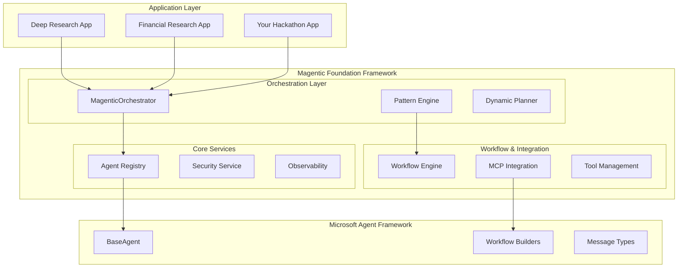
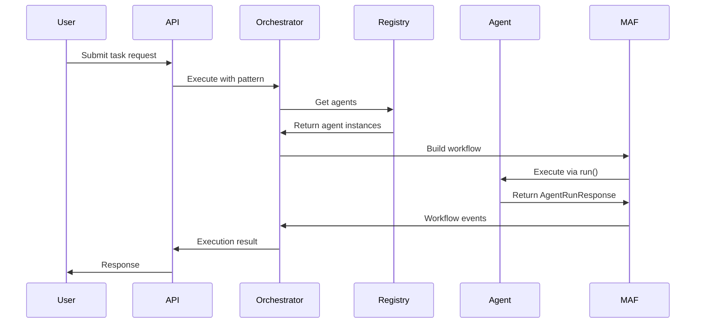
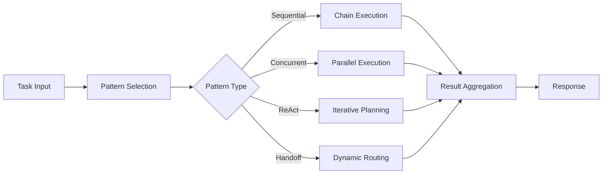

# Magentic Foundation Framework Architecture

## 🎯 Overview

The Magentic Foundation Framework is an enterprise-grade multi-agent orchestration layer built **on top** of Microsoft Agent Framework (MAF). It extends MAF with production-ready capabilities including advanced orchestration patterns, security, monitoring, and enterprise integrations.

## 🏗 Layered Architecture



## 🎭 Three Execution Paradigms

The framework supports three different workflow execution modes:

### 1. YAML Workflows (Declarative)
**Best for**: Simple, configuration-driven workflows

```yaml
name: research_workflow
description: "Multi-step research process"
tasks:
  - id: plan
    type: agent
    agent: planner
    description: "Create research plan"
    
  - id: research
    type: agent
    agent: researcher  
    description: "Execute research"
    dependencies: [plan]
    
  - id: synthesize
    type: agent
    agent: synthesizer
    description: "Synthesize findings"
    dependencies: [research]
```

**Advantages:**
- No-code workflow definition
- Easy to modify and maintain
- Perfect for business analysts
- Version controllable

### 2. Code-Based Workflows (Programmatic)
**Best for**: Complex orchestration with dynamic logic

```python
from framework.patterns import SequentialPattern, ConcurrentPattern

async def execute_research(orchestrator, topic: str):
    # Phase 1: Planning (Sequential)
    planning_result = await orchestrator.execute(
        task=f"Create research plan for {topic}",
        pattern=SequentialPattern(agents=["planner"]),
        metadata={"phase": "planning"}
    )
    
    # Phase 2: Research (Concurrent)
    research_result = await orchestrator.execute(
        task=f"Research {topic}",
        pattern=ConcurrentPattern(agents=["researcher1", "researcher2", "researcher3"]),
        context=planning_result,
        metadata={"phase": "research"}
    )
    
    # Phase 3: Synthesis (Sequential)  
    synthesis_result = await orchestrator.execute(
        task="Synthesize research findings",
        pattern=SequentialPattern(agents=["synthesizer", "reviewer"]),
        context=research_result,
        metadata={"phase": "synthesis"}
    )
    
    return synthesis_result
```

**Advantages:**
- Full programmatic control
- Dynamic decision-making
- Complex error handling
- Custom business logic

### 3. MAF Workflows (Graph-Based)
**Best for**: Visual workflows with advanced patterns

```python
from agent_framework import WorkflowBuilder

async def create_maf_workflow():
    # Create agents
    planner = await registry.get_agent("planner")
    researchers = [
        await registry.get_agent("researcher1"),
        await registry.get_agent("researcher2"), 
        await registry.get_agent("researcher3")
    ]
    synthesizer = await registry.get_agent("synthesizer")
    
    # Build graph-based workflow
    workflow = (
        WorkflowBuilder()
        .set_start_executor(planner)
        .add_fan_out_edges(planner, researchers)  # Parallel execution
        .add_fan_in_edges(researchers, synthesizer)  # Collect results
        .build()
    )
    
    # Execute with type-safe messages
    messages = [ChatMessage(role=Role.USER, contents=[TextContent(text="Research AI trends")])]
    result = await workflow.run(messages)
    
    return result
```

**Advantages:**
- Visual workflow representation
- Type-safe message passing
- Built-in fan-out/fan-in patterns
- Native MAF integration

## 🎯 Core Components

### 1. MagenticOrchestrator

The central coordination engine that manages agent execution and pattern implementation.

```python
class MagenticOrchestrator:
    async def execute(
        self,
        task: str,
        pattern: Union[str, OrchestrationPattern],
        agents: Optional[List[str]] = None,
        tools: Optional[List[str]] = None,
        metadata: Optional[Dict] = None
    ) -> ExecutionContext:
        """Execute task using specified pattern."""
        pass
    
    async def execute_sequential(
        self,
        task: str,
        agent_ids: List[str],
        tools: Optional[List[str]] = None
    ) -> Dict[str, Any]:
        """Execute agents in sequence."""
        pass
    
    async def execute_concurrent(
        self,
        task: str,
        agent_ids: List[str], 
        tools: Optional[List[str]] = None
    ) -> Dict[str, Any]:
        """Execute agents in parallel."""
        pass
```

**Key Responsibilities:**
- Pattern execution coordination
- MAF workflow lifecycle management  
- Context propagation between agents
- Error handling and retry logic
- Progress monitoring and reporting

### 2. Agent Registry

Dynamic agent discovery and management service.

```python
class AgentRegistry:
    async def register_agent(
        self,
        agent_id: str,
        agent_instance: BaseAgent,
        capabilities: List[str] = None
    ) -> None:
        """Register agent with the framework."""
        pass
        
    async def get_agent(self, agent_id: str) -> BaseAgent:
        """Get agent instance by ID."""
        pass
        
    async def list_agents(self, capability: str = None) -> List[str]:
        """List available agents, optionally filtered by capability.""" 
        pass
        
    async def discover_agents(self, pattern: str) -> List[str]:
        """Discover agents matching pattern."""
        pass
```

**Features:**
- Dynamic agent registration
- Capability-based agent discovery
- Health monitoring
- Load balancing support

### 3. Pattern Engine

Implements the 7 orchestration patterns available in the framework.

```python
# Available patterns
patterns = [
    "sequential",    # Chain execution with context passing
    "concurrent",    # Parallel execution with result aggregation
    "react",         # Reasoning + Acting with dynamic planning
    "group_chat",    # Multi-agent collaborative conversations
    "handoff",       # Dynamic agent delegation and routing
    "hierarchical",  # Manager-worker coordination
    "maf_workflow"   # Native MAF graph-based workflows
]
```

### 4. MCP Integration Layer

Hybrid MCP (Model Context Protocol) integration supporting both external servers and internal hosting.

```python
# External MCP server connection
adapter = MAFMCPAdapter()
adapter.register_external_server(
    server_label="github",
    server_url="https://gitmcp.io/Azure/azure-rest-api-specs"
)

# Internal MCP server hosting
server = MCPServer(settings)

@server.register_tool(name="analyze_data")
async def analyze_data(data: str) -> dict:
    # Custom tool implementation
    return {"analysis": "results"}

await server.start(port=8080)
```

### 5. Observability Service

Native OpenTelemetry integration with comprehensive monitoring.

```python
class ObservabilityService:
    def __init__(self, settings: Settings):
        self.tracer = trace.get_tracer(__name__)
        self.meter = metrics.get_meter(__name__)
        
    async def trace_execution(self, context: ExecutionContext):
        """Trace workflow execution."""
        with self.tracer.start_as_current_span("workflow_execution") as span:
            span.set_attributes({
                "workflow.id": context.id,
                "workflow.pattern": context.pattern_name,
                "workflow.agents": len(context.agents)
            })
```

**Monitoring Capabilities:**
- Distributed tracing (OTLP)
- Performance metrics
- Error tracking
- Custom business metrics
- Integration with Azure Application Insights
- VS Code AI Toolkit integration

## 🔗 Integration Patterns

### Pattern 1: MAF-Compliant Agent Implementation

```python
from agent_framework import BaseAgent, AgentRunResponse, ChatMessage, Role, TextContent

class CustomResearchAgent(BaseAgent):
    """Custom agent implementing MAF interface."""
    
    def __init__(self, name: str, azure_client, model: str):
        super().__init__(name=name, description="Custom research agent")
        self.azure_client = azure_client
        self.model = model
    
    async def run(
        self,
        messages: str | ChatMessage | list[str] | list[ChatMessage] | None = None,
        *,
        thread: AgentThread | None = None,
        **kwargs: Any
    ) -> AgentRunResponse:
        """Execute the agent - MAF required method."""
        
        # 1. Normalize messages using framework helper
        normalized_messages = self._normalize_messages(messages)
        
        # 2. Extract task and context
        task = normalized_messages[-1].text if normalized_messages else ""
        context = kwargs.get('context', {})
        
        # 3. Build prompt with context
        prompt = self._build_prompt(task, context)
        
        # 4. Call Azure OpenAI
        response = await self.azure_client.chat.completions.create(
            model=self.model,
            messages=[
                {"role": "system", "content": self.system_prompt},
                {"role": "user", "content": prompt}
            ],
            temperature=0.7,
            max_tokens=2000
        )
        
        # 5. Create MAF response
        result_text = response.choices[0].message.content
        response_message = ChatMessage(
            role=Role.ASSISTANT,
            contents=[TextContent(text=result_text)]
        )
        
        # 6. Notify thread if provided
        if thread:
            await self._notify_thread_of_new_messages(
                thread, normalized_messages, response_message
            )
        
        return AgentRunResponse(messages=[response_message])
    
    async def run_stream(
        self,
        messages: str | ChatMessage | list[str] | list[ChatMessage] | None = None,
        *,
        thread: AgentThread | None = None,
        **kwargs: Any
    ) -> AsyncGenerator[AgentRunResponseUpdate, None]:
        """Stream responses - MAF required method."""
        response = await self.run(messages, thread=thread, **kwargs)
        
        # Yield streaming updates
        for message in response.messages:
            if message.contents:
                for content in message.contents:
                    if isinstance(content, TextContent):
                        yield AgentRunResponseUpdate(
                            contents=[content],
                            role=Role.ASSISTANT
                        )
    
    def _normalize_messages(self, messages):
        """Helper to normalize messages to ChatMessage list."""
        if messages is None:
            return []
        
        if isinstance(messages, str):
            return [ChatMessage(role=Role.USER, contents=[TextContent(text=messages)])]
        
        if isinstance(messages, ChatMessage):
            return [messages]
        
        if isinstance(messages, list):
            normalized = []
            for msg in messages:
                if isinstance(msg, str):
                    normalized.append(ChatMessage(role=Role.USER, contents=[TextContent(text=msg)]))
                elif isinstance(msg, ChatMessage):
                    normalized.append(msg)
            return normalized
        
        return []
```

### Pattern 2: Framework Registration and Usage

```python
# Initialize framework
from framework import MagenticFoundation

app = MagenticFoundation()
await app.initialize()

# Register agents
await app.agent_registry.register_agent(
    agent_id="research_agent",
    agent_instance=CustomResearchAgent("Research Agent", azure_client, "gpt-4"),
    capabilities=["research", "analysis", "summarization"]
)

# Use orchestrator
result = await app.orchestrator.execute(
    task="Research latest AI developments",
    pattern="sequential",
    agents=["research_agent", "validator_agent"],
    tools=["web_search", "document_analysis"],
    metadata={"priority": "high", "domain": "technology"}
)
```

## 🔄 Execution Flow

### 1. Request Processing


### 2. Pattern Execution


## 🛡 Enterprise Features

### Security
- Role-based access control
- Agent capability restrictions
- Secure tool execution environment
- Audit logging

### Scalability  
- Horizontal agent scaling
- Load balancing
- Resource management
- Performance optimization

### Reliability
- Error handling and recovery
- Circuit breaker patterns
- Retry mechanisms
- Health monitoring

### Integration
- Enterprise SSO support
- API rate limiting
- Custom authentication
- External system connectors

## 🔜 Next Steps

Now let's dive deep into the 7 orchestration patterns available in the framework:

[→ Continue to Orchestration Patterns Deep Dive](./03-orchestration-patterns.md)

---

## 📁 Reference Implementation

The framework is demonstrated in two reference applications:

- **Deep Research App**: Showcases all three execution paradigms
- **Financial Research App**: Production-grade financial analysis with dynamic planning

Both applications provide complete examples of framework integration and best practices.