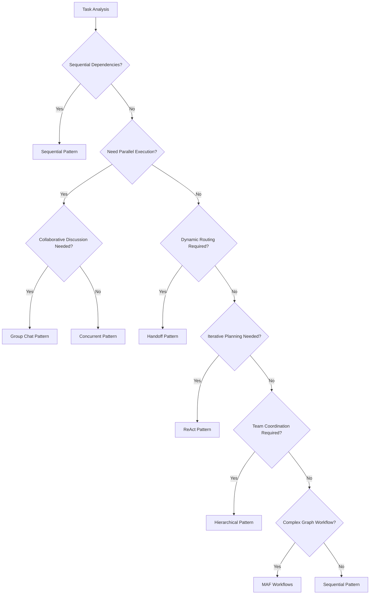

# Orchestration Patterns Deep Dive

## 🎯 Overview

The Foundation Framework provides **7 orchestration patterns** for different multi-agent scenarios. Each pattern is optimized for specific use cases and can be combined to create sophisticated workflows.

## 📊 Pattern Comparison Matrix

| Pattern | Complexity | MAF Integration | Best Use Case | Hackathon Projects |
|---------|------------|-----------------|---------------|-------------------|
| **Sequential** | ⭐ Simple | Native Wrapper | Linear workflows | All projects |
| **Concurrent** | ⭐⭐ Medium | Native Wrapper | Parallel processing | Multi-Modal Research, Data Optimization |
| **Group Chat** | ⭐⭐ Medium | Native Wrapper | Collaborative analysis | Orchestrator Enhancement |
| **Handoff** | ⭐⭐ Medium | Native Wrapper | Dynamic routing | General Purpose Agent |
| **ReAct** | ⭐⭐⭐ Complex | Custom Implementation | Dynamic reasoning | All projects |
| **Hierarchical** | ⭐⭐⭐ Complex | Custom Implementation | Team coordination | Orchestrator Enhancement |
| **MAF Workflows** | ⭐⭐⭐ Complex | Native MAF | Graph-based flows | Advanced scenarios |

---

## 1. Sequential Pattern 🔗

**Purpose**: Execute agents one after another in a defined order, with each agent building on the previous results.

### Implementation

```python
from framework.patterns import SequentialPattern

# Configuration
pattern = SequentialPattern(
    agents=["planner", "researcher", "writer", "reviewer"],
    config={
        "preserve_context": True,
        "fail_fast": False,
        "context_accumulation": "incremental"
    }
)

# Execution
result = await orchestrator.execute(
    task="Create comprehensive research report",
    pattern=pattern,
    metadata={"domain": "technology", "depth": "comprehensive"}
)
```

### MAF Integration
```python
# Internal implementation uses MAF SequentialBuilder
builder = SequentialBuilder()
builder = builder.participants([agent1, agent2, agent3, agent4])
workflow = builder.build()

messages = [ChatMessage(role=Role.USER, contents=[TextContent(text=task)])]
workflow_run = await workflow.run(messages)

# Process events
for event in workflow_run:
    if isinstance(event, WorkflowOutputEvent):
        agent_id = event.source_executor_id
        result = event.output
        # Accumulate context for next agent
```

### Hackathon Use Cases

#### **Orchestrator Enhancement**
```python
# Multi-modal input processing pipeline
sequential_pattern = SequentialPattern(
    agents=["input_analyzer", "content_extractor", "context_builder", "orchestrator_enhancer"],
    config={"multimodal_support": True}
)

# Document → Image → Verbal instruction processing
result = await orchestrator.execute(
    task="Process multi-modal input for orchestration enhancement",
    pattern=sequential_pattern,
    context={
        "documents": document_list,
        "images": image_list, 
        "verbal_instructions": audio_transcript
    }
)
```

#### **Multi-Modal Researcher**
```python
# Research pipeline with specialized agents
research_pipeline = SequentialPattern(
    agents=["topic_analyzer", "source_gatherer", "content_processor", "insight_synthesizer"],
    config={"preserve_context": True, "deep_reasoning": True}
)

result = await orchestrator.execute(
    task="Research AI developments with multimodal analysis",
    pattern=research_pipeline,
    tools=["web_search", "document_analysis", "image_recognition"]
)
```

#### **Data Retrieval Optimization**
```python
# Optimization pipeline
optimization_pipeline = SequentialPattern(
    agents=["data_profiler", "access_analyzer", "optimizer", "validator"],
    config={"entitlement_aware": True}
)

result = await orchestrator.execute(
    task="Optimize data retrieval for large datasets",
    pattern=optimization_pipeline,
    context={"knowledge_graphs": kg_list, "access_patterns": patterns}
)
```

### Best Practices

✅ **DO:**
- Use for workflows with clear dependencies
- Implement context accumulation for complex tasks
- Add validation checkpoints between stages
- Use fail-fast for critical pipelines

❌ **DON'T:**
- Use for independent tasks (use Concurrent instead)
- Create overly long chains (max 5-7 agents)
- Skip error handling between stages

---

## 2. Concurrent Pattern ⚡

**Purpose**: Execute multiple agents simultaneously on the same task for speed and diverse perspectives.

### Implementation

```python
from framework.patterns import ConcurrentPattern

# Configuration
pattern = ConcurrentPattern(
    agents=["analyst1", "analyst2", "analyst3", "domain_expert"],
    config={
        "max_concurrent": 4,
        "aggregation_method": "consensus",
        "timeout": 120,
        "require_all_success": False
    }
)

# Execution with result aggregation
result = await orchestrator.execute(
    task="Analyze market trends from multiple perspectives",
    pattern=pattern,
    metadata={"aggregation": "weighted_consensus"}
)
```

### MAF Integration
```python
# Uses MAF ConcurrentBuilder
builder = ConcurrentBuilder()
builder = builder.participants([agent1, agent2, agent3])  # Minimum 2 agents
workflow = builder.build()

# Execute in parallel
messages = [ChatMessage(role=Role.USER, contents=[TextContent(text=task)])]
workflow_run = await workflow.run(messages)

# Aggregate results from all agents
results = []
for event in workflow_run:
    if isinstance(event, WorkflowOutputEvent):
        results.append({
            "agent": event.source_executor_id,
            "output": event.output.messages[-1].text
        })

# Apply aggregation strategy
final_result = aggregate_results(results, method="consensus")
```

### Hackathon Use Cases

#### **Multi-Modal Researcher**
```python
# Parallel research with specialized agents
multimodal_research = ConcurrentPattern(
    agents=["text_researcher", "image_analyst", "audio_processor", "video_analyzer"],
    config={
        "aggregation_method": "multimodal_synthesis",
        "cross_modal_validation": True
    }
)

result = await orchestrator.execute(
    task="Research topic across all media types",
    pattern=multimodal_research,
    context={
        "input_modalities": ["text", "image", "audio", "video"],
        "synthesis_strategy": "cross_reference"
    }
)
```

#### **Data Retrieval Optimization**
```python
# Parallel data source analysis
data_optimization = ConcurrentPattern(
    agents=["sql_optimizer", "graph_analyzer", "cache_optimizer", "index_analyzer"],
    config={
        "aggregation_method": "performance_weighted",
        "optimization_target": "latency_and_accuracy"
    }
)

result = await orchestrator.execute(
    task="Optimize data retrieval across multiple sources",
    pattern=data_optimization,
    tools=["database_profiler", "query_analyzer", "performance_monitor"]
)
```

#### **Real-Time Call Analysis**
```python
# Parallel analysis of call aspects
call_analysis = ConcurrentPattern(
    agents=["sentiment_analyzer", "topic_extractor", "speaker_identifier", "insight_generator"],
    config={
        "real_time": True,
        "streaming_aggregation": True
    }
)

result = await orchestrator.execute(
    task="Analyze ongoing call in real-time",
    pattern=call_analysis,
    context={"audio_stream": stream, "real_time": True}
)
```

### Aggregation Strategies

#### Consensus-Based
```python
def consensus_aggregation(results: List[Dict]) -> str:
    """Aggregate using weighted consensus."""
    # Find common themes
    themes = extract_themes(results)
    
    # Weight by agent expertise
    weighted_themes = apply_weights(themes, agent_weights)
    
    # Generate consensus summary
    return synthesize_consensus(weighted_themes)
```

#### Performance-Weighted
```python
def performance_weighted_aggregation(results: List[Dict]) -> str:
    """Aggregate based on performance metrics."""
    # Score each result
    scored_results = []
    for result in results:
        score = calculate_performance_score(result)
        scored_results.append((result, score))
    
    # Weighted combination
    return combine_weighted_results(scored_results)
```

---

## 3. ReAct Pattern 🧠

**Purpose**: Reasoning + Acting pattern for dynamic planning and iterative problem-solving.

### Implementation

```python
from framework.patterns import ReActPattern

# Configuration
pattern = ReActPattern(
    agent="strategic_planner",
    config={
        "max_iterations": 10,
        "reflection_enabled": True,
        "dynamic_tool_selection": True,
        "learning_enabled": True
    }
)

# Execution with iterative planning
result = await orchestrator.execute(
    task="Develop comprehensive strategy for complex problem",
    pattern=pattern,
    tools=["web_search", "data_analysis", "document_review"],
    metadata={"complexity": "high", "domain": "business_strategy"}
)
```

### ReAct Loop Implementation

```python
class ReActPattern(OrchestrationPattern):
    async def execute(self, input_data: Any, context: Optional[Dict] = None) -> Any:
        """Execute ReAct loop: Observe → Think → Act → Reflect."""
        
        observations = []
        actions = []
        reflections = []
        
        for iteration in range(self.config.get("max_iterations", 10)):
            # 1. OBSERVE - Gather current context
            observation = await self._observe(input_data, context, actions)
            observations.append(observation)
            
            # 2. THINK - Reason about next action
            thought = await self._think(observation, observations, actions)
            
            # 3. ACT - Take action based on reasoning
            action = await self._act(thought, context)
            actions.append(action)
            
            # 4. REFLECT - Evaluate action effectiveness
            reflection = await self._reflect(action, observations, context)
            reflections.append(reflection)
            
            # Check if goal is achieved
            if await self._goal_achieved(reflection, context):
                break
                
            # Update context for next iteration
            context = self._update_context(context, observation, action, reflection)
        
        return {
            "final_result": actions[-1] if actions else None,
            "reasoning_chain": list(zip(observations, actions, reflections)),
            "iterations": len(actions)
        }
```

### Hackathon Use Cases

#### **Orchestrator Enhancement**
```python
# Dynamic orchestration with plan updating
orchestrator_react = ReActPattern(
    agent="orchestrator_planner",
    config={
        "dynamic_plan_updating": True,
        "multimodal_reasoning": True,
        "agent_discovery": True
    }
)

# Iteratively enhance orchestration based on feedback
result = await orchestrator.execute(
    task="Enhance orchestration for multi-modal input",
    pattern=orchestrator_react,
    context={
        "current_plan": initial_plan,
        "feedback_loop": True,
        "optimization_target": "accuracy_and_speed"
    }
)
```

#### **Multi-Modal Researcher**
```python
# Research with dynamic strategy adaptation
research_react = ReActPattern(
    agent="research_strategist", 
    config={
        "adaptive_strategy": True,
        "source_discovery": True,
        "quality_assessment": True
    }
)

result = await orchestrator.execute(
    task="Research complex topic with adaptive strategy",
    pattern=research_react,
    tools=["web_search", "academic_search", "multimedia_analysis"],
    context={"research_depth": "comprehensive", "time_constraint": 300}
)
```

#### **General Purpose Agent**
```python
# Dynamic capability selection and execution
general_agent_react = ReActPattern(
    agent="general_purpose_planner",
    config={
        "capability_discovery": True,
        "mcp_integration": True,
        "plugin_selection": True
    }
)

result = await orchestrator.execute(
    task="Handle user request with optimal capability selection",
    pattern=general_agent_react,
    context={
        "available_mcps": mcp_list,
        "user_preferences": preferences,
        "dynamic_loading": True
    }
)
```

### ReAct Components Deep Dive

#### Observation Phase
```python
async def _observe(self, input_data, context, previous_actions):
    """Gather comprehensive context for reasoning."""
    return {
        "current_state": self._assess_current_state(context),
        "available_actions": self._discover_actions(context),
        "previous_outcomes": self._analyze_previous_actions(previous_actions),
        "environmental_factors": self._assess_environment(context),
        "success_metrics": self._define_success_criteria(input_data)
    }
```

#### Thinking Phase
```python
async def _think(self, observation, all_observations, all_actions):
    """Reason about next best action."""
    reasoning_prompt = f"""
    Current situation: {observation['current_state']}
    Available actions: {observation['available_actions']}
    Previous actions and outcomes: {self._format_action_history(all_actions)}
    Success criteria: {observation['success_metrics']}
    
    What should be the next action and why?
    Consider:
    1. Progress toward goal
    2. Risk vs benefit
    3. Resource efficiency
    4. Alternative approaches
    """
    
    return await self.agent.process(reasoning_prompt)
```

---

## 4. Group Chat Pattern 💬

**Purpose**: Multi-agent collaborative conversations for consensus building and diverse expertise integration.

### Implementation

```python
from framework.patterns import GroupChatPattern, RoundRobinManager

# Configuration with custom discussion manager
pattern = GroupChatPattern(
    agents=["financial_analyst", "market_researcher", "risk_assessor", "strategist"],
    manager=RoundRobinManager(max_rounds=5),
    config={
        "consensus_threshold": 0.8,
        "discussion_timeout": 300,
        "allow_interruptions": True,
        "expertise_weighting": True
    }
)

# Execution with collaborative analysis
result = await orchestrator.execute(
    task="Analyze investment opportunity through expert discussion",
    pattern=pattern,
    metadata={"discussion_type": "investment_analysis"}
)
```

### MAF Integration
```python
# Uses MAF's GroupChatBuilder with custom manager
from agent_framework import GroupChatBuilder

builder = GroupChatBuilder()
builder = builder.participants([agent1, agent2, agent3, agent4])
builder = builder.manager(custom_manager)  # RoundRobinManager or ConsensusManager
workflow = builder.build()

# Execute collaborative discussion
messages = [ChatMessage(role=Role.USER, contents=[TextContent(text=discussion_topic)])]
workflow_run = await workflow.run(messages)

# Track discussion flow
discussion_history = []
for event in workflow_run:
    if isinstance(event, WorkflowOutputEvent):
        discussion_history.append({
            "speaker": event.source_executor_id,
            "message": event.output.messages[-1].text,
            "timestamp": datetime.utcnow()
        })
```

### Discussion Managers

#### Round-Robin Manager
```python
class RoundRobinManager:
    """Manages turn-based discussion."""
    
    def __init__(self, max_rounds: int = 3):
        self.max_rounds = max_rounds
        self.current_round = 0
        self.participant_index = 0
    
    async def select_next_speaker(self, participants, discussion_history):
        """Select next participant in round-robin fashion."""
        if self.current_round >= self.max_rounds:
            return None  # End discussion
        
        speaker = participants[self.participant_index]
        self.participant_index = (self.participant_index + 1) % len(participants)
        
        if self.participant_index == 0:
            self.current_round += 1
        
        return speaker
```

#### Consensus Manager
```python
class ConsensusManager:
    """Manages discussion until consensus is reached."""
    
    def __init__(self, consensus_threshold: float = 0.8):
        self.consensus_threshold = consensus_threshold
    
    async def select_next_speaker(self, participants, discussion_history):
        """Select speaker based on consensus analysis."""
        # Analyze current consensus level
        consensus_score = await self._analyze_consensus(discussion_history)
        
        if consensus_score >= self.consensus_threshold:
            return None  # Consensus reached
        
        # Select participant with most divergent view
        return await self._select_divergent_speaker(participants, discussion_history)
```

### Hackathon Use Cases

#### **Orchestrator Enhancement**
```python
# Multi-expert orchestration planning
orchestration_discussion = GroupChatPattern(
    agents=["orchestration_architect", "performance_optimizer", "security_expert", "ux_designer"],
    manager=ConsensusManager(consensus_threshold=0.85),
    config={"expertise_domains": ["architecture", "performance", "security", "usability"]}
)

result = await orchestrator.execute(
    task="Design enhanced orchestration system through expert collaboration",
    pattern=orchestration_discussion,
    context={"requirements": requirements, "constraints": constraints}
)
```

#### **Multi-Modal Researcher**
```python
# Collaborative research analysis
research_discussion = GroupChatPattern(
    agents=["text_expert", "visual_expert", "audio_expert", "synthesis_expert"],
    manager=RoundRobinManager(max_rounds=4),
    config={"cross_modal_validation": True}
)

result = await orchestrator.execute(
    task="Collaborative analysis of multi-modal research findings",
    pattern=research_discussion,
    context={"research_data": multimodal_data, "validation_required": True}
)
```

---

## 5. Handoff Pattern 🔄

**Purpose**: Dynamic agent delegation and routing based on expertise and context.

### Implementation

```python
from framework.patterns import HandoffPattern

# Configuration with routing rules
pattern = HandoffPattern(
    initial_agent="triage_agent",
    agents=["specialist1", "specialist2", "specialist3", "escalation_agent"],
    config={
        "max_handoffs": 3,
        "routing_strategy": "expertise_based",
        "context_preservation": True,
        "escalation_enabled": True
    }
)

# Add routing rules
pattern.add_handoff("triage_agent", "specialist1", "financial_queries")
pattern.add_handoff("triage_agent", "specialist2", "technical_queries") 
pattern.add_handoff("specialist1", "escalation_agent", "complex_analysis_needed")

# Execution with dynamic routing
result = await orchestrator.execute(
    task="Handle customer query with appropriate specialist",
    pattern=pattern,
    metadata={"query_type": "unknown", "priority": "high"}
)
```

### Routing Implementation
```python
class HandoffPattern(OrchestrationPattern):
    def __init__(self, initial_agent: str, agents: List[str]):
        self.initial_agent = initial_agent
        self.agents = agents
        self.handoff_rules = {}  # agent -> [(condition, target_agent)]
    
    def add_handoff(self, from_agent: str, to_agent: str, condition: str):
        """Add routing rule between agents."""
        if from_agent not in self.handoff_rules:
            self.handoff_rules[from_agent] = []
        self.handoff_rules[from_agent].append((condition, to_agent))
    
    async def execute(self, input_data: Any, context: Dict = None) -> Any:
        """Execute with dynamic handoffs."""
        current_agent = self.initial_agent
        handoff_chain = [current_agent]
        conversation_context = []
        
        for handoff_count in range(self.config.get("max_handoffs", 5)):
            # Execute current agent
            agent_result = await self._execute_agent(current_agent, input_data, conversation_context)
            conversation_context.append({
                "agent": current_agent,
                "result": agent_result,
                "timestamp": datetime.utcnow()
            })
            
            # Determine if handoff is needed
            next_agent = await self._determine_handoff(current_agent, agent_result, context)
            
            if not next_agent:
                # No handoff needed, return current result
                break
            
            current_agent = next_agent
            handoff_chain.append(current_agent)
        
        return {
            "final_result": conversation_context[-1]["result"],
            "handoff_chain": handoff_chain,
            "conversation_history": conversation_context
        }
```

### Hackathon Use Cases

#### **General Purpose Agent**
```python
# Dynamic capability selection with handoffs
general_purpose_handoff = HandoffPattern(
    initial_agent="capability_router",
    agents=["text_processor", "image_analyzer", "code_generator", "data_analyst", "integration_specialist"]
)

# Add capability-based routing
general_purpose_handoff.add_handoff("capability_router", "text_processor", "text_processing_needed")
general_purpose_handoff.add_handoff("capability_router", "image_analyzer", "image_analysis_needed")
general_purpose_handoff.add_handoff("text_processor", "integration_specialist", "mcp_integration_needed")

result = await orchestrator.execute(
    task="Handle diverse user request with optimal agent selection",
    pattern=general_purpose_handoff,
    context={"available_capabilities": capabilities, "user_context": user_profile}
)
```

#### **Real-Time Call Analysis**
```python
# Dynamic analysis routing based on call characteristics
call_analysis_handoff = HandoffPattern(
    initial_agent="call_classifier",
    agents=["sales_analyzer", "support_analyzer", "escalation_handler", "sentiment_specialist"]
)

# Route based on call type
call_analysis_handoff.add_handoff("call_classifier", "sales_analyzer", "sales_call_detected")
call_analysis_handoff.add_handoff("call_classifier", "support_analyzer", "support_call_detected")
call_analysis_handoff.add_handoff("sales_analyzer", "escalation_handler", "negative_sentiment_detected")

result = await orchestrator.execute(
    task="Analyze call with appropriate specialist routing",
    pattern=call_analysis_handoff,
    context={"call_stream": audio_stream, "real_time": True}
)
```

---

## 6. Hierarchical Pattern 🏢

**Purpose**: Manager-worker coordination with task allocation and result aggregation.

### Implementation

```python
from framework.patterns import HierarchicalPattern

# Configuration with team structure
pattern = HierarchicalPattern(
    manager="project_manager",
    workers=["developer", "designer", "qa_tester", "analyst"],
    config={
        "allocation_strategy": "capability_based",
        "parallel_execution": True,
        "quality_gates": True,
        "progress_tracking": True
    }
)

# Execution with team coordination
result = await orchestrator.execute(
    task="Develop comprehensive solution with coordinated team effort",
    pattern=pattern,
    metadata={"project_complexity": "high", "deadline": "urgent"}
)
```

### Team Coordination Implementation
```python
class HierarchicalPattern(OrchestrationPattern):
    async def execute(self, input_data: Any, context: Dict = None) -> Any:
        """Execute with manager-worker coordination."""
        
        # 1. Manager creates execution plan
        manager = await self.registry.get_agent(self.manager)
        execution_plan = await manager.create_plan(input_data, context)
        
        # 2. Break down into worker tasks
        worker_tasks = await self._allocate_tasks(execution_plan, self.workers)
        
        # 3. Execute worker tasks (parallel or sequential)
        if self.config.get("parallel_execution", True):
            worker_results = await self._execute_parallel_tasks(worker_tasks)
        else:
            worker_results = await self._execute_sequential_tasks(worker_tasks)
        
        # 4. Manager reviews and integrates results
        final_result = await manager.integrate_results(worker_results, execution_plan)
        
        return {
            "final_result": final_result,
            "execution_plan": execution_plan,
            "worker_contributions": worker_results,
            "management_decisions": manager.get_decisions()
        }
    
    async def _allocate_tasks(self, plan: Dict, workers: List[str]) -> Dict:
        """Allocate tasks to workers based on capabilities."""
        allocation = {}
        
        for task in plan["tasks"]:
            # Find best worker for task
            best_worker = await self._select_worker_for_task(task, workers)
            
            if best_worker not in allocation:
                allocation[best_worker] = []
            allocation[best_worker].append(task)
        
        return allocation
```

### Hackathon Use Cases

#### **Orchestrator Enhancement**
```python
# Coordinated orchestration development team
orchestration_team = HierarchicalPattern(
    manager="orchestration_architect",
    workers=["pattern_developer", "integration_specialist", "performance_optimizer", "testing_coordinator"],
    config={
        "allocation_strategy": "expertise_based",
        "quality_gates": ["design_review", "performance_test", "integration_test"]
    }
)

result = await orchestrator.execute(
    task="Develop enhanced orchestration system with coordinated team",
    pattern=orchestration_team,
    context={"enhancement_requirements": requirements, "timeline": timeline}
)
```

---

## 7. MAF Workflows Pattern 🔗

**Purpose**: Native Microsoft Agent Framework graph-based workflows with visual representation.

### Implementation

```python
from agent_framework import WorkflowBuilder

async def create_research_workflow():
    """Create sophisticated research workflow using native MAF."""
    
    # Get agent instances
    planner = await registry.get_agent("research_planner")
    researchers = [
        await registry.get_agent("web_researcher"),
        await registry.get_agent("academic_researcher"), 
        await registry.get_agent("expert_interviewer")
    ]
    synthesizer = await registry.get_agent("research_synthesizer")
    reviewer = await registry.get_agent("quality_reviewer")
    
    # Build graph-based workflow
    workflow = (
        WorkflowBuilder()
        .set_start_executor(planner)                          # Start with planning
        .add_fan_out_edges(planner, researchers)              # Fan out to researchers
        .add_fan_in_edges(researchers, synthesizer)           # Fan in to synthesis
        .add_edge(synthesizer, reviewer)                      # Final review
        .build()
    )
    
    return workflow

# Execute native MAF workflow
workflow = await create_research_workflow()
messages = [ChatMessage(role=Role.USER, contents=[TextContent(text="Research AI safety")])]
result = await workflow.run(messages)
```

### Advanced MAF Patterns

#### Conditional Routing
```python
async def create_conditional_workflow():
    """Workflow with conditional execution paths."""
    
    classifier = await registry.get_agent("content_classifier")
    text_processor = await registry.get_agent("text_processor")
    image_processor = await registry.get_agent("image_processor")
    synthesizer = await registry.get_agent("multi_modal_synthesizer")
    
    workflow = (
        WorkflowBuilder()
        .set_start_executor(classifier)
        .add_conditional_edge(
            classifier, 
            condition=lambda result: "text" in result.content_types,
            true_executor=text_processor,
            false_executor=image_processor
        )
        .add_fan_in_edges([text_processor, image_processor], synthesizer)
        .build()
    )
    
    return workflow
```

#### Loop Patterns
```python
async def create_iterative_workflow():
    """Workflow with iterative refinement loops."""
    
    analyzer = await registry.get_agent("content_analyzer")
    refiner = await registry.get_agent("content_refiner")
    validator = await registry.get_agent("quality_validator")
    
    workflow = (
        WorkflowBuilder()
        .set_start_executor(analyzer)
        .add_edge(analyzer, refiner)
        .add_edge(refiner, validator)
        .add_conditional_edge(
            validator,
            condition=lambda result: result.quality_score < 0.8,
            true_executor=refiner,    # Loop back for refinement
            false_executor=None       # End workflow
        )
        .build()
    )
    
    return workflow
```

---

## 🎯 Pattern Selection Guide

### Decision Tree



### Hackathon Project Mapping

| Project | Primary Pattern | Secondary Pattern | Rationale |
|---------|----------------|-------------------|-----------|
| **Orchestrator Enhancement** | ReAct + Hierarchical | MAF Workflows | Dynamic planning with team coordination |
| **Multi-Modal Researcher** | Sequential + Concurrent | Group Chat | Pipeline processing with parallel analysis |
| **Data Retrieval Optimization** | ReAct + Concurrent | Sequential | Iterative optimization with parallel testing |
| **General Purpose Agent** | Handoff + ReAct | All patterns | Dynamic capability selection and routing |
| **Real-Time Call Analysis** | Concurrent + Handoff | Sequential | Parallel analysis with dynamic routing |

---

## 🔜 Next Steps

Now let's dive into implementing MAF-compliant agents that work with these patterns:

[→ Continue to Agent Implementation Guide](./04-agent-implementation.md)

---

## 📚 Pattern Combination Examples

Advanced scenarios often combine multiple patterns:

```python
# Example: Multi-stage workflow with different patterns per stage
async def complex_research_workflow(orchestrator, topic: str):
    # Stage 1: Planning (ReAct)
    plan = await orchestrator.execute(
        task=f"Create comprehensive research plan for {topic}",
        pattern=ReActPattern(agent="strategic_planner"),
        tools=["web_search", "academic_search"]
    )
    
    # Stage 2: Research (Concurrent)
    research = await orchestrator.execute(
        task=f"Execute parallel research on {topic}",
        pattern=ConcurrentPattern(agents=["web_researcher", "academic_researcher", "expert_researcher"]),
        context=plan
    )
    
    # Stage 3: Analysis (Group Chat)
    analysis = await orchestrator.execute(
        task="Collaborative analysis of research findings",
        pattern=GroupChatPattern(agents=["analyst1", "analyst2", "domain_expert"]),
        context=research
    )
    
    # Stage 4: Synthesis (Sequential)
    final_report = await orchestrator.execute(
        task="Create final research report",
        pattern=SequentialPattern(agents=["synthesizer", "editor", "reviewer"]),
        context=analysis
    )
    
    return final_report
```