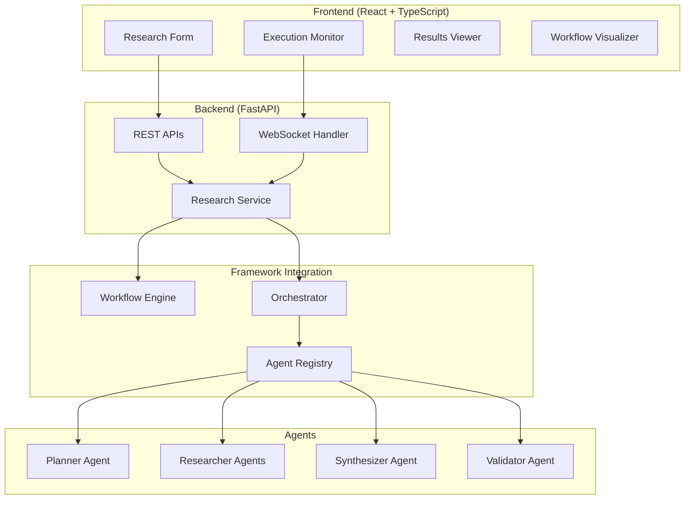
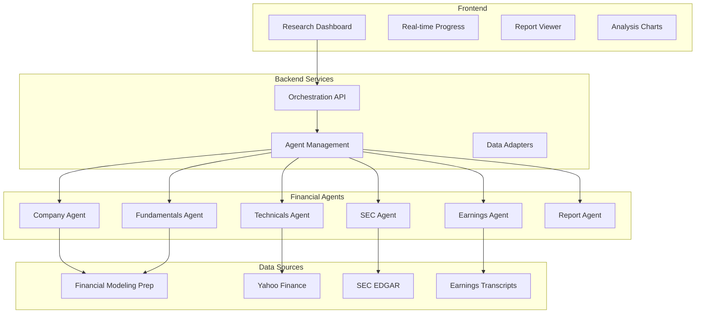
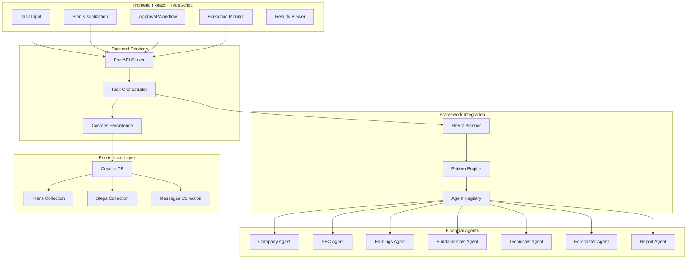
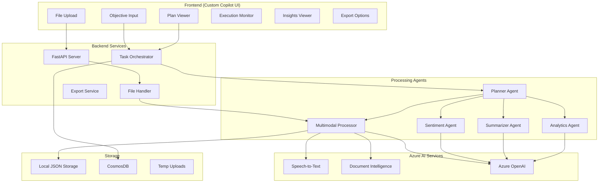

# Reference Applications Analysis

## 🎯 Overview

Our reference applications demonstrate real-world implementations of the Microsoft Agent Framework and our orchestration patterns. They provide concrete examples that you can study, extend, and adapt for your hackathon projects.

## 📊 Reference Applications Comparison

| Application | Focus Area | Execution Modes | Patterns Used | Hackathon Relevance |
|-------------|------------|-----------------|---------------|-------------------|
| **Deep Research App** | Multi-modal research workflows | 3 modes (YAML, Code, MAF) | Sequential, Concurrent, MAF Workflows | Multi-Modal Researcher, Orchestrator Enhancement |
| **Financial Research App (Static)** | Static financial analysis | Code-based (4 patterns) | Sequential, Concurrent, Handoff, GroupChat | Pattern demonstrations, Multi-pattern execution |
| **Financial Research App (Dynamic)** | Dynamic financial planning | ReAct + Human-in-the-loop | ReAct, Handoff, Synthesis Pattern | Data Optimization, General Purpose Agent, Dynamic Planning |
| **Multimodal Insights App** | Multimodal content analysis | ReAct + Handoff + GroupChat | ReAct, Handoff, GroupChat | Multi-Modal Researcher, Real-Time Analysis, Custom Copilot |

---

## 🔬 Deep Research Application

### Architecture Overview

The Deep Research App showcases all three execution paradigms and demonstrates how to build production-ready research workflows.



### Key Components Analysis

#### 1. AIResearchAgent Implementation

```python
# Location: deep_research_app/backend/app/main.py

class AIResearchAgent(BaseAgent):
    """Production-ready research agent with MAF compliance."""
    
    def __init__(self, agent_id: str, name: str, description: str, azure_client, model: str, system_prompt: str):
        super().__init__(name=name, description=description)
        self.agent_id = agent_id
        self.azure_client = azure_client
        self.model = model
        self.system_prompt = system_prompt
    
    async def run(self, messages, *, thread=None, **kwargs) -> AgentRunResponse:
        """MAF-compliant execution method."""
        # 1. Message normalization
        normalized_messages = self._normalize_messages(messages)
        
        # 2. Context extraction from framework
        context = kwargs.get('context', {})
        
        # 3. Enhanced prompt building
        prompt = self._build_prompt(
            normalized_messages[-1].text if normalized_messages else "",
            context
        )
        
        # 4. Azure OpenAI integration
        response = await asyncio.to_thread(
            self.azure_client.chat.completions.create,
            model=self.model,
            messages=[
                {"role": "system", "content": self.system_prompt},
                {"role": "user", "content": prompt}
            ],
            temperature=0.7,
            max_tokens=2000
        )
        
        # 5. MAF response creation
        result_text = response.choices[0].message.content
        response_message = ChatMessage(
            role=Role.ASSISTANT,
            contents=[TextContent(text=result_text)]
        )
        
        # 6. Thread notification for conversation continuity
        if thread:
            await self._notify_thread_of_new_messages(
                thread, normalized_messages, response_message
            )
        
        return AgentRunResponse(messages=[response_message])
    
    def _build_prompt(self, message_content: str, context: Dict[str, Any]) -> str:
        """Context-aware prompt building."""
        prompt_parts = [f"Research Task: {message_content}"]
        
        # Add orchestration context
        if 'findings' in context:
            prompt_parts.append(f"Previous Research: {context['findings']}")
        
        if 'plan' in context:
            prompt_parts.append(f"Research Plan: {context['plan']}")
        
        # Add execution metadata
        execution_mode = context.get('execution_mode', 'unknown')
        prompt_parts.append(f"Execution Mode: {execution_mode}")
        
        return "\n\n".join(prompt_parts)
```

**Key Learnings:**
- ✅ Proper MAF interface implementation
- ✅ Context integration from orchestration patterns
- ✅ Thread management for conversation continuity
- ✅ Graceful error handling and logging

#### 2. Three Execution Modes Implementation

##### Mode 1: YAML Workflows (Declarative)

```yaml
# Location: deep_research_app/workflows/deep_research.yaml

name: deep_research_workflow
description: "Comprehensive research workflow with validation"

agents:
  planner: "research_planner"
  researcher1: "core_researcher" 
  researcher2: "current_trends_researcher"
  researcher3: "comparative_researcher"
  synthesizer: "research_synthesizer"
  reviewer: "quality_reviewer"
  summarizer: "executive_summarizer"

tasks:
  - id: planning
    type: agent
    agent: planner
    description: "Create comprehensive research plan"
    timeout: 60
    
  - id: core_research
    type: agent
    agent: researcher1
    description: "Core topic research"
    dependencies: [planning]
    timeout: 120
    
  - id: trends_research
    type: agent
    agent: researcher2
    description: "Current trends analysis"
    dependencies: [planning]
    timeout: 120
    
  - id: comparative_research
    type: agent
    agent: researcher3
    description: "Comparative analysis"
    dependencies: [planning]
    timeout: 120
    
  - id: synthesis
    type: agent
    agent: synthesizer
    description: "Synthesize all research findings"
    dependencies: [core_research, trends_research, comparative_research]
    timeout: 180
    
  - id: review
    type: agent
    agent: reviewer
    description: "Quality review and validation"
    dependencies: [synthesis]
    timeout: 120
    
  - id: summary
    type: agent
    agent: summarizer
    description: "Executive summary creation"
    dependencies: [review]
    timeout: 60
```

**Implementation Details:**
```python
# Location: deep_research_app/backend/app/main.py

async def execute_research_yaml(execution_id: str, topic: str, depth: str, max_sources: int, include_citations: bool):
    """Execute using YAML workflow engine."""
    
    # Load workflow definition
    workflow_path = Path("workflows/deep_research.yaml")
    workflow_engine = WorkflowEngine(agent_registry)
    
    # Execute with context
    context = {
        "topic": topic,
        "depth": depth,
        "max_sources": max_sources,
        "include_citations": include_citations,
        "execution_id": execution_id
    }
    
    # Progress tracking
    def progress_callback(task_id: str, status: str, result: str = None):
        # Update real-time progress via WebSocket
        asyncio.create_task(update_execution_progress(execution_id, task_id, status, result))
    
    # Execute workflow
    result = await workflow_engine.execute_workflow(
        workflow_path, 
        context, 
        progress_callback=progress_callback
    )
    
    return result
```

##### Mode 2: Code-Based (Programmatic)

```python
async def execute_research_programmatically(
    agent_registry: AgentRegistry,
    orchestrator_instance: MagenticOrchestrator,
    execution_id: str,
    topic: str,
    depth: str,
    max_sources: int,
    include_citations: bool
) -> Dict[str, Any]:
    """Code-based execution with framework patterns."""
    
    results = {}
    
    # Phase 1: Sequential Planning
    logger.info("Phase 1 - Sequential Planning with SequentialPattern")
    
    planning_result = await orchestrator_instance.execute(
        task=f"Create comprehensive research plan for: {topic}",
        pattern=SequentialPattern(agents=["planner"]),
        metadata={
            "execution_id": execution_id,
            "phase": "planning",
            "depth": depth,
            "max_sources": max_sources
        }
    )
    
    results["planning"] = planning_result
    
    # Phase 2: Concurrent Research
    logger.info("Phase 2 - Concurrent Research with ConcurrentPattern")
    
    research_result = await orchestrator_instance.execute(
        task=f"Execute parallel research on: {topic}",
        pattern=ConcurrentPattern(
            agents=["core_researcher", "trends_researcher", "comparative_researcher"],
            config={"aggregation_method": "comprehensive_merge"}
        ),
        context={"plan": planning_result, "topic": topic},
        metadata={
            "execution_id": execution_id,
            "phase": "research",
            "parallel_execution": True
        }
    )
    
    results["research"] = research_result
    
    # Phase 3: Sequential Synthesis and Review
    logger.info("Phase 3 - Sequential Synthesis with SequentialPattern")
    
    synthesis_result = await orchestrator_instance.execute(
        task="Synthesize research findings and create final report",
        pattern=SequentialPattern(agents=["synthesizer", "reviewer", "summarizer"]),
        context={
            "findings": research_result,
            "plan": planning_result,
            "topic": topic,
            "include_citations": include_citations
        },
        metadata={
            "execution_id": execution_id,
            "phase": "synthesis"
        }
    )
    
    results["synthesis"] = synthesis_result
    
    return {
        "plan": planning_result,
        "findings": research_result,
        "report": synthesis_result["synthesizer"]["result"],
        "validation": synthesis_result["reviewer"]["result"], 
        "summary": synthesis_result["summarizer"]["result"]
    }
```

##### Mode 3: MAF Workflows (Graph-Based)

```python
async def execute_research_maf_workflow(
    agent_registry: AgentRegistry,
    execution_id: str,
    topic: str,
    depth: str,
    max_sources: int,
    include_citations: bool
) -> Dict[str, Any]:
    """Native MAF workflow execution with graph patterns."""
    
    # Get agent instances
    planner = await agent_registry.get_agent("research_planner")
    researchers = [
        await agent_registry.get_agent("core_researcher"),
        await agent_registry.get_agent("trends_researcher"),
        await agent_registry.get_agent("comparative_researcher")
    ]
    synthesizer = await agent_registry.get_agent("research_synthesizer")
    reviewer = await agent_registry.get_agent("quality_reviewer")
    summarizer = await agent_registry.get_agent("executive_summarizer")
    
    # Build MAF workflow with fan-out/fan-in pattern
    from agent_framework import WorkflowBuilder
    
    workflow = (
        WorkflowBuilder()
        .set_start_executor(planner)                          # Start with planning
        .add_fan_out_edges(planner, researchers)              # Fan out to parallel researchers
        .add_fan_in_edges(researchers, synthesizer)           # Fan in to synthesis
        .add_edge(synthesizer, reviewer)                      # Sequential review
        .add_edge(reviewer, summarizer)                       # Final summary
        .build()
    )
    
    # Create MAF-compatible messages
    messages = [ChatMessage(
        role=Role.USER,
        contents=[TextContent(text=f"Conduct comprehensive research on: {topic}")]
    )]
    
    # Execute workflow
    workflow_run = await workflow.run(messages)
    
    # Process results
    results = {}
    for event in workflow_run:
        if isinstance(event, WorkflowOutputEvent):
            agent_id = event.source_executor_id
            output = event.output
            
            if hasattr(output, 'messages') and output.messages:
                results[agent_id] = output.messages[-1].text
    
    return results
```

### Hackathon Implementation Insights

#### For Multi-Modal Researcher Project:

**Key Patterns to Adopt:**
```python
# Multi-modal context integration (from Deep Research App)
def build_multimodal_prompt(task: str, context: Dict) -> str:
    """Build prompts with multi-modal context."""
    prompt_parts = [f"Task: {task}"]
    
    # Document context
    if 'documents' in context:
        prompt_parts.append(f"Document Analysis: {len(context['documents'])} documents processed")
    
    # Image context  
    if 'images' in context:
        prompt_parts.append(f"Visual Analysis: {len(context['images'])} images analyzed")
    
    # Audio context
    if 'audio_transcripts' in context:
        prompt_parts.append(f"Audio Analysis: {len(context['audio_transcripts'])} transcripts processed")
    
    return "\n\n".join(prompt_parts)

# Concurrent pattern for multi-modal processing
multimodal_pattern = ConcurrentPattern(
    agents=["text_processor", "image_analyzer", "audio_processor"],
    config={"cross_modal_validation": True}
)
```

#### For Orchestrator Enhancement Project:

**Dynamic Plan Updating (inspired by Deep Research's adaptive execution):**
```python
async def adaptive_orchestration(orchestrator, initial_plan: Dict, feedback: Dict):
    """Implement adaptive orchestration with plan updating."""
    
    # Analyze execution feedback
    adaptation_needed = await analyze_execution_feedback(feedback)
    
    if adaptation_needed:
        # Use ReAct pattern for plan updating
        updated_plan = await orchestrator.execute(
            task="Update orchestration plan based on execution feedback",
            pattern=ReActPattern(
                agent="orchestration_planner",
                config={"max_iterations": 5, "adaptation_mode": True}
            ),
            context={
                "original_plan": initial_plan,
                "execution_feedback": feedback,
                "performance_metrics": feedback.get("metrics", {})
            }
        )
        
        return updated_plan
    
    return initial_plan
```

---

## 💰 Financial Research Application (Static)

### Architecture Overview

The original Financial Research App (in `finagent_app/`) demonstrates production-grade multi-pattern orchestration with specialized financial agents.



### Key Features

- **4 Orchestration Patterns**: Sequential, Concurrent, Handoff, GroupChat
- **6 Specialized Agents**: Company, SEC, Earnings, Fundamentals, Technicals, Report
- **Multi-source Data**: FMP, Yahoo Finance, SEC EDGAR
- **PDF Report Generation**: Professional equity research briefs
- **Real-time Progress Tracking**: WebSocket-based updates

### Hackathon Implementation Insights

#### For Data Retrieval Optimization Project:

**Multi-Source Data Integration Pattern:**
```python
# Inspired by Financial App's data integration
class DataOptimizationAgent(BaseAgent):
    """Optimize data retrieval across multiple sources."""
    
    async def optimize_data_retrieval(self, sources: List[Dict], query_patterns: List[Dict]):
        """Implement optimization strategies."""
        
        # Analyze current performance
        performance_metrics = await self._analyze_current_performance(sources)
        
        # Identify bottlenecks
        bottlenecks = await self._identify_bottlenecks(performance_metrics, query_patterns)
        
        # Generate optimization strategies
        optimization_plan = await self._generate_optimization_plan(bottlenecks)
        
        return optimization_plan
```

---

## 💼 Financial Research Application (Dynamic Planning)

### Architecture Overview

The Dynamic Financial Research App (`finagent_dynamic_app/`) demonstrates production-grade **dynamic planning** with human-in-the-loop approval workflow.



### Key Implementation Patterns

#### 1. Dynamic Planning with Task Orchestrator

```python
# Location: finagent_dynamic_app/backend/app/services/task_orchestrator.py

class TaskOrchestrator:
    """
    Orchestrates task planning and execution using framework patterns.
    
    Key Features:
    - ReAct pattern for dynamic planning
    - Handoff pattern for specialist routing
    - Context-aware agent selection
    - Human-in-the-loop approval workflow
    """
    
    async def create_plan(self, request: PlanRequest) -> Plan:
        """Create dynamic plan using ReAct pattern."""
        
        # Use ReAct pattern for iterative planning
        planning_result = await self.orchestrator.execute(
            task=f"Create comprehensive analysis plan for {request.ticker}",
            pattern=ReActPattern(
                agent="financial_planner",
                config={
                    "max_iterations": 10,
                    "dynamic_adaptation": True,
                    "market_awareness": True
                }
            ),
            context={
                "ticker": request.ticker,
                "analysis_scope": request.scope,
                "market_conditions": await self._get_market_context(),
                "available_agents": await self._get_available_agents(),
                "data_sources": await self._get_data_sources()
            }
        )
        
        # Parse plan from LLM response
        plan = self._parse_plan_from_response(planning_result)
        
        # Store in Cosmos DB for approval workflow
        await self.cosmos.store_plan(plan)
        
        return plan
    
    async def execute_step(self, step: Step, feedback: HumanFeedback) -> ActionResponse:
        """Execute step using appropriate pattern based on complexity."""
        
        # Pattern selection based on step requirements
        if len(step.required_agents) > 1:
            # Multi-agent collaboration required
            pattern = GroupChatPattern(
                agents=step.required_agents,
                manager=ConsensusManager(consensus_threshold=0.8)
            )
        else:
            # Single agent with potential handoff
            pattern = HandoffPattern(
                initial_agent=step.agent,
                agents=await self._get_specialist_agents(step.domain)
            )
        
        # Execute with comprehensive context
        result = await self.orchestrator.execute(
            task=step.action,
            pattern=pattern,
            tools=step.tools,
            context={
                "step_id": step.id,
                "ticker": feedback.ticker,
                "session_context": await self._get_session_context(step),
                "dependency_artifacts": await self._get_dependency_artifacts(step)
            }
        )
        
        return result
```

#### 2. Synthesis Agent Pattern

**The Dual-Context Pattern** - A key innovation in the dynamic app:

```python
# Location: finagent_dynamic_app/docs/SYNTHESIS_AGENT_PATTERN.md

class SynthesisAgentPattern:
    """
    Demonstrates dual-context pattern for different agent types:
    
    1. Data Gathering Agents: Use dependency_artifacts (focused context)
    2. Synthesis Agents: Use session_context (comprehensive context)
    """
    
    def _is_synthesis_agent(self, step: Step) -> bool:
        """Determine if agent needs comprehensive context."""
        synthesis_agents = [AgentType.FORECASTER, AgentType.REPORT]
        return step.agent in synthesis_agents
    
    async def _get_context_for_agent(self, step: Step) -> Dict[str, Any]:
        """Get appropriate context based on agent type."""
        
        if self._is_synthesis_agent(step):
            # Synthesis agents need ALL previous step outputs
            return await self._get_session_context(step)
        else:
            # Regular agents only need explicit dependencies
            return await self._get_dependency_artifacts(step)
    
    async def _get_session_context(self, step: Step) -> Dict[str, Any]:
        """Get comprehensive session context for synthesis agents."""
        all_steps = await self.cosmos.get_steps_by_plan(step.plan_id, step.session_id)
        previous_completed = [
            s for s in all_steps 
            if s.status == COMPLETED and s.order < step.order
        ]
        
        return {
            "session_context": [
                {
                    "step_order": s.order,
                    "agent": s.agent.value,
                    "action": s.action,
                    "tools": s.tools,
                    "result": s.agent_reply
                }
                for s in previous_completed
            ]
        }
```

**Why This Matters:**
- **Efficiency**: Data gathering agents don't get overwhelmed with irrelevant context
- **Comprehensiveness**: Synthesis agents see the full picture for better analysis
- **Automatic Discovery**: No need to manually declare all dependencies
- **Production-Ready**: Implements enterprise-grade context management

#### 3. Human-in-the-Loop Approval Workflow

```python
# User submits objective
plan = await orchestrator.create_plan(PlanRequest(
    ticker="MSFT",
    objective="Analyze investment potential",
    scope=["sec", "earnings", "fundamentals", "technicals", "forecast"]
))

# User reviews and approves specific steps
await orchestrator.approve_steps(
    plan_id=plan.id,
    session_id=session.id,
    approved_steps=[1, 2, 3, 4, 5]  # User selects which steps to execute
)

# Execute approved steps with real-time updates
execution = await orchestrator.execute_plan(plan.id, session.id)
```

### Key Features for Hackathon

1. **ReAct Planning**: Dynamic, iterative plan generation based on objectives
2. **CosmosDB Persistence**: Enterprise-grade storage for plans, steps, and conversations
3. **Dual-Context Pattern**: Optimized context management for different agent types
4. **Human Approval**: Review and approve plans before execution
5. **Synthesis Agents**: Forecaster and Report agents with comprehensive context
6. **Tool Integration**: MCP tools for data retrieval and analysis

### Hackathon Implementation Insights

#### For General Purpose Agent Project:

**Dynamic Capability Selection:**
```python
# Inspired by Financial Dynamic App's agent specialization
class GeneralPurposeRouter(BaseAgent):
    """Route requests to specialized agents based on context."""
    
    async def route_request(self, user_request: str, available_agents: List[str]):
        """Dynamically route to best agent."""
        
        # Analyze request to determine required capabilities
        routing_decision = await self.orchestrator.execute(
            task=f"Analyze request and route to optimal agent: {user_request}",
            pattern=HandoffPattern(
                initial_agent="request_analyzer",
                agents=available_agents
            ),
            context={
                "available_capabilities": await self._get_agent_capabilities(),
                "user_context": await self._get_user_context(),
                "performance_history": await self._get_agent_performance_history()
            }
        )
        
        return routing_decision
```

#### For Data Retrieval Optimization Project:

**CosmosDB Persistence Pattern:**
```python
class OptimizedDataRetrieval:
    """Implement caching and persistence for optimal retrieval."""
    
    async def retrieve_with_cache(self, query: Dict) -> Dict:
        """Retrieve data with intelligent caching."""
        
        # Check Cosmos cache first
        cached = await self.cosmos.get_cached_result(query)
        if cached and not self._is_stale(cached):
            return cached
        
        # Retrieve fresh data
        fresh_data = await self._fetch_from_source(query)
        
        # Store in Cosmos for future use
        await self.cosmos.store_result(query, fresh_data)
        
        return fresh_data
```

---

## 🎨 Multimodal Insights Application

### Architecture Overview

The Multimodal Insights App (`multimodal_insights_app/`) demonstrates a **Custom Copilot-style experience** for processing and analyzing multimodal content (audio, video, PDF).



### Key Features

1. **Multimodal Input Processing**
   - **Audio**: Transcription via Azure Speech-to-Text
   - **Video**: Audio extraction + transcription, frame analysis
   - **PDF**: Content extraction via Azure Document Intelligence
   - **Metadata**: Comprehensive metadata extraction and storage

2. **Specialized Agents**
   - **Multimodal Processor**: Extract and process content from various formats
   - **Sentiment Agent**: Multi-dimensional sentiment analysis
   - **Summarizer Agent**: Multi-level and persona-based summaries
   - **Analytics Agent**: Context-aware insights and pattern recognition
   - **Planner Agent**: ReAct-based dynamic planning

3. **Orchestration Patterns**
   - **ReAct Pattern**: Dynamic planning with iterative reasoning
   - **Handoff Pattern**: Single-agent task execution
   - **GroupChat Pattern**: Multi-agent collaboration for complex analysis

4. **Custom Copilot Experience**
   - Upload multiple files
   - Enter analysis objectives
   - Review and approve execution plan
   - Monitor real-time progress
   - Export results in multiple formats (Markdown, PDF, JSON)

### Implementation Highlights

#### 1. Multimodal Processing Agent

```python
# Location: multimodal_insights_app/backend/app/agents/multimodal_processor_agent.py

class MultimodalProcessorAgent(BaseAgent):
    """Process audio, video, and PDF files using Azure AI services."""
    
    async def process_file(self, file_path: str, file_type: str, session_id: str) -> Dict:
        """Process file based on type."""
        
        if file_type in ["audio/mpeg", "audio/wav", "audio/mp3"]:
            return await self._process_audio(file_path, session_id)
        elif file_type in ["video/mp4", "video/avi"]:
            return await self._process_video(file_path, session_id)
        elif file_type == "application/pdf":
            return await self._process_pdf(file_path, session_id)
        else:
            raise ValueError(f"Unsupported file type: {file_type}")
    
    async def _process_audio(self, file_path: str, session_id: str) -> Dict:
        """Transcribe audio using Azure Speech-to-Text."""
        
        # Use Azure Speech SDK
        speech_config = speechsdk.SpeechConfig(
            subscription=self.speech_key,
            region=self.speech_region
        )
        audio_config = speechsdk.audio.AudioConfig(filename=file_path)
        recognizer = speechsdk.SpeechRecognizer(
            speech_config=speech_config,
            audio_config=audio_config
        )
        
        # Continuous recognition
        transcript = []
        done = False
        
        def recognized(evt):
            if evt.result.reason == speechsdk.ResultReason.RecognizedSpeech:
                transcript.append(evt.result.text)
        
        recognizer.recognized.connect(recognized)
        recognizer.start_continuous_recognition()
        
        # Wait for completion and save
        full_transcript = " ".join(transcript)
        
        # Store in local JSON
        extracted_data = {
            "file_path": file_path,
            "file_type": "audio",
            "transcript": full_transcript,
            "metadata": {
                "duration": self._get_audio_duration(file_path),
                "processed_at": datetime.utcnow().isoformat()
            }
        }
        
        await self._save_extracted_content(session_id, file_path, extracted_data)
        
        return extracted_data
    
    async def _process_pdf(self, file_path: str, session_id: str) -> Dict:
        """Extract content from PDF using Azure Document Intelligence."""
        
        # Use Document Intelligence SDK
        document_client = DocumentAnalysisClient(
            endpoint=self.doc_intel_endpoint,
            credential=AzureKeyCredential(self.doc_intel_key)
        )
        
        with open(file_path, "rb") as f:
            poller = document_client.begin_analyze_document(
                "prebuilt-document",
                document=f
            )
        
        result = poller.result()
        
        # Extract content
        extracted_data = {
            "file_path": file_path,
            "file_type": "pdf",
            "content": result.content,
            "pages": len(result.pages),
            "tables": [self._extract_table(table) for table in result.tables],
            "key_value_pairs": self._extract_key_values(result),
            "metadata": {
                "processed_at": datetime.utcnow().isoformat()
            }
        }
        
        await self._save_extracted_content(session_id, file_path, extracted_data)
        
        return extracted_data
```

#### 2. ReAct Planner for Dynamic Planning

```python
# Location: multimodal_insights_app/backend/app/agents/planner_agent.py

class PlannerAgent(BaseAgent):
    """ReAct-based planner for dynamic task generation."""
    
    async def create_plan(self, objective: str, files: List[Dict], context: Dict) -> Plan:
        """Create execution plan using ReAct pattern."""
        
        # Build planning prompt
        planning_prompt = f"""
        Objective: {objective}
        
        Available Files:
        {self._format_files(files)}
        
        Available Agents:
        - multimodal_processor: Process audio, video, PDF files
        - sentiment_agent: Analyze sentiment in content
        - summarizer_agent: Create summaries (brief/detailed/comprehensive, various personas)
        - analytics_agent: Extract insights, patterns, recommendations
        
        Create a step-by-step execution plan to achieve the objective.
        Each step should specify:
        - agent: Which agent to use
        - action: What the agent should do
        - dependencies: Which previous steps this depends on
        - tools: What tools/capabilities to use
        
        Think through this step-by-step (ReAct pattern):
        1. OBSERVE: What files and resources do we have?
        2. THINK: What needs to be done to achieve the objective?
        3. ACT: What's the optimal sequence of steps?
        4. REFLECT: Is this plan comprehensive and efficient?
        """
        
        # Use ReAct pattern for planning
        planning_result = await self.orchestrator.execute(
            task=planning_prompt,
            pattern=ReActPattern(
                agent=self,
                config={
                    "max_iterations": 5,
                    "multimodal_awareness": True,
                    "file_context": files
                }
            ),
            context=context
        )
        
        # Parse plan from LLM response
        plan = self._parse_plan(planning_result, objective, files)
        
        return plan
```

#### 3. Sentiment Analysis Agent

```python
class SentimentAgent(BaseAgent):
    """Multi-dimensional sentiment analysis."""
    
    async def analyze_sentiment(self, content: str, context: Dict) -> Dict:
        """Perform comprehensive sentiment analysis."""
        
        analysis_prompt = f"""
        Analyze the sentiment of the following content:
        
        {content}
        
        Provide analysis on:
        1. Overall Sentiment: Positive/Negative/Neutral/Mixed (with confidence score)
        2. Emotions Detected: Joy, sadness, anger, fear, surprise, etc.
        3. Tone: Professional, casual, formal, passionate, etc.
        4. Intent: Informative, persuasive, entertaining, etc.
        5. Speaker/Section Sentiment: Sentiment changes throughout content
        
        Format as structured JSON.
        """
        
        result = await self._execute_llm(analysis_prompt)
        
        return {
            "sentiment_analysis": result,
            "processed_at": datetime.utcnow().isoformat()
        }
```

#### 4. Persona-Based Summarization

```python
class SummarizerAgent(BaseAgent):
    """Multi-level and persona-based summarization."""
    
    async def create_summary(
        self, 
        content: str, 
        level: str = "detailed",  # brief/detailed/comprehensive
        persona: str = "general",  # executive/technical/general
        context: Dict = None
    ) -> Dict:
        """Create customized summary."""
        
        summary_prompt = f"""
        Create a {level} summary of the following content for a {persona} audience:
        
        {content}
        
        Guidelines:
        - Level '{level}': 
          * brief: 2-3 sentences, key takeaways only
          * detailed: 1-2 paragraphs, main points and supporting details
          * comprehensive: Multiple paragraphs, full analysis
        
        - Persona '{persona}':
          * executive: Focus on business impact, decisions, ROI
          * technical: Focus on technical details, implementation, specifications
          * general: Balanced, accessible language, key insights
        
        Include:
        - Key points
        - Action items (if any)
        - Recommendations (if applicable)
        """
        
        summary = await self._execute_llm(summary_prompt)
        
        return {
            "summary": summary,
            "level": level,
            "persona": persona,
            "generated_at": datetime.utcnow().isoformat()
        }
```

### Key Features for Hackathon

1. **Azure AI Integration**: Speech-to-Text, Document Intelligence
2. **Local JSON Storage**: Extracted content persistence
3. **CosmosDB**: Plan and execution tracking
4. **ReAct Planning**: Dynamic, context-aware plan generation
5. **Human-in-the-Loop**: Review and approve plans before execution
6. **Export Capabilities**: Markdown, PDF, JSON exports
7. **Custom Copilot UI**: Professional file upload and analysis interface

### Hackathon Implementation Insights

#### For Multi-Modal Researcher Project:

**Multimodal Processing Pattern:**
```python
class MultiModalResearcher(BaseAgent):
    """Research agent with multimodal input support."""
    
    async def research_with_multimodal(
        self,
        topic: str,
        documents: List[str] = None,
        images: List[str] = None,
        audio_files: List[str] = None
    ) -> Dict:
        """Conduct research using multimodal inputs."""
        
        # Process all input types
        processed_docs = await self._process_documents(documents) if documents else []
        processed_images = await self._process_images(images) if images else []
        processed_audio = await self._process_audio(audio_files) if audio_files else []
        
        # Integrate contexts
        integrated_context = self._integrate_multimodal_context(
            processed_docs, processed_images, processed_audio
        )
        
        # Conduct research with full context
        research_result = await self.orchestrator.execute(
            task=f"Research {topic} using multimodal context",
            pattern=ConcurrentPattern(
                agents=["text_researcher", "visual_analyzer", "audio_analyzer"],
                config={"cross_modal_validation": True}
            ),
            context=integrated_context
        )
        
        return research_result
```

#### For Real-Time Call Analysis Project:

**Streaming Analysis Pattern:**
```python
# Inspired by Multimodal App's audio processing
class RealTimeCallAgent(BaseAgent):
    """Real-time call analysis with concurrent processing."""
    
    async def analyze_call_stream(self, audio_stream, context: Dict):
        """Process call in real-time with multiple analysis agents."""
        
        # Real-time transcription
        transcript_stream = await self._stream_transcription(audio_stream)
        
        # Concurrent analysis
        analysis_result = await self.orchestrator.execute(
            task="Analyze ongoing call in real-time",
            pattern=ConcurrentPattern(
                agents=["sentiment_analyzer", "topic_extractor", "speaker_identifier"],
                config={
                    "real_time": True,
                    "streaming_aggregation": True,
                    "update_frequency": 5  # seconds
                }
            ),
            context={
                "transcript_stream": transcript_stream,
                "call_metadata": context,
                "analysis_mode": "real_time"
            }
        )
        
        return analysis_result
```

---

## 💰 Financial Research Application

### Architecture Overview

The Financial Research App demonstrates production-grade dynamic planning with specialized financial agents.


### Key Implementation Patterns

#### 1. Dynamic Planning with Task Orchestrator

```python
# Location: finagent_dynamic_app/backend/app/services/task_orchestrator.py

class TaskOrchestrator:
    """
    Orchestrates task planning and execution using framework patterns.
    
    Key Features:
    - ReAct pattern for dynamic planning
    - Handoff pattern for specialist routing
    - Context-aware agent selection
    - Human-in-the-loop approval workflow
    """
    
    async def create_plan(self, request: PlanRequest) -> Plan:
        """Create dynamic plan using ReAct pattern."""
        
        # Use ReAct pattern for iterative planning
        planning_result = await self.orchestrator.execute(
            task=f"Create comprehensive analysis plan for {request.ticker}",
            pattern=ReActPattern(
                agent="financial_planner",
                config={
                    "max_iterations": 10,
                    "dynamic_adaptation": True,
                    "market_awareness": True
                }
            ),
            context={
                "ticker": request.ticker,
                "analysis_scope": request.scope,
                "market_conditions": await self._get_market_context(),
                "available_agents": await self._get_available_agents(),
                "data_sources": await self._get_data_sources()
            }
        )
        
        # Parse plan from LLM response
        plan = self._parse_plan_from_response(planning_result)
        
        # Store in Cosmos DB for approval workflow
        await self.cosmos.store_plan(plan)
        
        return plan
    
    async def execute_step(self, step: Step, feedback: HumanFeedback) -> ActionResponse:
        """Execute step using appropriate pattern based on complexity."""
        
        # Pattern selection based on step requirements
        if len(step.required_agents) > 1:
            # Multi-agent collaboration required
            pattern = GroupChatPattern(
                agents=step.required_agents,
                manager=ConsensusManager(consensus_threshold=0.8)
            )
        else:
            # Single agent with potential handoff
            pattern = HandoffPattern(
                initial_agent=step.agent,
                agents=await self._get_specialist_agents(step.domain)
            )
        
        # Execute with comprehensive context
        result = await self.orchestrator.execute(
            task=step.action,
            pattern=pattern,
            tools=step.tools,
            context={
                "step_id": step.id,
                "ticker": feedback.ticker,
                "session_context": await self._get_session_context(step),
                "dependency_artifacts": await self._get_dependency_artifacts(step)
            }
        )
        
        return result
```

#### 2. Synthesis Agent Pattern

```python
# Location: finagent_dynamic_app/docs/SYNTHESIS_AGENT_PATTERN.md

class SynthesisAgentPattern:
    """
    Demonstrates dual-context pattern for different agent types:
    
    1. Data Gathering Agents: Use dependency_artifacts (focused context)
    2. Synthesis Agents: Use session_context (comprehensive context)
    """
    
    def _is_synthesis_agent(self, step: Step) -> bool:
        """Determine if agent needs comprehensive context."""
        synthesis_agents = [AgentType.FORECASTER, AgentType.REPORT]
        return step.agent in synthesis_agents
    
    async def _get_context_for_agent(self, step: Step) -> Dict[str, Any]:
        """Get appropriate context based on agent type."""
        
        if self._is_synthesis_agent(step):
            # Synthesis agents need ALL previous step outputs
            return await self._get_session_context(step)
        else:
            # Regular agents only need explicit dependencies
            return await self._get_dependency_artifacts(step)
    
    async def _get_session_context(self, step: Step) -> Dict[str, Any]:
        """Get comprehensive session context for synthesis agents."""
        all_steps = await self.cosmos.get_steps_by_plan(step.plan_id, step.session_id)
        previous_completed = [
            s for s in all_steps 
            if s.status == COMPLETED and s.order < step.order
        ]
        
        return {
            "session_context": [
                {
                    "step_order": s.order,
                    "agent": s.agent.value,
                    "action": s.action,
                    "tools": s.tools,
                    "result": s.agent_reply
                }
                for s in previous_completed
            ]
        }
```

#### 3. Specialized Financial Agents

**Company Agent (Multi-Source Data Integration):**
```python
# Location: finagent_dynamic_app/backend/app/agents/company_agent.py

class CompanyAgent(BaseAgent):
    """Company intelligence with market data integration."""
    
    async def run(self, messages, *, thread=None, **kwargs) -> AgentRunResponse:
        """Execute company analysis with multi-source data."""
        
        context = kwargs.get("context", {})
        ticker = context.get("ticker", kwargs.get("ticker"))
        
        if not ticker:
            return self._create_error_response("Ticker symbol required")
        
        # Multi-source data gathering
        company_data = await self._gather_company_data(ticker)
        
        # Build comprehensive analysis prompt
        analysis_prompt = self._build_company_analysis_prompt(ticker, company_data, context)
        
        # Execute with financial expertise
        result = await self._execute_llm(analysis_prompt)
        
        return self._create_response(result)
    
    async def _gather_company_data(self, ticker: str) -> Dict:
        """Gather data from multiple financial sources."""
        data = {}
        
        try:
            # Company profile from FMP
            if self.fmp_helper:
                data["profile"] = await self.fmp_helper.get_company_profile(ticker)
                data["quote"] = await self.fmp_helper.get_quote(ticker)
                data["metrics"] = await self.fmp_helper.get_key_metrics(ticker)
            
            # Market data from Yahoo Finance
            if self.yahoo_helper:
                data["news"] = await self.yahoo_helper.get_news(ticker)
                data["analyst_recommendations"] = await self.yahoo_helper.get_recommendations(ticker)
            
        except Exception as e:
            logger.warning(f"Data gathering partial failure for {ticker}", error=str(e))
        
        return data
```

**SEC Agent (Document Analysis):**
```python
class SECAgent(BaseAgent):
    """SEC filing analysis with document processing."""
    
    async def run(self, messages, *, thread=None, **kwargs) -> AgentRunResponse:
        """Analyze SEC filings for business insights."""
        
        context = kwargs.get("context", {})
        ticker = context.get("ticker")
        
        # Get recent SEC filings
        filings = await self._get_recent_filings(ticker)
        
        # Process 10-K and 10-Q documents
        processed_filings = []
        for filing in filings[:3]:  # Limit to recent 3 filings
            analysis = await self._analyze_filing(filing, ticker)
            processed_filings.append(analysis)
        
        # Generate comprehensive SEC analysis
        sec_analysis = await self._generate_sec_analysis(ticker, processed_filings, context)
        
        return self._create_response(sec_analysis)
    
    async def _analyze_filing(self, filing: Dict, ticker: str) -> Dict:
        """Deep analysis of individual SEC filing."""
        
        filing_text = filing.get("content", "")
        filing_type = filing.get("type", "Unknown")
        
        analysis_prompt = f"""
        Analyze this {filing_type} filing for {ticker}:
        
        Filing Content: {filing_text[:5000]}...  # Truncate for token limits
        
        Focus on:
        1. Business highlights and strategic initiatives
        2. Risk factors and challenges
        3. Financial performance indicators
        4. Management outlook and guidance
        5. Competitive positioning
        
        Provide structured analysis with key insights.
        """
        
        analysis = await self._execute_llm(analysis_prompt)
        
        return {
            "type": filing_type,
            "date": filing.get("date"),
            "analysis": analysis
        }
```

### Hackathon Implementation Insights

#### For Data Retrieval Optimization Project:

**Multi-Source Data Integration Pattern:**
```python
# Inspired by Financial App's data integration
class DataOptimizationAgent(BaseAgent):
    """Optimize data retrieval across multiple sources."""
    
    async def optimize_data_retrieval(self, sources: List[Dict], query_patterns: List[Dict]):
        """Implement optimization strategies."""
        
        # Analyze current performance
        performance_metrics = await self._analyze_current_performance(sources)
        
        # Identify bottlenecks
        bottlenecks = await self._identify_bottlenecks(performance_metrics, query_patterns)
        
        # Generate optimization strategies
        optimization_plan = await self._generate_optimization_plan(bottlenecks)
        
        return optimization_plan
    
    async def _analyze_current_performance(self, sources: List[Dict]) -> Dict:
        """Analyze performance across data sources."""
        metrics = {}
        
        for source in sources:
            # Measure latency, throughput, error rates
            source_metrics = await self._measure_source_performance(source)
            metrics[source['name']] = source_metrics
        
        return metrics
```

#### For Real-Time Call Analysis Project:

**Streaming Analysis Pattern:**
```python
# Inspired by Financial App's real-time capabilities
class RealTimeCallAgent(BaseAgent):
    """Real-time call analysis with concurrent processing."""
    
    async def analyze_call_stream(self, audio_stream, context: Dict):
        """Process call in real-time with multiple analysis agents."""
        
        # Concurrent analysis pattern
        analysis_result = await self.orchestrator.execute(
            task="Analyze ongoing call in real-time",
            pattern=ConcurrentPattern(
                agents=["sentiment_analyzer", "topic_extractor", "speaker_identifier"],
                config={
                    "real_time": True,
                    "streaming_aggregation": True,
                    "update_frequency": 5  # seconds
                }
            ),
            context={
                "audio_stream": audio_stream,
                "call_metadata": context,
                "analysis_mode": "real_time"
            }
        )
        
        return analysis_result
```

#### For General Purpose Agent Project:

**Dynamic Capability Selection:**
```python
# Inspired by Financial App's agent specialization
class GeneralPurposeRouter(BaseAgent):
    """Route requests to specialized agents based on context."""
    
    async def route_request(self, user_request: str, available_agents: List[str]):
        """Dynamically route to best agent."""
        
        # Analyze request to determine required capabilities
        routing_decision = await self.orchestrator.execute(
            task=f"Analyze request and route to optimal agent: {user_request}",
            pattern=HandoffPattern(
                initial_agent="request_analyzer",
                agents=available_agents
            ),
            context={
                "available_capabilities": await self._get_agent_capabilities(),
                "user_context": await self._get_user_context(),
                "performance_history": await self._get_agent_performance_history()
            }
        )
        
        return routing_decision
```

---

## 🎯 Key Architectural Patterns Across All Apps

### 1. Context Propagation Pattern

All applications demonstrate sophisticated context management:

```python
# Context flows through orchestration layers
context = {
    "execution_metadata": {
        "execution_id": execution_id,
        "mode": execution_mode,
        "timestamp": datetime.utcnow()
    },
    "domain_context": {
        "topic": topic,          # Deep Research
        "ticker": ticker,        # Financial Research
        "files": files,          # Multimodal Insights
        "analysis_scope": scope
    },
    "orchestration_context": {
        "previous_results": previous_agent_outputs,
        "current_phase": current_phase,
        "remaining_agents": remaining_agents
    },
    "performance_context": {
        "time_constraints": time_limits,
        "resource_limits": resource_constraints,
        "quality_requirements": quality_thresholds
    }
}
```

### 2. Progressive Enhancement Pattern

All apps demonstrate how to enhance basic workflows:

```python
# Start with simple sequential pattern
basic_workflow = SequentialPattern(agents=["analyzer", "reporter"])

# Enhance with concurrent analysis
enhanced_workflow = ConcurrentPattern(agents=["analyzer1", "analyzer2", "analyzer3"])

# Add dynamic planning (Financial Dynamic + Multimodal)
adaptive_workflow = ReActPattern(
    agent="adaptive_planner",
    config={"dynamic_enhancement": True}
)
```

### 3. Multi-Modal Integration Pattern

```python
# From Deep Research & Multimodal Apps - adapt for your multi-modal projects
class MultiModalContextManager:
    """Manage context across different modalities."""
    
    def integrate_modalities(self, text_data, image_data, audio_data):
        """Integrate different types of input data."""
        integrated_context = {
            "text_analysis": self._process_text_data(text_data),
            "visual_analysis": self._process_image_data(image_data),
            "audio_analysis": self._process_audio_data(audio_data),
            "cross_modal_correlations": self._find_correlations(text_data, image_data, audio_data)
        }
        
        return integrated_context
```

### 4. Dual-Context Pattern (Financial Dynamic App Innovation)

```python
# Optimized context management for different agent types
class ContextManager:
    """Manage context based on agent type."""
    
    def _is_synthesis_agent(self, agent_type: str) -> bool:
        """Check if agent needs comprehensive context."""
        synthesis_agents = ["forecaster", "report", "summarizer", "analytics"]
        return agent_type in synthesis_agents
    
    async def get_context_for_agent(self, agent_type: str, step: Step) -> Dict:
        """Get appropriate context based on agent type."""
        
        if self._is_synthesis_agent(agent_type):
            # Synthesis agents need ALL previous outputs
            return await self._get_session_context(step)
        else:
            # Data gathering agents only need explicit dependencies
            return await self._get_dependency_artifacts(step)
```

### 5. Human-in-the-Loop Pattern (Financial Dynamic + Multimodal Apps)

```python
# Approval workflow pattern
class ApprovalWorkflow:
    """Implement human approval for agent plans."""
    
    async def execute_with_approval(self, objective: str) -> ExecutionResult:
        """Execute with human approval steps."""
        
        # 1. Generate plan
        plan = await self.planner.create_plan(objective)
        
        # 2. Present plan to user for approval
        await self.ui.display_plan(plan)
        
        # 3. Get user approval
        approved_steps = await self.ui.get_approval()
        
        # 4. Execute only approved steps
        results = []
        for step in approved_steps:
            result = await self.orchestrator.execute_step(step)
            results.append(result)
            
            # Real-time progress updates
            await self.ui.update_progress(step, result)
        
        return results
```

### 6. Azure AI Services Integration (Multimodal App)

```python
# Azure Speech-to-Text integration
class AzureAIIntegration:
    """Integrate Azure AI services for multimodal processing."""
    
    async def process_with_azure_ai(self, file_path: str, file_type: str) -> Dict:
        """Process files using appropriate Azure AI service."""
        
        if file_type == "audio":
            # Azure Speech-to-Text
            return await self._transcribe_audio(file_path)
        elif file_type == "pdf":
            # Azure Document Intelligence
            return await self._extract_document_content(file_path)
        elif file_type == "video":
            # Azure Video Indexer or Speech for audio track
            return await self._process_video(file_path)
```

---

## 🔜 Next Steps

Now let's apply these patterns to implement your specific hackathon use cases:

[→ Continue to Hackathon Implementation Guide](./06-hackathon-implementation.md)

---

## 📚 Reference Code Locations

### Deep Research App
- **Main Application**: `deep_research_app/backend/app/main.py`
- **Agent Implementation**: `deep_research_app/backend/app/main.py` (AIResearchAgent)
- **Workflow Engine**: Framework integration in execution methods
- **Frontend**: `deep_research_app/frontend/src/`

### Financial Research App (Static)
- **Main Application**: `finagent_app/backend/app/main.py`
- **Financial Agents**: `finagent_app/backend/app/agents/`
- **Orchestration Routers**: `finagent_app/backend/app/routers/orchestration.py`
- **Frontend**: `finagent_app/frontend/src/`

### Financial Research App (Dynamic)
- **Task Orchestrator**: `finagent_dynamic_app/backend/app/services/task_orchestrator.py`
- **Financial Agents**: `finagent_dynamic_app/backend/app/agents/`
- **Synthesis Pattern**: `finagent_dynamic_app/docs/SYNTHESIS_AGENT_PATTERN.md`
- **CosmosDB Persistence**: `finagent_dynamic_app/backend/app/persistence/`
- **Frontend**: `finagent_dynamic_app/frontend/src/`

### Multimodal Insights App
- **Main Application**: `multimodal_insights_app/backend/app/main.py`
- **Multimodal Processor**: `multimodal_insights_app/backend/app/agents/multimodal_processor_agent.py`
- **Planner Agent**: `multimodal_insights_app/backend/app/agents/planner_agent.py`
- **Sentiment Agent**: `multimodal_insights_app/backend/app/agents/sentiment_agent.py`
- **Summarizer Agent**: `multimodal_insights_app/backend/app/agents/summarizer_agent.py`
- **Analytics Agent**: `multimodal_insights_app/backend/app/agents/analytics_agent.py`
- **Frontend**: `multimodal_insights_app/frontend/src/`

### Framework Core
- **Orchestrator**: `framework/core/orchestrator.py`
- **Patterns**: `framework/patterns/`
- **Agent Registry**: `framework/core/registry.py`
- **MCP Integration**: `framework/mcp_integration/`