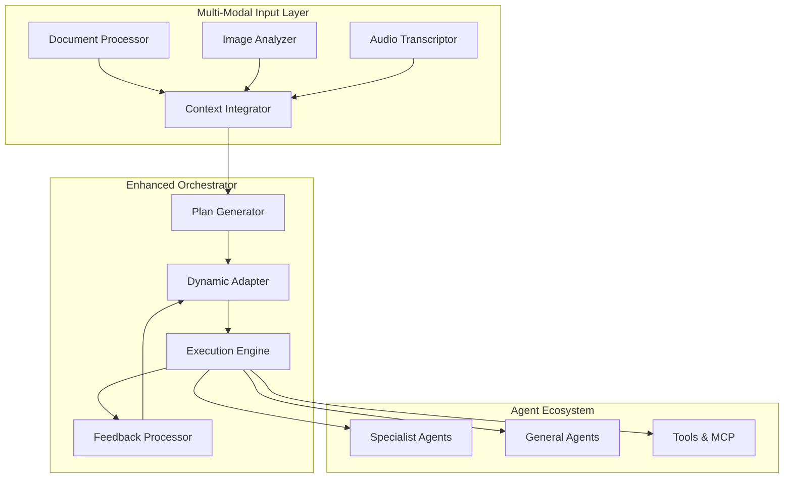
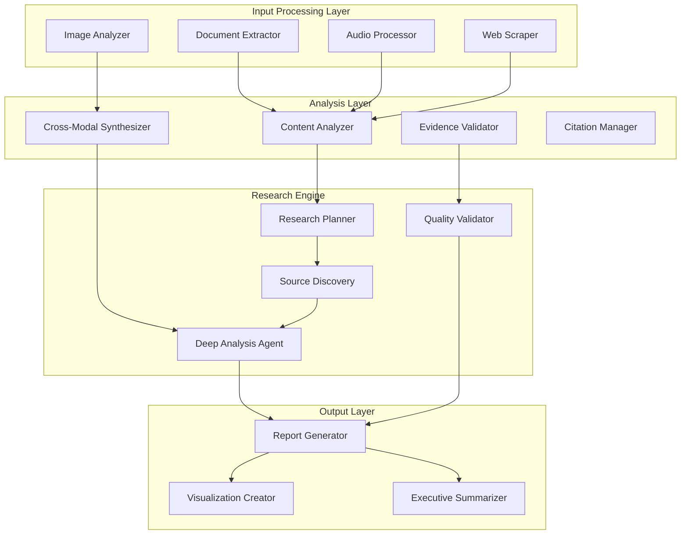

# Hackathon Use Cases & Implementation Guide

## 🎯 Overview

This guide provides specific implementation strategies for each hackathon use case, mapping them to our framework patterns and providing concrete code examples you can build upon.

## 📊 Hackathon Projects Matrix

| Project | Primary Patterns | Key Technologies | Implementation Complexity | Business Value |
|---------|------------------|------------------|--------------------------|----------------|
| **Orchestrator Enhancement** | ReAct + Hierarchical + MAF Workflows | Multi-modal processing, Dynamic planning | ⭐⭐⭐ High | Enterprise orchestration backbone |
| **Multi-Modal Researcher** | Sequential + Concurrent + Group Chat | Document/Image/Audio processing | ⭐⭐⭐ High | Automated research capabilities |
| **Data Retrieval Optimization** | ReAct + Concurrent + Sequential | Knowledge graphs, Query optimization | ⭐⭐ Medium | Performance and cost optimization |
| **General Purpose Agent** | Handoff + ReAct + All patterns | MCP integration, Dynamic capabilities | ⭐⭐⭐ High | Unified agent platform |
| **Real-Time Call Analysis** | Concurrent + Handoff + Sequential | Speech processing, Sentiment analysis | ⭐⭐ Medium | Customer insights and compliance |

---

## 🎭 Project 1: Orchestrator Enhancement

### Project Vision
Build a robust, multi-modal orchestrator as the foundation for future development with unified, enterprise-grade orchestration layer that standardizes agent interactions and supports prototype-to-pilot transitions.

### Key Features to Implement
- **Multi-modal input processing** (documents, images, verbal instructions)
- **Dynamic plan updating** based on execution feedback
- **Entitlement awareness** for secure agent access
- **Optimized data retrieval** with P95 latency improvements

### Implementation Architecture



### Core Implementation

#### 1. Multi-Modal Orchestrator Agent

```python
from framework.patterns import ReActPattern, HierarchicalPattern, SequentialPattern
from typing import Dict, List, Any, Optional
import structlog

logger = structlog.get_logger(__name__)

class EnhancedOrchestrator(BaseAgent):
    """
    Multi-modal orchestrator with dynamic planning capabilities.
    
    Implements the Orchestrator Enhancement pattern with:
    - Multi-modal input processing
    - Dynamic plan updating
    - Performance optimization
    - Entitlement-aware execution
    """
    
    def __init__(self, name: str, azure_client, mcp_client=None):
        super().__init__(
            name=name,
            description="Enhanced orchestrator with multi-modal and dynamic planning capabilities"
        )
        self.azure_client = azure_client
        self.mcp_client = mcp_client
        self.system_prompt = """
        You are an advanced orchestrator agent specialized in:
        1. Multi-modal input analysis and processing
        2. Dynamic orchestration plan creation and adaptation
        3. Performance optimization and resource allocation
        4. Security and entitlement management
        
        Your role is to analyze complex requests and design optimal execution strategies
        that leverage the best agents and patterns for each situation.
        """
        
        # Performance tracking
        self.execution_metrics = {}
        self.plan_adaptations = []
    
    async def run(self, messages, *, thread=None, **kwargs) -> AgentRunResponse:
        """Enhanced orchestration with multi-modal support."""
        
        context = kwargs.get('context', {})
        
        # Extract multi-modal inputs
        multimodal_context = await self._process_multimodal_inputs(context)
        
        # Generate initial orchestration plan
        initial_plan = await self._generate_orchestration_plan(
            messages, multimodal_context, context
        )
        
        # Execute with dynamic adaptation
        execution_result = await self._execute_with_adaptation(
            initial_plan, multimodal_context, context
        )
        
        # Generate orchestration response
        response_text = await self._generate_orchestration_response(
            initial_plan, execution_result, self.plan_adaptations
        )
        
        return AgentRunResponse(messages=[
            ChatMessage(role=Role.ASSISTANT, contents=[TextContent(text=response_text)])
        ])
    
    async def _process_multimodal_inputs(self, context: Dict) -> Dict[str, Any]:
        """Process and integrate multi-modal inputs."""
        multimodal_context = {
            "input_types": [],
            "processed_content": {},
            "integration_summary": ""
        }
        
        # Process documents
        if 'documents' in context:
            doc_analysis = await self._process_documents(context['documents'])
            multimodal_context["processed_content"]["documents"] = doc_analysis
            multimodal_context["input_types"].append("documents")
        
        # Process images
        if 'images' in context:
            image_analysis = await self._process_images(context['images'])
            multimodal_context["processed_content"]["images"] = image_analysis
            multimodal_context["input_types"].append("images")
        
        # Process audio/verbal instructions
        if 'audio_transcripts' in context or 'verbal_instructions' in context:
            audio_analysis = await self._process_audio(
                context.get('audio_transcripts', []) + context.get('verbal_instructions', [])
            )
            multimodal_context["processed_content"]["audio"] = audio_analysis
            multimodal_context["input_types"].append("audio")
        
        # Generate integration summary
        multimodal_context["integration_summary"] = await self._integrate_multimodal_content(
            multimodal_context["processed_content"]
        )
        
        return multimodal_context
    
    async def _generate_orchestration_plan(self, messages, multimodal_context: Dict, context: Dict) -> Dict:
        """Generate comprehensive orchestration plan using ReAct pattern."""
        
        task = self._extract_task(self._normalize_messages(messages))
        
        planning_prompt = f"""
        Orchestration Planning Task: {task}
        
        Multi-Modal Context:
        - Input Types: {multimodal_context['input_types']}
        - Content Summary: {multimodal_context['integration_summary']}
        
        Available Resources:
        - Agent Registry: {context.get('available_agents', 'Will be discovered')}
        - Performance Constraints: {context.get('performance_requirements', 'Standard')}
        - Security Requirements: {context.get('entitlement_rules', 'Standard')}
        
        Please create a comprehensive orchestration plan that includes:
        
        1. **Pattern Selection**: Choose optimal orchestration pattern(s)
           - Sequential for dependent tasks
           - Concurrent for parallel processing
           - ReAct for dynamic planning needs
           - Hierarchical for complex coordination
           - Handoff for specialist routing
        
        2. **Agent Allocation**: Specify agents for each step
           - Consider agent capabilities and specializations
           - Account for workload balancing
           - Include fallback agents for resilience
        
        3. **Resource Optimization**: 
           - Estimate execution time and resources
           - Identify potential bottlenecks
           - Plan for performance monitoring points
        
        4. **Adaptation Strategy**:
           - Define adaptation triggers (performance thresholds, error rates)
           - Specify alternative execution paths
           - Plan feedback integration points
        
        5. **Security & Entitlement**:
           - Agent permission requirements
           - Data access controls
           - Audit and compliance checkpoints
        
        Provide the plan in structured format with clear execution steps.
        """
        
        # Use LLM to generate comprehensive plan
        plan_response = await self._execute_llm(planning_prompt)
        
        # Parse and structure the plan
        structured_plan = await self._parse_orchestration_plan(plan_response)
        
        return structured_plan
    
    async def _execute_with_adaptation(self, initial_plan: Dict, multimodal_context: Dict, context: Dict) -> Dict:
        """Execute plan with dynamic adaptation based on performance feedback."""
        
        current_plan = initial_plan.copy()
        execution_results = []
        adaptation_count = 0
        max_adaptations = 3
        
        for step_index, step in enumerate(current_plan.get('execution_steps', [])):
            step_start_time = datetime.utcnow()
            
            try:
                # Execute current step
                step_result = await self._execute_orchestration_step(
                    step, multimodal_context, context, execution_results
                )
                
                # Track performance metrics
                step_duration = (datetime.utcnow() - step_start_time).total_seconds()
                step_metrics = {
                    "step_index": step_index,
                    "duration": step_duration,
                    "success": step_result.get('success', False),
                    "agent_used": step.get('agent'),
                    "pattern_used": step.get('pattern')
                }
                
                execution_results.append({
                    "step": step,
                    "result": step_result,
                    "metrics": step_metrics
                })
                
                # Evaluate need for plan adaptation
                if adaptation_count < max_adaptations:
                    adaptation_needed = await self._evaluate_adaptation_need(
                        step_metrics, execution_results, current_plan
                    )
                    
                    if adaptation_needed:
                        # Adapt plan for remaining steps
                        adapted_plan = await self._adapt_orchestration_plan(
                            current_plan, execution_results, step_index + 1
                        )
                        
                        if adapted_plan:
                            logger.info(f"Plan adapted after step {step_index}", 
                                      adaptation_count=adaptation_count + 1)
                            self.plan_adaptations.append({
                                "step_index": step_index,
                                "reason": adaptation_needed,
                                "changes": adapted_plan.get('changes', [])
                            })
                            
                            current_plan = adapted_plan
                            adaptation_count += 1
            
            except Exception as e:
                logger.error(f"Step {step_index} execution failed", error=str(e))
                
                # Handle execution failure
                failure_handled = await self._handle_execution_failure(
                    step, str(e), current_plan, step_index
                )
                
                if not failure_handled:
                    # Critical failure - abort execution
                    execution_results.append({
                        "step": step,
                        "result": {"success": False, "error": str(e)},
                        "metrics": {"duration": step_duration, "success": False}
                    })
                    break
        
        return {
            "execution_results": execution_results,
            "final_plan": current_plan,
            "adaptations": self.plan_adaptations,
            "overall_metrics": self._calculate_overall_metrics(execution_results)
        }
    
    async def _execute_orchestration_step(self, step: Dict, multimodal_context: Dict, context: Dict, previous_results: List) -> Dict:
        """Execute individual orchestration step using specified pattern."""
        
        pattern_type = step.get('pattern', 'sequential')
        agents = step.get('agents', [])
        task = step.get('task', '')
        
        # Build execution context
        execution_context = {
            "multimodal_context": multimodal_context,
            "previous_results": previous_results,
            "step_metadata": step,
            **context
        }
        
        # Select and execute pattern
        if pattern_type == 'sequential':
            result = await self._execute_sequential_pattern(task, agents, execution_context)
        elif pattern_type == 'concurrent':
            result = await self._execute_concurrent_pattern(task, agents, execution_context)
        elif pattern_type == 'react':
            result = await self._execute_react_pattern(task, agents[0] if agents else 'general_agent', execution_context)
        elif pattern_type == 'hierarchical':
            result = await self._execute_hierarchical_pattern(task, agents, execution_context)
        elif pattern_type == 'handoff':
            result = await self._execute_handoff_pattern(task, agents, execution_context)
        else:
            result = {"success": False, "error": f"Unknown pattern: {pattern_type}"}
        
        return result
    
    # Pattern execution methods
    async def _execute_sequential_pattern(self, task: str, agents: List[str], context: Dict) -> Dict:
        """Execute using sequential pattern."""
        try:
            pattern = SequentialPattern(
                agents=agents,
                config={"preserve_context": True, "multimodal_support": True}
            )
            
            # Use orchestrator to execute pattern
            result = await self.orchestrator.execute(
                task=task,
                pattern=pattern,
                context=context,
                metadata={"execution_mode": "enhanced_sequential"}
            )
            
            return {"success": True, "result": result, "pattern": "sequential"}
            
        except Exception as e:
            return {"success": False, "error": str(e), "pattern": "sequential"}
    
    async def _execute_concurrent_pattern(self, task: str, agents: List[str], context: Dict) -> Dict:
        """Execute using concurrent pattern with multimodal aggregation."""
        try:
            pattern = ConcurrentPattern(
                agents=agents,
                config={
                    "aggregation_method": "multimodal_synthesis",
                    "cross_validation": True,
                    "performance_optimization": True
                }
            )
            
            result = await self.orchestrator.execute(
                task=task,
                pattern=pattern,
                context=context,
                metadata={"execution_mode": "enhanced_concurrent"}
            )
            
            return {"success": True, "result": result, "pattern": "concurrent"}
            
        except Exception as e:
            return {"success": False, "error": str(e), "pattern": "concurrent"}
    
    async def _execute_react_pattern(self, task: str, agent: str, context: Dict) -> Dict:
        """Execute using ReAct pattern for dynamic reasoning."""
        try:
            pattern = ReActPattern(
                agent=agent,
                config={
                    "max_iterations": 10,
                    "multimodal_reasoning": True,
                    "adaptation_enabled": True,
                    "performance_monitoring": True
                }
            )
            
            result = await self.orchestrator.execute(
                task=task,
                pattern=pattern,
                context=context,
                metadata={"execution_mode": "enhanced_react"}
            )
            
            return {"success": True, "result": result, "pattern": "react"}
            
        except Exception as e:
            return {"success": False, "error": str(e), "pattern": "react"}
```

#### 2. Multi-Modal Input Processing

```python
class MultiModalProcessor:
    """Specialized processor for different input modalities."""
    
    def __init__(self, azure_client):
        self.azure_client = azure_client
        self.vision_client = None  # Initialize Azure Computer Vision
        self.speech_client = None  # Initialize Azure Speech Services
    
    async def process_documents(self, documents: List[Dict]) -> Dict:
        """Process document inputs with extraction and summarization."""
        processed_docs = []
        
        for doc in documents:
            doc_analysis = {
                "title": doc.get('title', 'Untitled'),
                "content_type": doc.get('type', 'text'),
                "summary": await self._summarize_document(doc.get('content', '')),
                "key_concepts": await self._extract_concepts(doc.get('content', '')),
                "sentiment": await self._analyze_sentiment(doc.get('content', '')),
                "metadata": doc.get('metadata', {})
            }
            processed_docs.append(doc_analysis)
        
        return {
            "document_count": len(processed_docs),
            "documents": processed_docs,
            "overall_themes": await self._identify_common_themes(processed_docs),
            "processing_timestamp": datetime.utcnow().isoformat()
        }
    
    async def process_images(self, images: List[Dict]) -> Dict:
        """Process image inputs with computer vision analysis."""
        processed_images = []
        
        for img in images:
            if self.vision_client:
                # Use Azure Computer Vision for analysis
                image_analysis = await self._analyze_image_with_azure_cv(img)
            else:
                # Fallback to LLM-based analysis
                image_analysis = await self._analyze_image_with_llm(img)
            
            processed_images.append(image_analysis)
        
        return {
            "image_count": len(processed_images),
            "images": processed_images,
            "visual_themes": await self._identify_visual_themes(processed_images),
            "processing_timestamp": datetime.utcnow().isoformat()
        }
    
    async def process_audio(self, audio_inputs: List[Dict]) -> Dict:
        """Process audio/verbal instructions with speech analysis."""
        processed_audio = []
        
        for audio in audio_inputs:
            if 'transcript' in audio:
                # Already transcribed
                transcript = audio['transcript']
            else:
                # Transcribe audio file
                transcript = await self._transcribe_audio(audio.get('audio_data'))
            
            audio_analysis = {
                "transcript": transcript,
                "intent": await self._extract_intent(transcript),
                "sentiment": await self._analyze_sentiment(transcript),
                "key_instructions": await self._extract_instructions(transcript),
                "urgency_level": await self._assess_urgency(transcript),
                "metadata": audio.get('metadata', {})
            }
            processed_audio.append(audio_analysis)
        
        return {
            "audio_count": len(processed_audio),
            "audio_analysis": processed_audio,
            "instruction_summary": await self._summarize_instructions(processed_audio),
            "processing_timestamp": datetime.utcnow().isoformat()
        }
    
    async def integrate_multimodal_content(self, processed_content: Dict) -> str:
        """Generate integrated summary of multi-modal content."""
        
        integration_prompt = f"""
        Integrate the following multi-modal content analysis:
        
        Documents: {processed_content.get('documents', {}).get('overall_themes', 'None')}
        Images: {processed_content.get('images', {}).get('visual_themes', 'None')} 
        Audio: {processed_content.get('audio', {}).get('instruction_summary', 'None')}
        
        Provide a comprehensive integration that:
        1. Identifies common themes across modalities
        2. Highlights unique insights from each modality
        3. Suggests orchestration implications
        4. Recommends processing priorities
        """
        
        response = await self.azure_client.chat.completions.create(
            model="gpt-4",
            messages=[
                {"role": "system", "content": "You are an expert at multi-modal content integration."},
                {"role": "user", "content": integration_prompt}
            ],
            temperature=0.7,
            max_tokens=1000
        )
        
        return response.choices[0].message.content
```

#### 3. Dynamic Plan Adaptation

```python
class PlanAdaptationEngine:
    """Engine for dynamic plan adaptation based on execution feedback."""
    
    async def evaluate_adaptation_need(self, step_metrics: Dict, execution_history: List, current_plan: Dict) -> Optional[str]:
        """Evaluate if plan adaptation is needed."""
        
        # Performance-based triggers
        if step_metrics['duration'] > current_plan.get('performance_thresholds', {}).get('max_step_duration', 300):
            return f"Performance degradation: Step took {step_metrics['duration']}s"
        
        # Success rate triggers
        recent_failures = sum(1 for result in execution_history[-3:] if not result.get('metrics', {}).get('success', True))
        if recent_failures >= 2:
            return f"High failure rate: {recent_failures} failures in last 3 steps"
        
        # Resource utilization triggers
        if self._check_resource_constraints(step_metrics, execution_history):
            return "Resource constraint violation detected"
        
        # Quality degradation triggers
        if await self._assess_quality_degradation(execution_history):
            return "Output quality degradation detected"
        
        return None
    
    async def adapt_orchestration_plan(self, current_plan: Dict, execution_results: List, remaining_step_index: int) -> Optional[Dict]:
        """Adapt orchestration plan for remaining steps."""
        
        # Analyze execution patterns
        performance_analysis = await self._analyze_execution_performance(execution_results)
        
        # Generate adaptation strategy
        adaptation_prompt = f"""
        Current orchestration plan requires adaptation.
        
        Performance Analysis:
        {performance_analysis}
        
        Current Plan (remaining steps):
        {current_plan['execution_steps'][remaining_step_index:]}
        
        Please provide an adapted plan that addresses the identified issues:
        1. Optimize for better performance
        2. Include alternative agent selections
        3. Adjust pattern choices if needed
        4. Add additional monitoring points
        5. Include fallback strategies
        
        Provide specific changes for remaining execution steps.
        """
        
        # Use LLM to generate adaptation strategy
        adaptation_response = await self._execute_llm(adaptation_prompt)
        
        # Parse and apply adaptations
        adapted_plan = await self._parse_and_apply_adaptations(
            current_plan, adaptation_response, remaining_step_index
        )
        
        return adapted_plan
```

### Usage Example

```python
# Initialize enhanced orchestrator
enhanced_orchestrator = EnhancedOrchestrator(
    name="Enhanced Orchestrator",
    azure_client=azure_client,
    mcp_client=mcp_client
)

# Register with framework
await app.agent_registry.register_agent(
    agent_id="enhanced_orchestrator",
    agent_instance=enhanced_orchestrator,
    capabilities=["orchestration", "multi_modal", "dynamic_planning", "performance_optimization"]
)

# Execute with multi-modal input
result = await app.orchestrator.execute(
    task="Enhance our customer service system with AI capabilities",
    pattern=ReActPattern(
        agent="enhanced_orchestrator",
        config={"multimodal_support": True, "adaptation_enabled": True}
    ),
    context={
        "documents": [
            {"title": "Current System Architecture", "content": "..."},
            {"title": "Customer Feedback Analysis", "content": "..."}
        ],
        "images": [
            {"description": "System workflow diagram", "image_url": "..."}
        ],
        "verbal_instructions": [
            {"transcript": "We need to improve response times by 50%"}
        ],
        "performance_requirements": {
            "max_response_time": 2.0,
            "target_accuracy": 0.95,
            "concurrent_users": 1000
        },
        "entitlement_rules": [
            {"role": "customer_service", "permissions": ["read_tickets", "update_status"]},
            {"role": "manager", "permissions": ["read_all", "approve_escalations"]}
        ]
    }
)
```

---

## 🔬 Project 2: Multi-Modal Researcher

### Project Vision
Develop a researcher agent capable of deep reasoning and producing detailed analysis and reports with multi-modal input support (documents, images, verbal instructions).

### Key Features to Implement
- **Cross-modal content analysis** and synthesis
- **Deep reasoning capabilities** with iterative refinement
- **Evidence-based research** with proper citation
- **Comprehensive report generation** in multiple formats

### Implementation Architecture



### Core Implementation

#### 1. Multi-Modal Research Agent

```python
class MultiModalResearcher(BaseAgent):
    """
    Advanced research agent with multi-modal capabilities and deep reasoning.
    
    Features:
    - Cross-modal content analysis
    - Iterative research refinement
    - Evidence validation and citation
    - Comprehensive report generation
    """
    
    def __init__(self, name: str, azure_client, web_search_tool=None):
        super().__init__(
            name=name,
            description="Multi-modal research agent with deep reasoning capabilities"
        )
        self.azure_client = azure_client
        self.web_search_tool = web_search_tool
        self.system_prompt = """
        You are an expert research agent with advanced analytical capabilities.
        
        Your expertise includes:
        1. Multi-modal content analysis (text, images, audio)
        2. Cross-referencing information across sources
        3. Evidence-based reasoning with proper attribution
        4. Comprehensive report writing with executive summaries
        5. Quality assessment and fact-checking
        
        Always provide detailed analysis with confidence levels and proper citations.
        Identify potential biases, limitations, and areas requiring further research.
        """
        
        # Research tracking
        self.research_sessions = {}
        self.source_quality_scores = {}
    
    async def run(self, messages, *, thread=None, **kwargs) -> AgentRunResponse:
        """Execute comprehensive multi-modal research."""
        
        context = kwargs.get('context', {})
        research_depth = context.get('depth', 'comprehensive')
        
        # Initialize research session
        session_id = self._create_research_session(context)
        
        # Extract research topic and parameters
        research_request = await self._parse_research_request(messages, context)
        
        # Execute research workflow
        research_results = await self._execute_research_workflow(
            research_request, session_id, context
        )
        
        # Generate comprehensive response
        response_text = await self._generate_research_response(
            research_results, research_request, session_id
        )
        
        return AgentRunResponse(messages=[
            ChatMessage(role=Role.ASSISTANT, contents=[TextContent(text=response_text)])
        ])
    
    async def _execute_research_workflow(self, research_request: Dict, session_id: str, context: Dict) -> Dict:
        """Execute comprehensive research workflow with iterative refinement."""
        
        # Phase 1: Research Planning with ReAct
        research_plan = await self._create_research_plan(research_request, context)
        
        # Phase 2: Multi-Source Data Gathering
        source_data = await self._gather_research_sources(research_plan, context)
        
        # Phase 3: Cross-Modal Analysis
        analysis_results = await self._perform_cross_modal_analysis(source_data, research_plan)
        
        # Phase 4: Evidence Validation
        validated_findings = await self._validate_evidence(analysis_results, source_data)
        
        # Phase 5: Iterative Refinement
        refined_analysis = await self._refine_analysis(validated_findings, research_plan)
        
        # Phase 6: Report Generation
        final_report = await self._generate_comprehensive_report(refined_analysis, research_plan)
        
        return {
            "session_id": session_id,
            "research_plan": research_plan,
            "source_data": source_data,
            "analysis_results": refined_analysis,
            "final_report": final_report,
            "research_metadata": {
                "total_sources": len(source_data.get('sources', [])),
                "confidence_score": refined_analysis.get('overall_confidence', 0.0),
                "research_depth": research_request.get('depth', 'standard')
            }
        }
    
    async def _create_research_plan(self, research_request: Dict, context: Dict) -> Dict:
        """Create comprehensive research plan using ReAct pattern."""
        
        planning_prompt = f"""
        Research Planning Task: {research_request.get('topic', 'Unknown topic')}
        
        Research Parameters:
        - Depth: {research_request.get('depth', 'standard')}
        - Focus Areas: {research_request.get('focus_areas', [])}
        - Time Constraint: {research_request.get('time_limit', 'None specified')}
        - Multi-modal Inputs: {list(context.keys())}
        
        Available Input Sources:
        {self._format_available_sources(context)}
        
        Create a comprehensive research plan that includes:
        
        1. **Research Objectives**: Clear, measurable research goals
        2. **Source Strategy**: Primary and secondary source identification
        3. **Analysis Framework**: Methods for cross-modal analysis
        4. **Validation Approach**: Evidence validation and fact-checking strategy
        5. **Quality Metrics**: Success criteria and confidence thresholds
        6. **Deliverable Structure**: Report format and key sections
        
        Consider:
        - Multi-modal content integration opportunities
        - Potential biases and limitations
        - Alternative perspectives to explore
        - Evidence quality requirements
        
        Provide a structured, actionable research plan.
        """
        
        plan_response = await self._execute_llm(planning_prompt)
        
        # Structure the plan
        structured_plan = await self._parse_research_plan(plan_response, research_request)
        
        return structured_plan
    
    async def _gather_research_sources(self, research_plan: Dict, context: Dict) -> Dict:
        """Gather and process research sources from multiple modalities."""
        
        source_data = {
            "sources": [],
            "processed_content": {},
            "source_quality_map": {}
        }
        
        # Process existing multi-modal inputs
        if 'documents' in context:
            doc_sources = await self._process_document_sources(context['documents'], research_plan)
            source_data["sources"].extend(doc_sources)
            source_data["processed_content"]["documents"] = doc_sources
        
        if 'images' in context:
            image_sources = await self._process_image_sources(context['images'], research_plan)
            source_data["sources"].extend(image_sources)
            source_data["processed_content"]["images"] = image_sources
        
        if 'audio_data' in context:
            audio_sources = await self._process_audio_sources(context['audio_data'], research_plan)
            source_data["sources"].extend(audio_sources)
            source_data["processed_content"]["audio"] = audio_sources
        
        # Discover additional web sources
        if self.web_search_tool and research_plan.get('web_research_enabled', True):
            web_sources = await self._discover_web_sources(research_plan)
            source_data["sources"].extend(web_sources)
            source_data["processed_content"]["web"] = web_sources
        
        # Assess source quality
        for source in source_data["sources"]:
            quality_score = await self._assess_source_quality(source)
            source_data["source_quality_map"][source['id']] = quality_score
        
        return source_data
    
    async def _perform_cross_modal_analysis(self, source_data: Dict, research_plan: Dict) -> Dict:
        """Perform deep cross-modal analysis of research sources."""
        
        analysis_results = {
            "individual_analyses": {},
            "cross_modal_correlations": {},
            "synthesis": {},
            "confidence_assessments": {}
        }
        
        # Analyze each modality individually
        for modality, content in source_data["processed_content"].items():
            if content:  # Only analyze if content exists
                modality_analysis = await self._analyze_modality_content(modality, content, research_plan)
                analysis_results["individual_analyses"][modality] = modality_analysis
        
        # Find cross-modal correlations
        if len(analysis_results["individual_analyses"]) > 1:
            correlations = await self._identify_cross_modal_correlations(
                analysis_results["individual_analyses"], research_plan
            )
            analysis_results["cross_modal_correlations"] = correlations
        
        # Synthesize findings
        synthesis = await self._synthesize_multimodal_findings(
            analysis_results["individual_analyses"],
            analysis_results["cross_modal_correlations"],
            research_plan
        )
        analysis_results["synthesis"] = synthesis
        
        # Assess confidence levels
        confidence_assessments = await self._assess_analysis_confidence(
            analysis_results, source_data["source_quality_map"]
        )
        analysis_results["confidence_assessments"] = confidence_assessments
        
        return analysis_results
    
    async def _validate_evidence(self, analysis_results: Dict, source_data: Dict) -> Dict:
        """Validate evidence and identify potential issues."""
        
        validation_results = {
            "validated_claims": [],
            "disputed_claims": [],
            "insufficient_evidence": [],
            "bias_assessments": {},
            "fact_check_results": {}
        }
        
        # Extract claims from synthesis
        claims = await self._extract_claims_from_analysis(analysis_results["synthesis"])
        
        # Validate each claim
        for claim in claims:
            validation = await self._validate_individual_claim(claim, source_data, analysis_results)
            
            if validation["confidence"] >= 0.8:
                validation_results["validated_claims"].append(validation)
            elif validation["confidence"] >= 0.5:
                validation_results["disputed_claims"].append(validation)
            else:
                validation_results["insufficient_evidence"].append(validation)
        
        # Assess potential biases
        bias_assessment = await self._assess_potential_biases(source_data, analysis_results)
        validation_results["bias_assessments"] = bias_assessment
        
        # Perform fact-checking where possible
        fact_check_results = await self._perform_fact_checking(claims, source_data)
        validation_results["fact_check_results"] = fact_check_results
        
        return validation_results
    
    async def _refine_analysis(self, validated_findings: Dict, research_plan: Dict) -> Dict:
        """Iteratively refine analysis based on validation results."""
        
        refinement_prompt = f"""
        Refine the research analysis based on evidence validation:
        
        Research Objectives: {research_plan.get('objectives', [])}
        
        Validation Results:
        - Validated Claims ({len(validated_findings['validated_claims'])}): High confidence findings
        - Disputed Claims ({len(validated_findings['disputed_claims'])}): Medium confidence findings  
        - Insufficient Evidence ({len(validated_findings['insufficient_evidence'])}): Low confidence areas
        
        Bias Assessment: {validated_findings.get('bias_assessments', {})}
        
        Please provide a refined analysis that:
        1. Emphasizes high-confidence findings with proper attribution
        2. Acknowledges limitations and uncertainties
        3. Identifies areas requiring further research
        4. Provides balanced perspectives where claims are disputed
        5. Suggests mitigation strategies for identified biases
        6. Offers actionable insights and recommendations
        
        Maintain academic rigor while ensuring practical applicability.
        """
        
        refined_response = await self._execute_llm(refinement_prompt)
        
        # Structure refined analysis
        refined_analysis = {
            "executive_summary": await self._extract_executive_summary(refined_response),
            "key_findings": await self._extract_key_findings(refined_response),
            "evidence_base": validated_findings,
            "limitations": await self._identify_limitations(validated_findings),
            "recommendations": await self._extract_recommendations(refined_response),
            "overall_confidence": self._calculate_overall_confidence(validated_findings),
            "further_research_needed": await self._identify_research_gaps(validated_findings)
        }
        
        return refined_analysis
    
    async def _generate_comprehensive_report(self, refined_analysis: Dict, research_plan: Dict) -> Dict:
        """Generate comprehensive research report in multiple formats."""
        
        # Generate main report sections
        report_sections = {
            "executive_summary": refined_analysis["executive_summary"],
            "methodology": await self._generate_methodology_section(research_plan),
            "findings": await self._generate_findings_section(refined_analysis),
            "analysis": await self._generate_analysis_section(refined_analysis),
            "conclusions": await self._generate_conclusions_section(refined_analysis),
            "recommendations": refined_analysis["recommendations"],
            "limitations": refined_analysis["limitations"],
            "appendices": await self._generate_appendices(refined_analysis)
        }
        
        # Generate different report formats
        report_formats = {
            "full_report": await self._format_full_report(report_sections),
            "executive_brief": await self._format_executive_brief(report_sections),
            "technical_summary": await self._format_technical_summary(report_sections),
            "presentation_outline": await self._format_presentation_outline(report_sections)
        }
        
        return {
            "sections": report_sections,
            "formats": report_formats,
            "metadata": {
                "generation_timestamp": datetime.utcnow().isoformat(),
                "research_depth": research_plan.get('depth', 'standard'),
                "confidence_score": refined_analysis["overall_confidence"],
                "source_count": len(refined_analysis.get("evidence_base", {}).get("validated_claims", []))
            }
        }
```

#### 2. Cross-Modal Analysis Engine

```python
class CrossModalAnalysisEngine:
    """Engine for analyzing and correlating information across different modalities."""
    
    async def analyze_modality_content(self, modality: str, content: List[Dict], research_plan: Dict) -> Dict:
        """Analyze content for a specific modality."""
        
        if modality == "documents":
            return await self._analyze_document_content(content, research_plan)
        elif modality == "images":
            return await self._analyze_image_content(content, research_plan)
        elif modality == "audio":
            return await self._analyze_audio_content(content, research_plan)
        elif modality == "web":
            return await self._analyze_web_content(content, research_plan)
        else:
            return {"error": f"Unknown modality: {modality}"}
    
    async def _analyze_document_content(self, documents: List[Dict], research_plan: Dict) -> Dict:
        """Deep analysis of document content."""
        
        document_insights = []
        
        for doc in documents:
            doc_analysis = {
                "document_id": doc.get('id'),
                "title": doc.get('title'),
                "key_themes": await self._extract_themes(doc.get('content', '')),
                "arguments": await self._identify_arguments(doc.get('content', '')),
                "evidence_presented": await self._extract_evidence(doc.get('content', '')),
                "author_perspective": await self._analyze_perspective(doc.get('content', '')),
                "credibility_indicators": await self._assess_credibility(doc),
                "relevance_score": await self._calculate_relevance(doc, research_plan)
            }
            document_insights.append(doc_analysis)
        
        # Aggregate document analysis
        aggregated_analysis = {
            "total_documents": len(documents),
            "document_insights": document_insights,
            "common_themes": await self._identify_common_themes(document_insights),
            "conflicting_viewpoints": await self._identify_conflicts(document_insights),
            "evidence_strength": await self._assess_collective_evidence_strength(document_insights),
            "gaps_identified": await self._identify_content_gaps(document_insights, research_plan)
        }
        
        return aggregated_analysis
    
    async def identify_cross_modal_correlations(self, individual_analyses: Dict, research_plan: Dict) -> Dict:
        """Identify correlations and patterns across different modalities."""
        
        correlation_analysis = {
            "theme_correlations": {},
            "evidence_reinforcements": {},
            "contradictions": {},
            "complementary_insights": {},
            "confidence_boosters": {}
        }
        
        # Compare themes across modalities
        all_themes = {}
        for modality, analysis in individual_analyses.items():
            themes = analysis.get('common_themes', []) or analysis.get('key_themes', [])
            all_themes[modality] = themes
        
        # Find theme correlations
        for mod1, themes1 in all_themes.items():
            for mod2, themes2 in all_themes.items():
                if mod1 != mod2:
                    correlations = await self._find_theme_correlations(themes1, themes2)
                    if correlations:
                        correlation_analysis["theme_correlations"][f"{mod1}_vs_{mod2}"] = correlations
        
        # Find evidence reinforcements
        for modality, analysis in individual_analyses.items():
            evidence = analysis.get('evidence_presented', []) or analysis.get('key_findings', [])
            for other_mod, other_analysis in individual_analyses.items():
                if modality != other_mod:
                    other_evidence = other_analysis.get('evidence_presented', []) or other_analysis.get('key_findings', [])
                    reinforcements = await self._find_evidence_reinforcements(evidence, other_evidence)
                    if reinforcements:
                        correlation_analysis["evidence_reinforcements"][f"{modality}_reinforced_by_{other_mod}"] = reinforcements
        
        return correlation_analysis
```

#### 3. Evidence Validation Engine

```python
class EvidenceValidationEngine:
    """Engine for validating research evidence and assessing credibility."""
    
    async def validate_individual_claim(self, claim: Dict, source_data: Dict, analysis_results: Dict) -> Dict:
        """Validate a specific research claim."""
        
        validation = {
            "claim": claim,
            "supporting_evidence": [],
            "contradicting_evidence": [],
            "source_credibility": 0.0,
            "evidence_strength": 0.0,
            "confidence": 0.0,
            "validation_notes": []
        }
        
        # Find supporting and contradicting evidence
        for source in source_data["sources"]:
            source_relevance = await self._assess_source_relevance_to_claim(source, claim)
            
            if source_relevance["supports_claim"]:
                validation["supporting_evidence"].append({
                    "source_id": source["id"],
                    "relevance_score": source_relevance["score"],
                    "evidence_excerpt": source_relevance["relevant_content"]
                })
            elif source_relevance["contradicts_claim"]:
                validation["contradicting_evidence"].append({
                    "source_id": source["id"],
                    "relevance_score": source_relevance["score"],
                    "contradictory_content": source_relevance["relevant_content"]
                })
        
        # Calculate credibility score
        source_credibilities = []
        for evidence in validation["supporting_evidence"]:
            source_id = evidence["source_id"]
            credibility = source_data["source_quality_map"].get(source_id, 0.5)
            source_credibilities.append(credibility * evidence["relevance_score"])
        
        validation["source_credibility"] = sum(source_credibilities) / len(source_credibilities) if source_credibilities else 0.0
        
        # Assess evidence strength
        validation["evidence_strength"] = await self._calculate_evidence_strength(
            validation["supporting_evidence"],
            validation["contradicting_evidence"]
        )
        
        # Calculate overall confidence
        validation["confidence"] = (validation["source_credibility"] + validation["evidence_strength"]) / 2
        
        # Add validation notes
        if validation["contradicting_evidence"]:
            validation["validation_notes"].append(f"Found {len(validation['contradicting_evidence'])} sources with contradictory information")
        
        if validation["confidence"] < 0.6:
            validation["validation_notes"].append("Low confidence: Insufficient supporting evidence")
        
        return validation
    
    async def assess_potential_biases(self, source_data: Dict, analysis_results: Dict) -> Dict:
        """Assess potential biases in sources and analysis."""
        
        bias_assessment = {
            "source_bias_indicators": {},
            "perspective_diversity": 0.0,
            "temporal_bias": {},
            "geographical_bias": {},
            "institutional_bias": {},
            "mitigation_recommendations": []
        }
        
        # Analyze source bias indicators
        for source in source_data["sources"]:
            bias_indicators = await self._identify_source_bias_indicators(source)
            bias_assessment["source_bias_indicators"][source["id"]] = bias_indicators
        
        # Assess perspective diversity
        perspectives = [
            source.get("author_perspective", "unknown") 
            for source in source_data["sources"]
        ]
        bias_assessment["perspective_diversity"] = await self._calculate_perspective_diversity(perspectives)
        
        # Check for temporal bias
        publication_dates = [
            source.get("publication_date") 
            for source in source_data["sources"] 
            if source.get("publication_date")
        ]
        bias_assessment["temporal_bias"] = await self._assess_temporal_bias(publication_dates)
        
        # Generate mitigation recommendations
        if bias_assessment["perspective_diversity"] < 0.6:
            bias_assessment["mitigation_recommendations"].append("Seek additional sources with diverse perspectives")
        
        if len(set(perspectives)) < 3:
            bias_assessment["mitigation_recommendations"].append("Include more varied viewpoints to reduce confirmation bias")
        
        return bias_assessment
```

### Usage Example

```python
# Initialize multi-modal researcher
researcher = MultiModalResearcher(
    name="Multi-Modal Researcher",
    azure_client=azure_client,
    web_search_tool=web_search_tool
)

# Register with framework
await app.agent_registry.register_agent(
    agent_id="multimodal_researcher",
    agent_instance=researcher,
    capabilities=["research", "analysis", "multi_modal", "evidence_validation", "report_generation"]
)

# Execute comprehensive research
result = await app.orchestrator.execute(
    task="Research the impact of AI on education with recommendations for implementation",
    pattern=SequentialPattern(agents=["multimodal_researcher"]),
    context={
        "documents": [
            {
                "title": "AI in Education: A Comprehensive Review",
                "content": "...",
                "author": "Educational Research Institute",
                "publication_date": "2024-08-15"
            }
        ],
        "images": [
            {
                "description": "Classroom with AI teaching assistant",
                "image_url": "...",
                "source": "EdTech Conference 2024"
            }
        ],
        "audio_data": [
            {
                "transcript": "Teacher interview about AI integration challenges",
                "speaker": "Elementary School Principal",
                "duration": 300
            }
        ],
        "depth": "comprehensive",
        "focus_areas": ["K-12 education", "higher education", "teacher training"],
        "time_limit": "2 hours",
        "output_format": "executive_report"
    }
)
```

---

## 🔜 Next Steps

Continue with the remaining hackathon projects:

[→ Continue to Development Guide](./07-development-guide.md) for practical implementation steps.

---

## 📚 Additional Implementation Resources

### Performance Optimization
- Use concurrent execution for independent analysis tasks
- Implement caching for repeated LLM calls
- Optimize token usage with content summarization
- Use streaming responses for real-time feedback

### Quality Assurance
- Implement comprehensive testing for each modality
- Add confidence scoring for all analysis outputs
- Include bias detection and mitigation strategies
- Validate evidence sources and citations

### Monitoring and Observability
- Track research session metrics
- Monitor source quality over time
- Measure analysis confidence trends
- Alert on potential bias indicators