# Building a Deep Research Application with MAF Patterns
## Complete Hackathon Guide & Implementation Template

> **Purpose**: This guide provides a comprehensive, step-by-step approach to building a Deep Research Application using Microsoft Agent Framework (MAF) patterns. It's specifically designed for hackathon participants to understand the concepts, see working examples, and build upon proven patterns.

---

## 🎯 Table of Contents

1. [Introduction & Vision](#introduction--vision)
2. [Architecture Overview](#architecture-overview)
3. [Hackathon Discussion Topics](#hackathon-discussion-topics)
4. [Implementation Patterns](#implementation-patterns)
5. [Template Code & Examples](#template-code--examples)
6. [Creative Pattern Ideas](#creative-pattern-ideas)
7. [Best Practices](#best-practices)
8. [Next Steps](#next-steps)

---

## 📖 Introduction & Vision

### What is Deep Research?

Deep Research is an AI-powered workflow that takes a high-level research objective and automatically:
1. **Plans** the research strategy
2. **Searches** the web for relevant information
3. **Analyzes** multiple sources in parallel
4. **Synthesizes** findings into a comprehensive report
5. **Reviews** for quality and completeness

### Why Use MAF Patterns?

The Microsoft Agent Framework provides proven orchestration patterns that make this complex workflow simple, maintainable, and scalable:

- ✅ **Sequential Pattern** - For linear workflows (Planning → Writing → Review)
- ✅ **Concurrent Pattern** - For parallel research across multiple topics
- ✅ **Hybrid Patterns** - Combining sequential and concurrent for optimal performance
- ✅ **Type-Safe** - Structured messages and workflow definitions
- ✅ **Observable** - Built-in progress tracking and monitoring

### Key Simplification for Hackathon

While our production `deep_research_app` is complex with three execution modes (YAML, Code-based, MAF Workflows), **this hackathon version focuses on the core pattern**: building a clean, understandable Deep Research app using the patterns from the `patterns/` folder.

---

## 🏗 Architecture Overview

### High-Level Flow

```mermaid
graph LR
    A[User: Research Objective] --> B[Planner Agent]
    B --> C[Research Plan]
    C --> D[Search Agent Pool]
    D --> E[Concurrent Web Search]
    E --> F[Research Findings]
    F --> G[Writer Agent]
    G --> H[Draft Report]
    H --> I[Reviewer Agent]
    I --> J[Final Research Report]
```



### Agent Roles

| Agent | Pattern | Responsibility | Tools/Capabilities |
|-------|---------|----------------|-------------------|
| **Planner** | Sequential | Break down objective into research topics | Task decomposition, strategic planning |
| **Search** | Concurrent | Perform parallel web searches | Tavily/Bing Grounding, web scraping |
| **Researcher** | Sequential | Analyze and synthesize search results | Data analysis, source evaluation |
| **Writer** | Sequential | Create comprehensive research report | Content synthesis, structured writing |
| **Reviewer** | Sequential | Quality assurance and validation | Quality checks, completeness verification |

### Hybrid Pattern Strategy

```python
# Pattern Flow:
# 1. Sequential: Planner creates research plan
# 2. Concurrent: Multiple Search agents work in parallel
# 3. Sequential: Researcher synthesizes findings
# 4. Sequential: Writer creates report
# 5. Sequential: Reviewer validates quality

WORKFLOW_PATTERN = {
    "phase_1": "Sequential(Planner)",
    "phase_2": "Concurrent(Search_1, Search_2, Search_3, ...)",
    "phase_3": "Sequential(Researcher → Writer → Reviewer)"
}
```

---

## 💬 Hackathon Discussion Topics

### Session 1: Understanding Deep Research (30 mins)

#### Discussion Questions:
1. **What makes deep research different from simple search?**
   - Multiple perspectives
   - Source verification
   - Synthesis and analysis
   - Quality assessment

2. **What are the pain points in manual research?**
   - Time-consuming
   - Information overload
   - Bias in source selection
   - Inconsistent quality

3. **How can AI agents improve the research process?**
   - Parallel processing
   - Comprehensive coverage
   - Consistent methodology
   - Automated quality checks

#### Team Activity:
- Break into groups
- Each group identifies 2-3 use cases for deep research
- Present to team (e.g., market research, competitive analysis, academic research)

---

### Session 2: MAF Patterns Deep Dive (45 mins)

#### Discussion Topics:

**1. Sequential Pattern**
```
Q: When should we use sequential orchestration?
A: When agents need context from previous agents' work
   - Planner needs to set strategy before research begins
   - Writer needs all research findings to create report
   - Reviewer needs complete report to provide feedback

Example Flow: Planner → Researcher → Writer → Reviewer
```

**2. Concurrent Pattern**
```
Q: When should we use concurrent orchestration?
A: When agents can work independently on parallel tasks
   - Multiple search agents researching different topics
   - Different perspectives on the same question
   - Speed optimization through parallelization

Example Flow: Search(Topic1) | Search(Topic2) | Search(Topic3)
```

**3. Hybrid Pattern**
```
Q: How do we combine patterns effectively?
A: Use sequential for dependencies, concurrent for independence

Example: 
  Sequential(Planner) → 
  Concurrent(Search agents) → 
  Sequential(Synthesizer → Writer → Reviewer)
```

#### Team Exercise:
- Design your own research workflow
- Identify which patterns to use for each phase
- Justify your pattern selection

---

### Session 3: Agent Design & Specialization (45 mins)

#### Key Concepts:

**1. Agent Responsibility**
Each agent should have a **single, clear purpose**:
```python
# Good: Focused responsibility
planner = create_agent(
    name="Research Planner",
    responsibility="Break objective into research topics"
)

# Bad: Too many responsibilities
super_agent = create_agent(
    name="Everything Agent",
    responsibility="Plan, search, write, and review"
)
```

**2. Agent Instructions**
Clear, specific instructions improve agent performance:
```python
planner_instructions = """
You are an expert research planner. Your ONLY job is to:
1. Analyze the research objective
2. Break it into 3-5 specific research questions
3. Prioritize questions by importance
4. Suggest search strategies for each question

Output format: JSON with research_questions array
"""
```

**3. Agent Communication**
Agents communicate through structured messages:
```python
# Planner output becomes Search agent input
plan = {
    "research_questions": [
        "What are the latest AI trends in healthcare?",
        "What are the key challenges in AI adoption?",
        "What are successful case studies?"
    ]
}

# Each question becomes a concurrent search task
```

#### Team Activity:
- Define instructions for each agent in your workflow
- Review and provide feedback on each other's agent designs
- Identify potential issues or improvements

---

### Session 4: Tool Integration Strategy (30 mins)

#### Discussion: Search Tools

**Tavily vs Bing Grounding**

| Feature | Tavily | Bing Grounding |
|---------|--------|----------------|
| Ease of Use | ⭐⭐⭐⭐⭐ Simple API | ⭐⭐⭐ Requires Azure setup |
| Cost | Pay per search | Part of Azure OpenAI |
| Quality | Excellent for research | Good general search |
| Customization | Search depth options | Limited customization |

**Recommendation for Hackathon**: Start with Tavily for simplicity, add Bing later if needed.

#### Integration Patterns:

```python
# Pattern 1: Tool as Agent Capability
class SearchAgent(BaseAgent):
    def __init__(self, tavily_client):
        self.search_tool = tavily_client
    
    async def run(self, messages):
        query = extract_query(messages)
        results = self.search_tool.search(query)
        return synthesize_results(results)

# Pattern 2: Tool as Standalone Service
search_service = TavilySearchService()
agent = create_agent_with_tool(search_service)

# Pattern 3: MCP Integration (Advanced)
mcp_server = MCPSearchServer()
agent = create_agent_with_mcp(mcp_server)
```

---

## 🔧 Implementation Patterns

### Pattern 1: Sequential Research Pipeline

**When to Use**: Simple research tasks with clear dependencies

```python
"""
Sequential Pattern: Planner → Researcher → Writer → Reviewer
Each agent builds upon the previous agent's output.
"""

from agent_framework import SequentialBuilder, ChatMessage, Role, TextContent
from patterns.backend.common.agents import AgentFactory

async def run_sequential_research(objective: str):
    """Execute simple sequential research workflow."""
    
    # Step 1: Create agents
    factory = AgentFactory()
    planner = factory.create_planner_agent()
    researcher = factory.create_researcher_agent()
    writer = factory.create_writer_agent()
    reviewer = factory.create_reviewer_agent()
    
    # Step 2: Build sequential workflow
    workflow = SequentialBuilder().participants([
        planner,
        researcher,
        writer,
        reviewer
    ]).build()
    
    # Step 3: Execute
    results = []
    async for event in workflow.run_stream(objective):
        if isinstance(event, WorkflowOutputEvent):
            results.append(event.data)
    
    return results
```

**Pros**:
- ✅ Simple to understand and implement
- ✅ Clear execution order
- ✅ Full context preservation

**Cons**:
- ❌ No parallel processing
- ❌ Slower execution time
- ❌ Single point of failure

---

### Pattern 2: Concurrent Search with Sequential Synthesis

**When to Use**: When you need parallel research followed by synthesis

```python
"""
Hybrid Pattern: Sequential(Planner) → Concurrent(Searches) → Sequential(Writer → Reviewer)
Optimal balance of speed and context preservation.
"""

from agent_framework import SequentialBuilder, ConcurrentBuilder, WorkflowBuilder

async def run_hybrid_research(objective: str):
    """Execute hybrid research workflow with parallel search."""
    
    factory = AgentFactory()
    
    # Phase 1: Planning (Sequential)
    planner = factory.create_planner_agent()
    plan = await planner.run(objective)
    
    # Extract research questions from plan
    research_questions = extract_questions(plan)
    
    # Phase 2: Parallel Search (Concurrent)
    search_agents = [
        create_search_agent(f"Search_{i}", question)
        for i, question in enumerate(research_questions)
    ]
    
    concurrent_workflow = ConcurrentBuilder().participants(
        search_agents
    ).build()
    
    search_results = []
    async for event in concurrent_workflow.run_stream("Execute searches"):
        if isinstance(event, WorkflowOutputEvent):
            search_results.append(event.data)
    
    # Phase 3: Synthesis and Review (Sequential)
    synthesizer = factory.create_researcher_agent()
    writer = factory.create_writer_agent()
    reviewer = factory.create_reviewer_agent()
    
    synthesis_workflow = SequentialBuilder().participants([
        synthesizer,
        writer,
        reviewer
    ]).build()
    
    # Combine search results for synthesis
    combined_results = combine_search_results(search_results)
    
    final_results = []
    async for event in synthesis_workflow.run_stream(combined_results):
        if isinstance(event, WorkflowOutputEvent):
            final_results.append(event.data)
    
    return final_results
```

**Pros**:
- ✅ Fast parallel search
- ✅ Comprehensive coverage
- ✅ Quality synthesis

**Cons**:
- ⚠️ More complex coordination
- ⚠️ Requires result aggregation

---

### Pattern 3: Dynamic Multi-Phase Research

**When to Use**: Complex research requiring adaptive strategy

```python
"""
Advanced Pattern: Uses WorkflowBuilder for graph-based execution
Allows conditional branching and dynamic agent selection.
"""

from agent_framework import WorkflowBuilder

async def run_dynamic_research(objective: str):
    """Execute advanced research with dynamic routing."""
    
    # Create workflow graph
    builder = WorkflowBuilder()
    
    # Define agents
    planner = create_planner()
    topic_analyzer = create_topic_analyzer()
    web_searcher = create_web_searcher()
    academic_searcher = create_academic_searcher()
    synthesizer = create_synthesizer()
    writer = create_writer()
    
    # Build workflow graph
    builder.add_executor("planner", planner)
    builder.add_executor("topic_analyzer", topic_analyzer)
    builder.add_executor("web_search", web_searcher)
    builder.add_executor("academic_search", academic_searcher)
    builder.add_executor("synthesizer", synthesizer)
    builder.add_executor("writer", writer)
    
    # Define conditional routing
    async def route_by_topic(context):
        """Route to appropriate search based on topic type."""
        topic_type = context.get("topic_type")
        if topic_type == "academic":
            return "academic_search"
        return "web_search"
    
    # Define edges
    builder.add_edge("planner", "topic_analyzer")
    builder.add_conditional_edge("topic_analyzer", route_by_topic)
    builder.add_edge("web_search", "synthesizer")
    builder.add_edge("academic_search", "synthesizer")
    builder.add_edge("synthesizer", "writer")
    
    workflow = builder.build()
    
    # Execute with routing
    result = await workflow.run(objective)
    return result
```

**Pros**:
- ✅ Highly flexible
- ✅ Adaptive to content
- ✅ Powerful routing

**Cons**:
- ❌ Complex implementation
- ❌ Harder to debug
- ❌ Requires careful design

---

## 📝 Template Code & Examples

### Template 1: Basic Deep Research App

**File Structure**:
```
deep_research_simple/
├── backend/
│   ├── agents/
│   │   ├── planner.py
│   │   ├── search.py
│   │   ├── writer.py
│   │   └── reviewer.py
│   ├── workflows/
│   │   └── research_workflow.py
│   ├── main.py
│   └── requirements.txt
├── .env.example
└── README.md
```

### Complete Working Example

#### `backend/agents/planner.py`

```python
"""
Research Planner Agent
Breaks down research objectives into structured research plans.
"""

from agent_framework import ChatAgent
from agent_framework.azure import AzureOpenAIChatClient
import os
import json
from typing import List, Dict

class ResearchPlanner:
    """Creates structured research plans from objectives."""
    
    def __init__(self, azure_endpoint: str, azure_key: str, deployment: str):
        """Initialize planner with Azure OpenAI client."""
        self.client = AzureOpenAIChatClient(
            endpoint=azure_endpoint,
            api_key=azure_key,
            deployment_name=deployment,
            api_version="2024-10-21"
        )
        
        self.agent = self.client.create_agent(
            name="Research Planner",
            instructions="""You are an expert research planner and strategist.

Your role is to analyze research objectives and create comprehensive research plans.

For each objective, you must:
1. Identify the core research question
2. Break it down into 3-5 specific sub-questions
3. Suggest search strategies for each question
4. Prioritize questions by importance

Output format (JSON):
{
  "objective": "Original research objective",
  "core_question": "Main question to answer",
  "research_questions": [
    {
      "question": "Specific research question",
      "search_strategy": "How to search for this",
      "priority": "high|medium|low"
    }
  ],
  "expected_sources": ["type1", "type2", ...]
}

Be specific, actionable, and comprehensive."""
        )
    
    async def create_plan(self, objective: str) -> Dict:
        """Create research plan from objective."""
        response = await self.agent.run(
            f"Create a detailed research plan for: {objective}"
        )
        
        # Extract plan from response
        plan_text = response.messages[-1].text
        
        # Parse JSON from response
        try:
            # Try to extract JSON from markdown code blocks
            if "```json" in plan_text:
                json_start = plan_text.find("```json") + 7
                json_end = plan_text.find("```", json_start)
                plan_json = plan_text[json_start:json_end].strip()
            elif "```" in plan_text:
                json_start = plan_text.find("```") + 3
                json_end = plan_text.find("```", json_start)
                plan_json = plan_text[json_start:json_end].strip()
            else:
                plan_json = plan_text
            
            plan = json.loads(plan_json)
            return plan
        except json.JSONDecodeError:
            # Fallback: return structured error
            return {
                "objective": objective,
                "error": "Failed to parse plan",
                "raw_response": plan_text
            }
    
    def extract_search_queries(self, plan: Dict) -> List[str]:
        """Extract search queries from plan."""
        queries = []
        for question in plan.get("research_questions", []):
            queries.append(question.get("question", ""))
        return queries


# Factory function for easy instantiation
def create_planner_agent() -> ResearchPlanner:
    """Create planner agent from environment variables."""
    return ResearchPlanner(
        azure_endpoint=os.getenv("AZURE_OPENAI_ENDPOINT"),
        azure_key=os.getenv("AZURE_OPENAI_KEY"),
        deployment=os.getenv("AZURE_OPENAI_CHAT_DEPLOYMENT_NAME")
    )
```

#### `backend/agents/search.py`

```python
"""
Search Agent with Tavily Integration
Performs web searches and synthesizes results.
"""

from agent_framework import ChatAgent
from agent_framework.azure import AzureOpenAIChatClient
from tavily import TavilyClient
import os
from typing import Dict, List, Optional

class SearchAgent:
    """Web search agent using Tavily."""
    
    def __init__(
        self,
        azure_endpoint: str,
        azure_key: str,
        deployment: str,
        tavily_key: str,
        name: str = "Search Agent"
    ):
        """Initialize search agent with Azure OpenAI and Tavily."""
        self.client = AzureOpenAIChatClient(
            endpoint=azure_endpoint,
            api_key=azure_key,
            deployment_name=deployment,
            api_version="2024-10-21"
        )
        
        self.tavily = TavilyClient(api_key=tavily_key)
        self.name = name
        
        self.agent = self.client.create_agent(
            name=name,
            instructions="""You are an expert research analyst who synthesizes information from web sources.

Your role is to:
1. Analyze search results from multiple sources
2. Extract key facts, statistics, and insights
3. Identify patterns and trends
4. Create comprehensive, well-structured summaries
5. Cite sources appropriately

Focus on:
- Accuracy and relevance
- Multiple perspectives
- Clear organization
- Actionable insights

Format your response with:
- Key Findings (bullet points)
- Detailed Analysis (paragraphs)
- Sources (numbered references)"""
        )
    
    async def search_and_analyze(
        self,
        query: str,
        search_depth: str = "advanced",
        max_results: int = 5
    ) -> Dict:
        """Perform web search and analyze results."""
        
        print(f"[{self.name}] Searching: {query}")
        
        # Perform Tavily search
        search_results = self.tavily.search(
            query=query,
            search_depth=search_depth,
            max_results=max_results,
            include_answer=True,
            include_raw_content=False
        )
        
        # Build synthesis prompt
        synthesis_prompt = self._build_synthesis_prompt(query, search_results)
        
        # Analyze with LLM
        response = await self.agent.run(synthesis_prompt)
        analysis = response.messages[-1].text
        
        return {
            "query": query,
            "analysis": analysis,
            "sources": [
                {
                    "title": r["title"],
                    "url": r["url"],
                    "snippet": r["content"][:200]
                }
                for r in search_results.get("results", [])
            ],
            "tavily_answer": search_results.get("answer", "")
        }
    
    def _build_synthesis_prompt(self, query: str, search_results: Dict) -> str:
        """Build prompt for synthesizing search results."""
        answer = search_results.get("answer", "")
        results = search_results.get("results", [])
        
        sources_text = "\n\n".join([
            f"[Source {i+1}] {r['title']}\nURL: {r['url']}\n{r['content']}"
            for i, r in enumerate(results)
        ])
        
        return f"""Research Query: {query}

Quick Answer from Tavily: {answer}

Detailed Sources:
{sources_text}

Based on these search results, provide a comprehensive analysis addressing the research query. 
Include specific facts, statistics, and insights. Structure your response clearly with key 
findings and supporting evidence. Cite sources using [Source N] notation."""


def create_search_agent(name: str = "Search Agent") -> SearchAgent:
    """Create search agent from environment variables."""
    return SearchAgent(
        azure_endpoint=os.getenv("AZURE_OPENAI_ENDPOINT"),
        azure_key=os.getenv("AZURE_OPENAI_KEY"),
        deployment=os.getenv("AZURE_OPENAI_CHAT_DEPLOYMENT_NAME"),
        tavily_key=os.getenv("TAVILY_API_KEY"),
        name=name
    )
```

#### `backend/agents/writer.py`

```python
"""
Writer Agent
Synthesizes research findings into comprehensive reports.
"""

from agent_framework import ChatAgent
from agent_framework.azure import AzureOpenAIChatClient
import os
from typing import List, Dict

class WriterAgent:
    """Creates comprehensive research reports."""
    
    def __init__(self, azure_endpoint: str, azure_key: str, deployment: str):
        """Initialize writer with Azure OpenAI client."""
        self.client = AzureOpenAIChatClient(
            endpoint=azure_endpoint,
            api_key=azure_key,
            deployment_name=deployment,
            api_version="2024-10-21"
        )
        
        self.agent = self.client.create_agent(
            name="Report Writer",
            instructions="""You are an expert research report writer.

Your role is to:
1. Synthesize findings from multiple research analyses
2. Create well-structured, comprehensive reports
3. Write in a clear, professional, and engaging style
4. Integrate citations and evidence appropriately
5. Ensure logical flow and coherence

Report Structure:
1. Executive Summary (key findings in 2-3 paragraphs)
2. Introduction (background and objectives)
3. Findings (detailed analysis organized by theme)
4. Conclusions (insights and implications)
5. References (all sources cited)

Writing Style:
- Clear and accessible
- Evidence-based
- Well-organized
- Professional tone
- Actionable insights"""
        )
    
    async def write_report(
        self,
        objective: str,
        research_findings: List[Dict]
    ) -> str:
        """Create research report from findings."""
        
        # Build comprehensive prompt
        prompt = self._build_writing_prompt(objective, research_findings)
        
        # Generate report
        response = await self.agent.run(prompt)
        report = response.messages[-1].text
        
        return report
    
    def _build_writing_prompt(
        self,
        objective: str,
        findings: List[Dict]
    ) -> str:
        """Build prompt for report writing."""
        
        findings_text = "\n\n".join([
            f"### Research Finding {i+1}\n"
            f"Query: {f.get('query', 'N/A')}\n"
            f"Analysis:\n{f.get('analysis', 'No analysis available')}\n"
            f"Sources: {len(f.get('sources', []))} sources"
            for i, f in enumerate(findings)
        ])
        
        return f"""Create a comprehensive research report for the following objective:

OBJECTIVE: {objective}

RESEARCH FINDINGS:
{findings_text}

Please create a well-structured research report following the standard format:
1. Executive Summary
2. Introduction
3. Detailed Findings
4. Conclusions and Implications
5. References

Ensure all findings are integrated coherently and sources are cited appropriately."""


def create_writer_agent() -> WriterAgent:
    """Create writer agent from environment variables."""
    return WriterAgent(
        azure_endpoint=os.getenv("AZURE_OPENAI_ENDPOINT"),
        azure_key=os.getenv("AZURE_OPENAI_KEY"),
        deployment=os.getenv("AZURE_OPENAI_CHAT_DEPLOYMENT_NAME")
    )
```

#### `backend/agents/reviewer.py`

```python
"""
Reviewer Agent
Quality assurance and validation of research reports.
"""

from agent_framework import ChatAgent
from agent_framework.azure import AzureOpenAIChatClient
import os
from typing import Dict

class ReviewerAgent:
    """Reviews and validates research quality."""
    
    def __init__(self, azure_endpoint: str, azure_key: str, deployment: str):
        """Initialize reviewer with Azure OpenAI client."""
        self.client = AzureOpenAIChatClient(
            endpoint=azure_endpoint,
            api_key=azure_key,
            deployment_name=deployment,
            api_version="2024-10-21"
        )
        
        self.agent = self.client.create_agent(
            name="Quality Reviewer",
            instructions="""You are an expert research quality reviewer and editor.

Your role is to:
1. Evaluate reports for accuracy, clarity, and completeness
2. Verify logical consistency and proper structure
3. Assess quality of evidence and citations
4. Identify gaps or areas needing improvement
5. Provide constructive, specific feedback

Review Criteria:
- ✓ Accuracy: Facts and data are correct
- ✓ Completeness: All aspects addressed
- ✓ Clarity: Easy to understand
- ✓ Structure: Logical organization
- ✓ Evidence: Well-supported claims
- ✓ Citations: Proper source attribution

Provide feedback in two sections:
1. Strengths (what works well)
2. Improvements (specific suggestions with examples)

Be constructive and actionable."""
        )
    
    async def review_report(
        self,
        objective: str,
        report: str
    ) -> Dict:
        """Review research report and provide feedback."""
        
        prompt = f"""Review the following research report:

OBJECTIVE: {objective}

REPORT:
{report}

Provide a comprehensive quality review covering accuracy, completeness, clarity, 
structure, evidence quality, and citations. Include both strengths and specific 
improvement suggestions."""
        
        response = await self.agent.run(prompt)
        review = response.messages[-1].text
        
        # Simple quality score based on review sentiment
        quality_score = self._estimate_quality_score(review)
        
        return {
            "review": review,
            "quality_score": quality_score,
            "approved": quality_score >= 7.0
        }
    
    def _estimate_quality_score(self, review: str) -> float:
        """Estimate quality score from review text."""
        # Simple heuristic: count positive vs negative indicators
        positive_words = ["excellent", "strong", "comprehensive", "clear", "well"]
        negative_words = ["missing", "unclear", "incomplete", "weak", "lacks"]
        
        review_lower = review.lower()
        positive_count = sum(1 for word in positive_words if word in review_lower)
        negative_count = sum(1 for word in negative_words if word in review_lower)
        
        # Score from 0-10
        if negative_count == 0:
            return 9.0
        ratio = positive_count / (positive_count + negative_count + 1)
        return ratio * 10


def create_reviewer_agent() -> ReviewerAgent:
    """Create reviewer agent from environment variables."""
    return ReviewerAgent(
        azure_endpoint=os.getenv("AZURE_OPENAI_ENDPOINT"),
        azure_key=os.getenv("AZURE_OPENAI_KEY"),
        deployment=os.getenv("AZURE_OPENAI_CHAT_DEPLOYMENT_NAME")
    )
```

#### `backend/workflows/research_workflow.py`

```python
"""
Deep Research Workflow
Orchestrates the complete research process using hybrid patterns.
"""

import asyncio
from typing import Dict, List
from datetime import datetime

from agents.planner import create_planner_agent
from agents.search import create_search_agent
from agents.writer import create_writer_agent
from agents.reviewer import create_reviewer_agent


async def execute_deep_research(objective: str) -> Dict:
    """
    Execute deep research workflow using hybrid patterns.
    
    Pattern Flow:
    1. Sequential: Planning
    2. Concurrent: Parallel searches
    3. Sequential: Synthesis → Writing → Review
    """
    
    print("=" * 80)
    print("DEEP RESEARCH WORKFLOW")
    print("=" * 80)
    print(f"Objective: {objective}")
    print()
    
    start_time = datetime.now()
    
    # Phase 1: Planning (Sequential)
    print("[Phase 1: Planning]")
    print("-" * 80)
    
    planner = create_planner_agent()
    plan = await planner.create_plan(objective)
    
    print(f"✓ Research plan created")
    print(f"  Core Question: {plan.get('core_question', 'N/A')}")
    print(f"  Research Questions: {len(plan.get('research_questions', []))}")
    print()
    
    # Extract search queries
    queries = planner.extract_search_queries(plan)
    
    # Phase 2: Parallel Search (Concurrent)
    print("[Phase 2: Parallel Search]")
    print("-" * 80)
    
    # Create search agents for each query
    search_tasks = []
    for i, query in enumerate(queries[:5]):  # Limit to 5 parallel searches
        agent = create_search_agent(f"Searcher_{i+1}")
        task = agent.search_and_analyze(query)
        search_tasks.append(task)
    
    # Execute all searches concurrently
    search_results = await asyncio.gather(*search_tasks)
    
    print(f"✓ Completed {len(search_results)} parallel searches")
    print()
    
    # Phase 3: Synthesis and Writing (Sequential)
    print("[Phase 3: Report Writing]")
    print("-" * 80)
    
    writer = create_writer_agent()
    report = await writer.write_report(objective, search_results)
    
    print(f"✓ Research report generated")
    print(f"  Report length: {len(report)} characters")
    print()
    
    # Phase 4: Quality Review (Sequential)
    print("[Phase 4: Quality Review]")
    print("-" * 80)
    
    reviewer = create_reviewer_agent()
    review_result = await reviewer.review_report(objective, report)
    
    print(f"✓ Quality review completed")
    print(f"  Quality Score: {review_result['quality_score']:.1f}/10")
    print(f"  Approved: {review_result['approved']}")
    print()
    
    # Calculate execution time
    end_time = datetime.now()
    duration = (end_time - start_time).total_seconds()
    
    print("=" * 80)
    print(f"Research completed in {duration:.1f} seconds")
    print("=" * 80)
    print()
    
    return {
        "objective": objective,
        "plan": plan,
        "research_findings": search_results,
        "report": report,
        "review": review_result,
        "execution_time": duration,
        "timestamp": end_time.isoformat()
    }


# Convenience function for common use
async def quick_research(topic: str) -> str:
    """Quick research returning just the report."""
    result = await execute_deep_research(topic)
    return result["report"]
```

#### `backend/main.py`

```python
"""
Deep Research Application - Main Entry Point
Simple FastAPI server for deep research workflow.
"""

from fastapi import FastAPI, HTTPException
from fastapi.middleware.cors import CORSMiddleware
from pydantic import BaseModel
from typing import Optional
import asyncio
from dotenv import load_dotenv
import os

from workflows.research_workflow import execute_deep_research

# Load environment variables
load_dotenv()

# Validate required environment variables
required_env_vars = [
    "AZURE_OPENAI_ENDPOINT",
    "AZURE_OPENAI_KEY",
    "AZURE_OPENAI_CHAT_DEPLOYMENT_NAME",
    "TAVILY_API_KEY"
]

missing_vars = [var for var in required_env_vars if not os.getenv(var)]
if missing_vars:
    raise ValueError(f"Missing required environment variables: {', '.join(missing_vars)}")

# Create FastAPI app
app = FastAPI(
    title="Deep Research API",
    description="AI-powered deep research using Microsoft Agent Framework",
    version="1.0.0"
)

# Configure CORS
app.add_middleware(
    CORSMiddleware,
    allow_origins=["*"],
    allow_credentials=True,
    allow_methods=["*"],
    allow_headers=["*"],
)


# Request/Response Models
class ResearchRequest(BaseModel):
    objective: str
    max_queries: Optional[int] = 5


class ResearchResponse(BaseModel):
    objective: str
    report: str
    quality_score: float
    execution_time: float
    timestamp: str


@app.get("/")
async def root():
    """Root endpoint."""
    return {
        "service": "Deep Research API",
        "version": "1.0.0",
        "status": "ready"
    }


@app.get("/health")
async def health():
    """Health check endpoint."""
    return {"status": "healthy"}


@app.post("/research", response_model=ResearchResponse)
async def create_research(request: ResearchRequest):
    """
    Execute deep research workflow.
    
    This endpoint orchestrates a multi-agent research workflow:
    1. Plans research strategy
    2. Performs parallel web searches
    3. Synthesizes findings into a report
    4. Reviews for quality
    """
    try:
        # Execute research workflow
        result = await execute_deep_research(request.objective)
        
        return ResearchResponse(
            objective=result["objective"],
            report=result["report"],
            quality_score=result["review"]["quality_score"],
            execution_time=result["execution_time"],
            timestamp=result["timestamp"]
        )
        
    except Exception as e:
        raise HTTPException(status_code=500, detail=str(e))


@app.get("/research/{research_id}")
async def get_research(research_id: str):
    """Get research by ID (placeholder for future database integration)."""
    return {
        "message": "Research retrieval not yet implemented",
        "research_id": research_id
    }


if __name__ == "__main__":
    import uvicorn
    uvicorn.run(app, host="0.0.0.0", port=8000)
```

#### `.env.example`

```bash
# Azure OpenAI Configuration
AZURE_OPENAI_ENDPOINT=https://your-endpoint.openai.azure.com/
AZURE_OPENAI_KEY=your-azure-openai-key
AZURE_OPENAI_CHAT_DEPLOYMENT_NAME=gpt-4o
AZURE_OPENAI_API_VERSION=2024-10-21

# Tavily Search API
TAVILY_API_KEY=your-tavily-api-key

# Optional: Bing Search (alternative to Tavily)
# BING_SEARCH_KEY=your-bing-key
# BING_SEARCH_ENDPOINT=https://api.bing.microsoft.com/v7.0/search
```

#### `requirements.txt`

```txt
# Core Framework
agent-framework>=0.1.0

# Azure Integration
azure-identity>=1.15.0
openai>=1.12.0

# Web Search
tavily-python>=0.3.0

# API Server
fastapi>=0.109.0
uvicorn>=0.27.0
python-dotenv>=1.0.0
pydantic>=2.6.0

# Utilities
aiofiles>=23.2.1
python-multipart>=0.0.9
```

#### `README.md`

```markdown
# Deep Research Application - Hackathon Template

A simplified Deep Research application built using Microsoft Agent Framework patterns.

## Architecture

- **Pattern**: Hybrid (Sequential + Concurrent)
- **Agents**: Planner, Search (concurrent), Writer, Reviewer
- **Tools**: Tavily for web search, Azure OpenAI for LLMs

## Quick Start

### 1. Setup Environment

```bash
# Copy environment template
cp .env.example .env

# Edit .env with your API keys
```

### 2. Install Dependencies

```bash
pip install -r requirements.txt
```

### 3. Run the Application

```bash
# Start API server
python backend/main.py

# Server runs on http://localhost:8000
```

### 4. Test Research

```bash
# Using curl
curl -X POST http://localhost:8000/research \
  -H "Content-Type: application/json" \
  -d '{"objective": "What are the latest trends in AI for healthcare?"}'

# Using Python
import requests

response = requests.post(
    "http://localhost:8000/research",
    json={"objective": "What are the latest trends in AI for healthcare?"}
)

print(response.json()["report"])
```

## Architecture Details

### Workflow Pattern

```
Sequential(Planner) → 
Concurrent(Search_1, Search_2, Search_3, ...) → 
Sequential(Writer → Reviewer)
```

### Agent Responsibilities

- **Planner**: Breaks objective into research questions
- **Search**: Performs parallel web searches using Tavily
- **Writer**: Synthesizes findings into comprehensive report
- **Reviewer**: Quality assurance and validation

## Customization

### Add More Agents

```python
# backend/agents/custom_agent.py
def create_custom_agent():
    return CustomAgent(...)

# backend/workflows/research_workflow.py
custom = create_custom_agent()
result = await custom.process(data)
```

### Change Search Tool

Replace Tavily with Bing or other search APIs in `backend/agents/search.py`.

### Modify Workflow

Edit `backend/workflows/research_workflow.py` to change the orchestration pattern.

## Next Steps

1. Add database persistence (CosmosDB, PostgreSQL)
2. Implement caching for search results
3. Add authentication and rate limiting
4. Build frontend UI (React/Vue)
5. Deploy to Azure (App Service, Container Apps)

## Learn More

- [MAF Documentation](../framework/msft-agent-framework.md)
- [Pattern Reference](../framework/pattern-reference.md)
- [Hackathon Guide](./DEEP_RESEARCH_GUIDE.md)
```

---

## 🎨 Creative Pattern Ideas

### Idea 1: Self-Improving Research Loop

```python
"""
Pattern: Iterative Quality Improvement
The reviewer provides feedback, and the writer refines the report.
"""

async def execute_self_improving_research(objective: str, max_iterations: int = 3):
    """Research with iterative quality improvement."""
    
    # Initial research
    plan = await planner.create_plan(objective)
    searches = await concurrent_search(plan)
    report = await writer.write_report(objective, searches)
    
    # Iterative improvement
    for iteration in range(max_iterations):
        review = await reviewer.review_report(objective, report)
        
        if review["approved"]:
            print(f"✓ Quality approved in iteration {iteration + 1}")
            break
        
        # Refine based on feedback
        report = await writer.refine_report(report, review["review"])
    
    return report
```

### Idea 2: Multi-Source Research Fusion

```python
"""
Pattern: Diverse Source Integration
Combines web search, academic papers, and news sources.
"""

async def execute_multi_source_research(objective: str):
    """Research from multiple source types."""
    
    # Create specialized search agents
    web_searcher = create_web_search_agent()
    academic_searcher = create_academic_search_agent()  # arXiv, Google Scholar
    news_searcher = create_news_search_agent()  # News APIs
    
    # Concurrent search across all sources
    results = await asyncio.gather(
        web_searcher.search(objective),
        academic_searcher.search(objective),
        news_searcher.search(objective)
    )
    
    # Specialized synthesis
    synthesizer = create_multi_source_synthesizer()
    report = await synthesizer.synthesize(objective, results)
    
    return report
```

### Idea 3: Hierarchical Deep Dive

```python
"""
Pattern: Recursive Deep Dive
Starts broad, identifies interesting areas, then dives deeper.
"""

async def execute_hierarchical_research(
    objective: str,
    current_depth: int = 0,
    max_depth: int = 2
):
    """Recursive deep dive research."""
    
    # Level 1: Broad overview
    broad_search = await search_agent.search(objective, depth="basic")
    
    # Identify interesting sub-topics
    subtopics = await analyzer.identify_subtopics(broad_search)
    
    # Level 2+: Deep dive into subtopics
    if current_depth < max_depth:
        deep_dives = await asyncio.gather(*[
            execute_hierarchical_research(
                subtopic,
                current_depth + 1,
                max_depth
            )
            for subtopic in subtopics[:3]  # Top 3 subtopics
        ])
    else:
        deep_dives = []
    
    # Synthesize all levels
    report = await synthesizer.synthesize_hierarchical(
        overview=broad_search,
        deep_dives=deep_dives
    )
    
    return report
```

### Idea 4: Expert Panel Research

```python
"""
Pattern: Simulated Expert Panel
Different "expert" agents with specialized perspectives.
"""

async def execute_expert_panel_research(objective: str):
    """Research with diverse expert perspectives."""
    
    # Create expert agents with different personas
    technical_expert = create_expert("technical", "Focus on technical details and implementation")
    business_expert = create_expert("business", "Focus on business value and ROI")
    risk_expert = create_expert("risk", "Focus on risks and challenges")
    innovation_expert = create_expert("innovation", "Focus on future trends and opportunities")
    
    # Concurrent expert analysis
    expert_analyses = await asyncio.gather(
        technical_expert.analyze(objective),
        business_expert.analyze(objective),
        risk_expert.analyze(objective),
        innovation_expert.analyze(objective)
    )
    
    # Panel moderator synthesizes perspectives
    moderator = create_moderator_agent()
    final_report = await moderator.synthesize_panel(expert_analyses)
    
    return final_report
```

### Idea 5: Evidence-Based Research

```python
"""
Pattern: Fact-Checking and Verification
Validates claims and provides confidence scores.
"""

async def execute_verified_research(objective: str):
    """Research with built-in fact-checking."""
    
    # Standard research
    plan = await planner.create_plan(objective)
    searches = await concurrent_search(plan)
    draft_report = await writer.write_report(objective, searches)
    
    # Extract claims from report
    claims = await claim_extractor.extract_claims(draft_report)
    
    # Verify each claim concurrently
    verifications = await asyncio.gather(*[
        fact_checker.verify_claim(claim, searches)
        for claim in claims
    ])
    
    # Add confidence scores to report
    verified_report = await writer.add_confidence_scores(
        draft_report,
        verifications
    )
    
    return {
        "report": verified_report,
        "confidence_scores": verifications
    }
```

---

## ✅ Best Practices

### 1. Agent Design

```python
# ✅ DO: Single responsibility
planner = create_agent(
    name="Research Planner",
    responsibility="Create research plans"
)

# ❌ DON'T: Multiple responsibilities
super_agent = create_agent(
    name="Super Agent",
    responsibility="Plan, search, write, and review"
)
```

### 2. Error Handling

```python
# ✅ DO: Graceful degradation
async def robust_search(query: str):
    try:
        return await tavily_search(query)
    except TavilyError:
        # Fallback to alternative
        return await bing_search(query)
    except Exception as e:
        # Log and return empty result
        logger.error(f"Search failed: {e}")
        return {"results": [], "error": str(e)}

# ❌ DON'T: Let errors crash the workflow
async def fragile_search(query: str):
    return await tavily_search(query)  # No error handling
```

### 3. Context Management

```python
# ✅ DO: Preserve context across agents
workflow_context = {
    "objective": objective,
    "plan": plan,
    "search_results": searches,
    "metadata": {"timestamp": datetime.now()}
}

# Pass context to each agent
report = await writer.write_report(workflow_context)

# ❌ DON'T: Lose context between steps
report = await writer.write_report(objective)  # Missing intermediate results
```

### 4. Performance Optimization

```python
# ✅ DO: Use concurrent execution when possible
searches = await asyncio.gather(*[
    search_agent.search(q) for q in queries
])

# ❌ DON'T: Sequential when concurrent is possible
searches = []
for q in queries:
    result = await search_agent.search(q)  # Slow!
    searches.append(result)
```

### 5. Monitoring and Logging

```python
# ✅ DO: Log progress and metrics
logger.info("Starting research", extra={
    "objective": objective,
    "num_queries": len(queries)
})

start_time = time.time()
result = await execute_research(objective)
duration = time.time() - start_time

logger.info("Research completed", extra={
    "duration": duration,
    "quality_score": result["quality_score"]
})

# ❌ DON'T: Silent execution
result = await execute_research(objective)
```

---

## 🚀 Next Steps

### For Hackathon Participants

1. **Setup** (30 mins)
   - Clone the template code
   - Configure environment variables
   - Test basic workflow

2. **Customize** (2 hours)
   - Modify agent instructions for your use case
   - Adjust workflow patterns
   - Add custom tools or integrations

3. **Enhance** (4 hours)
   - Implement one creative pattern idea
   - Add error handling and monitoring
   - Optimize performance

4. **Present** (1 hour)
   - Prepare demo
   - Document your enhancements
   - Showcase unique features

### Advanced Enhancements

- **Persistence**: Add CosmosDB for storing research history
- **Caching**: Cache search results to reduce API costs
- **Streaming**: Stream results to frontend in real-time
- **Authentication**: Add user authentication and quotas
- **Multi-Model**: Use different LLMs for different agents
- **Human-in-Loop**: Add approval steps for critical decisions

---

## 📚 Additional Resources

- [MAF Documentation](https://learn.microsoft.com/azure/ai/agent-framework)
- [Pattern Reference](../framework/pattern-reference.md)
- [Hackathon Implementation Guide](./06-hackathon-implementation.md)
- [Tavily API Docs](https://docs.tavily.com)
- [Azure OpenAI Docs](https://learn.microsoft.com/azure/ai-services/openai)

---

## 💡 Key Takeaways

1. **Start Simple**: Begin with sequential pattern, add complexity as needed
2. **Use Hybrid Patterns**: Combine sequential and concurrent for optimal results
3. **Specialize Agents**: Each agent should have a clear, focused responsibility
4. **Handle Errors**: Graceful degradation is better than crashes
5. **Monitor Progress**: Logging and metrics are essential for debugging
6. **Iterate**: The first version doesn't have to be perfect

---

**Happy Hacking! 🚀**

*Questions? Check the documentation or ask your hackathon mentors.*
