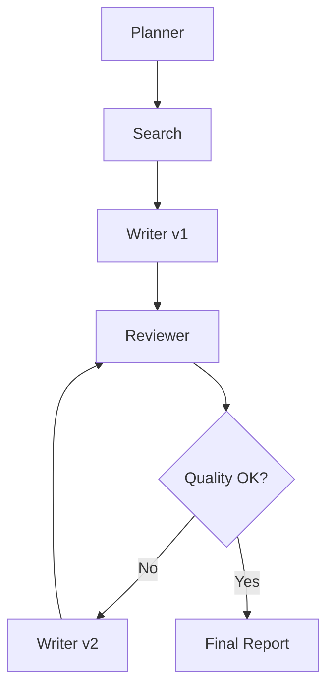
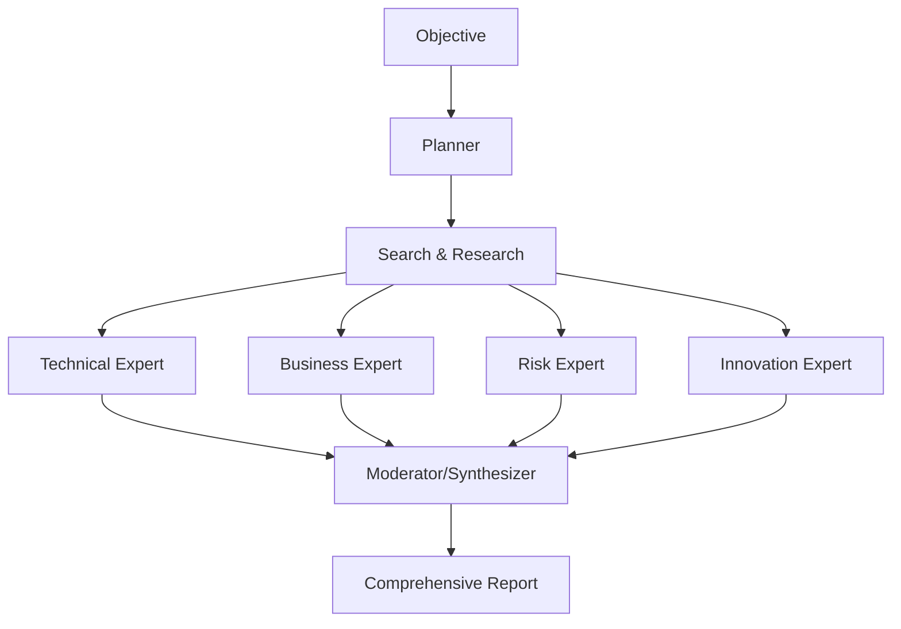
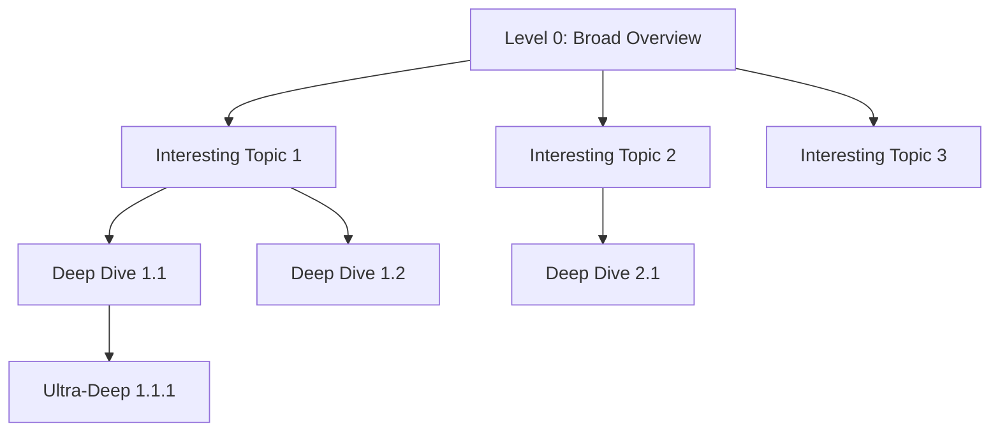

# Deep Research Pattern Variations
## Creative Patterns & Advanced Techniques

> **Purpose**: This document provides creative pattern variations and advanced techniques for building sophisticated Deep Research applications beyond the basic sequential workflow.

---

## 📑 Table of Contents

1. [Pattern Variations Overview](#pattern-variations-overview)
2. [Self-Improving Research Loop](#1-self-improving-research-loop)
3. [Multi-Perspective Analysis](#2-multi-perspective-analysis)
4. [Hierarchical Deep Dive](#3-hierarchical-deep-dive)
5. [Evidence-Based Research](#4-evidence-based-research)
6. [Iterative Expansion](#5-iterative-expansion)
7. [Meta-Research Patterns](#6-meta-research-patterns)
8. [Performance Optimization](#performance-optimization)

---

## Pattern Variations Overview

### Complexity Matrix

| Pattern | Complexity | Speed | Quality | Use Case |
|---------|-----------|-------|---------|----------|
| Basic Sequential | ⭐ | ⚡ Fast | ⭐⭐⭐ | Quick research |
| Self-Improving Loop | ⭐⭐ | ⚡⚡ Medium | ⭐⭐⭐⭐ | High-quality reports |
| Multi-Perspective | ⭐⭐ | ⚡⚡⚡ Slow | ⭐⭐⭐⭐⭐ | Comprehensive analysis |
| Hierarchical Deep Dive | ⭐⭐⭐ | ⚡⚡ Medium | ⭐⭐⭐⭐⭐ | In-depth exploration |
| Evidence-Based | ⭐⭐⭐ | ⚡ Fast | ⭐⭐⭐⭐⭐ | Factual accuracy |
| Meta-Research | ⭐⭐⭐⭐ | ⚡⚡⚡ Slow | ⭐⭐⭐⭐⭐ | Academic/scientific |

---

## 1. Self-Improving Research Loop

### Concept

The review agent provides feedback, and the writer iteratively improves the report until quality criteria are met.

### Architecture



### Implementation

```python
"""
Self-Improving Research Loop
Quality-driven iterative refinement
"""

from typing import Dict, List
import asyncio
from datetime import datetime

async def execute_self_improving_research(
    objective: str,
    quality_threshold: float = 8.0,
    max_iterations: int = 3
) -> Dict:
    """
    Research with iterative quality improvement.
    
    Args:
        objective: Research objective
        quality_threshold: Minimum quality score (0-10)
        max_iterations: Maximum refinement iterations
    
    Returns:
        Final report with quality metrics
    """
    
    print("="*80)
    print("SELF-IMPROVING RESEARCH WORKFLOW")
    print("="*80)
    print(f"Objective: {objective}")
    print(f"Quality Threshold: {quality_threshold}/10")
    print(f"Max Iterations: {max_iterations}\n")
    
    # Phase 1: Planning and Research
    print("[Phase 1: Planning & Research]")
    planner = create_planner_agent()
    plan = await planner.create_plan(objective)
    
    search_queries = extract_queries(plan)
    
    # Concurrent search
    search_agents = [create_search_agent(f"Searcher_{i}") for i in range(len(search_queries))]
    search_tasks = [agent.search(query) for agent, query in zip(search_agents, search_queries)]
    search_results = await asyncio.gather(*search_tasks)
    
    print(f"✓ Research complete: {len(search_results)} sources analyzed\n")
    
    # Phase 2: Iterative Writing and Review
    print("[Phase 2: Iterative Refinement]")
    
    writer = create_writer_agent()
    reviewer = create_reviewer_agent()
    
    # Initial draft
    report = await writer.write_report(objective, search_results)
    iteration = 0
    review_history = []
    
    while iteration < max_iterations:
        iteration += 1
        print(f"\n--- Iteration {iteration} ---")
        
        # Review current version
        review = await reviewer.review_report(objective, report)
        quality_score = review["quality_score"]
        review_history.append({
            "iteration": iteration,
            "quality_score": quality_score,
            "feedback": review["review"]
        })
        
        print(f"Quality Score: {quality_score:.1f}/10")
        
        if quality_score >= quality_threshold:
            print(f"✓ Quality threshold met in iteration {iteration}!")
            break
        
        if iteration < max_iterations:
            print("Refining report based on feedback...")
            
            # Refine report with specific feedback
            refinement_prompt = f"""
Original Report:
{report}

Reviewer Feedback:
{review['review']}

Please revise the report addressing all feedback points. Maintain the structure 
but improve clarity, add missing details, and enhance quality.
"""
            
            refined_response = await writer.agent.run(refinement_prompt)
            report = refined_response.messages[-1].text
    
    # Final assessment
    if iteration == max_iterations and quality_score < quality_threshold:
        print(f"\n⚠️  Maximum iterations reached. Quality: {quality_score:.1f}/10")
    
    print("\n[Refinement Complete]")
    
    return {
        "objective": objective,
        "report": report,
        "final_quality_score": quality_score,
        "iterations": iteration,
        "review_history": review_history,
        "improvement": review_history[-1]["quality_score"] - review_history[0]["quality_score"]
    }


# Specialized reviewer for iterative improvement
def create_iterative_reviewer():
    """Create reviewer optimized for providing actionable feedback."""
    
    return create_reviewer_agent_with_instructions("""
You are an expert research editor focused on ACTIONABLE improvement.

For each review, provide:

1. **Strengths** (2-3 specific points)
2. **Critical Issues** (must fix)
   - Missing information
   - Unclear explanations
   - Unsupported claims
3. **Improvements** (specific, actionable)
   - "Add statistics on X in section Y"
   - "Clarify the relationship between A and B"
   - "Expand on the implications of Z"

Quality Scoring:
- 9-10: Publication ready, minor polish needed
- 7-8: Good foundation, needs targeted improvements
- 5-6: Significant gaps, requires major revision
- 0-4: Fundamental issues, restart recommended

Be specific, constructive, and prioritize high-impact changes.
""")
```

### Usage Example

```python
# Run self-improving research
result = await execute_self_improving_research(
    objective="Analyze the impact of AI on healthcare diagnostics",
    quality_threshold=8.5,
    max_iterations=3
)

print(f"\nFinal Quality: {result['final_quality_score']:.1f}/10")
print(f"Improvement: +{result['improvement']:.1f} points")
print(f"Iterations: {result['iterations']}")
```

### Benefits

- ✅ **Higher Quality**: Iterative refinement improves report quality
- ✅ **Measurable**: Quality scores track improvement
- ✅ **Adaptive**: Stops when threshold is met, saving resources
- ✅ **Transparent**: Review history shows improvement trajectory

### Drawbacks

- ⚠️ **Time**: Multiple iterations increase latency
- ⚠️ **Cost**: More LLM calls = higher costs
- ⚠️ **Complexity**: Requires sophisticated review criteria

---

## 2. Multi-Perspective Analysis

### Concept

Multiple specialized "expert" agents analyze the same research from different perspectives, providing comprehensive coverage.

### Architecture



### Implementation

```python
"""
Multi-Perspective Analysis Pattern
Diverse expert viewpoints for comprehensive insights
"""

from typing import Dict, List
import asyncio

class ExpertAgent:
    """Specialized expert with specific perspective."""
    
    def __init__(self, name: str, expertise: str, focus_areas: List[str]):
        self.name = name
        self.expertise = expertise
        self.focus_areas = focus_areas
        
        self.agent = create_agent_with_instructions(
            name=name,
            instructions=f"""
You are an expert in {expertise}.

Your role is to analyze research from the perspective of {expertise}.

Focus Areas:
{chr(10).join(f'- {area}' for area in focus_areas)}

Provide insights specifically relevant to your expertise. Highlight:
1. Key considerations from your perspective
2. Opportunities and advantages
3. Challenges and risks
4. Recommendations

Structure your analysis with clear sections and actionable insights.
"""
        )
    
    async def analyze(self, objective: str, research_data: Dict) -> Dict:
        """Analyze from expert perspective."""
        
        analysis_prompt = f"""
Research Objective: {objective}

Research Findings:
{self._format_research_data(research_data)}

Provide your expert analysis from the {self.expertise} perspective.
Focus on {', '.join(self.focus_areas)}.
"""
        
        response = await self.agent.run(analysis_prompt)
        
        return {
            "expert": self.name,
            "perspective": self.expertise,
            "analysis": response.messages[-1].text
        }
    
    def _format_research_data(self, data: Dict) -> str:
        """Format research data for analysis."""
        # Combine search results into readable format
        return "\n\n".join([
            f"Source {i+1}: {r.get('analysis', '')}"
            for i, r in enumerate(data.get('search_results', []))
        ])


async def execute_multi_perspective_research(objective: str) -> Dict:
    """
    Execute research with multiple expert perspectives.
    
    Creates diverse viewpoints for comprehensive analysis.
    """
    
    print("="*80)
    print("MULTI-PERSPECTIVE RESEARCH")
    print("="*80)
    print(f"Objective: {objective}\n")
    
    # Phase 1: Planning and Research (Standard)
    print("[Phase 1: Research]")
    planner = create_planner_agent()
    plan = await planner.create_plan(objective)
    
    search_results = await execute_concurrent_search(plan)
    print(f"✓ Research complete\n")
    
    # Phase 2: Multi-Expert Analysis (Concurrent)
    print("[Phase 2: Expert Panel Analysis]")
    
    # Define expert panel
    experts = [
        ExpertAgent(
            name="Technical Expert",
            expertise="technical architecture and implementation",
            focus_areas=[
                "Technical feasibility and requirements",
                "Implementation complexity and timeline",
                "Technology stack and infrastructure",
                "Scalability and performance considerations"
            ]
        ),
        ExpertAgent(
            name="Business Strategist",
            expertise="business strategy and value creation",
            focus_areas=[
                "Business value and ROI",
                "Market opportunities and competitive advantage",
                "Cost-benefit analysis",
                "Strategic alignment and priorities"
            ]
        ),
        ExpertAgent(
            name="Risk Analyst",
            expertise="risk management and mitigation",
            focus_areas=[
                "Potential risks and vulnerabilities",
                "Compliance and regulatory concerns",
                "Security and privacy implications",
                "Mitigation strategies"
            ]
        ),
        ExpertAgent(
            name="Innovation Advisor",
            expertise="future trends and innovation",
            focus_areas=[
                "Emerging trends and opportunities",
                "Future-proofing strategies",
                "Disruptive potential",
                "Long-term implications"
            ]
        )
    ]
    
    # Concurrent expert analysis
    analysis_tasks = [
        expert.analyze(objective, {"search_results": search_results})
        for expert in experts
    ]
    
    expert_analyses = await asyncio.gather(*analysis_tasks)
    
    for analysis in expert_analyses:
        print(f"✓ {analysis['expert']} analysis complete")
    
    print()
    
    # Phase 3: Synthesis (Moderator)
    print("[Phase 3: Synthesis]")
    
    moderator = create_moderator_agent()
    final_report = await moderator.synthesize_perspectives(
        objective=objective,
        expert_analyses=expert_analyses
    )
    
    print("✓ Multi-perspective report complete\n")
    
    return {
        "objective": objective,
        "expert_analyses": expert_analyses,
        "synthesized_report": final_report,
        "perspectives_count": len(experts)
    }


def create_moderator_agent():
    """Create moderator for synthesizing expert perspectives."""
    
    return create_agent_with_instructions(
        name="Panel Moderator",
        instructions="""
You are an expert moderator synthesizing insights from multiple expert perspectives.

Your role is to:
1. Identify common themes across expert analyses
2. Highlight unique insights from each perspective
3. Resolve conflicting viewpoints with balanced analysis
4. Create a coherent narrative integrating all perspectives
5. Provide balanced recommendations considering all viewpoints

Report Structure:
1. Executive Summary (key insights from all perspectives)
2. Integrated Analysis
   - Technical Considerations
   - Business Implications
   - Risk Assessment
   - Innovation Opportunities
3. Synthesis of Perspectives (where experts agree/disagree)
4. Balanced Recommendations
5. Conclusion

Ensure each expert's insights are represented fairly while creating a unified narrative.
"""
    )


# Moderator synthesis method
async def synthesize_perspectives(
    self,
    objective: str,
    expert_analyses: List[Dict]
) -> str:
    """Synthesize multiple expert perspectives."""
    
    perspectives_text = "\n\n".join([
        f"=== {analysis['expert']} ({analysis['perspective']}) ===\n{analysis['analysis']}"
        for analysis in expert_analyses
    ])
    
    synthesis_prompt = f"""
Research Objective: {objective}

Expert Panel Analyses:
{perspectives_text}

Create a comprehensive synthesized report that integrates all expert perspectives.
Identify synergies, address conflicts, and provide balanced recommendations.
"""
    
    response = await self.agent.run(synthesis_prompt)
    return response.messages[-1].text
```

### Usage Example

```python
result = await execute_multi_perspective_research(
    objective="Should we implement AI-powered customer service for our enterprise?"
)

print(f"\n✓ Analyzed from {result['perspectives_count']} perspectives:")
for analysis in result['expert_analyses']:
    print(f"  - {analysis['expert']}")
```

### Benefits

- ✅ **Comprehensive**: Multiple viewpoints ensure thorough coverage
- ✅ **Balanced**: Reduces single-perspective bias
- ✅ **Actionable**: Different lenses reveal different insights
- ✅ **Credible**: Expert-based approach increases trust

### Customization

```python
# Healthcare-specific experts
healthcare_experts = [
    ExpertAgent("Clinical Expert", "clinical practice", ["Patient care", "Clinical workflows"]),
    ExpertAgent("Regulatory Expert", "healthcare compliance", ["HIPAA", "FDA regulations"]),
    ExpertAgent("Health Economist", "healthcare economics", ["Cost analysis", "Reimbursement"]),
]

# Financial services experts
finance_experts = [
    ExpertAgent("Quant Analyst", "quantitative analysis", ["Models", "Algorithms", "Data"]),
    ExpertAgent("Compliance Officer", "regulatory compliance", ["SEC", "FINRA", "Risk"]),
    ExpertAgent("Product Manager", "product strategy", ["UX", "Features", "Market fit"]),
]
```

---

## 3. Hierarchical Deep Dive

### Concept

Start with broad overview, identify interesting areas, then recursively dive deeper into specific topics.

### Architecture



### Implementation

```python
"""
Hierarchical Deep Dive Pattern
Recursive exploration with increasing depth
"""

from typing import Dict, List, Optional
import asyncio

async def execute_hierarchical_research(
    objective: str,
    current_depth: int = 0,
    max_depth: int = 2,
    breadth: int = 3
) -> Dict:
    """
    Recursive deep dive research.
    
    Args:
        objective: Research objective
        current_depth: Current recursion depth (0 = root)
        max_depth: Maximum depth to explore
        breadth: Number of subtopics to explore at each level
    
    Returns:
        Hierarchical research results
    """
    
    indent = "  " * current_depth
    print(f"{indent}[Level {current_depth}] {objective}")
    
    # Level 0-1: Broad overview
    depth_setting = "basic" if current_depth == 0 else "advanced"
    
    search_agent = create_search_agent(f"Searcher_L{current_depth}")
    overview = await search_agent.search_and_analyze(
        query=objective,
        search_depth=depth_setting
    )
    
    print(f"{indent}✓ Overview complete")
    
    # Analyze and identify interesting subtopics
    if current_depth < max_depth:
        analyzer = create_topic_analyzer()
        subtopics = await analyzer.identify_subtopics(
            objective=objective,
            overview=overview,
            max_subtopics=breadth
        )
        
        print(f"{indent}📌 Identified {len(subtopics)} subtopics")
        
        # Recursive deep dive into subtopics
        deep_dive_tasks = [
            execute_hierarchical_research(
                objective=subtopic,
                current_depth=current_depth + 1,
                max_depth=max_depth,
                breadth=breadth
            )
            for subtopic in subtopics[:breadth]
        ]
        
        deep_dives = await asyncio.gather(*deep_dive_tasks)
    else:
        deep_dives = []
        print(f"{indent}⚓ Max depth reached")
    
    return {
        "objective": objective,
        "depth": current_depth,
        "overview": overview,
        "subtopics": deep_dives,
        "leaf_node": len(deep_dives) == 0
    }


def create_topic_analyzer():
    """Create analyzer for identifying interesting subtopics."""
    
    return create_agent_with_instructions(
        name="Topic Analyzer",
        instructions="""
You are an expert at identifying interesting subtopics for deep research.

Analyze the research overview and identify the most important, interesting, 
or complex subtopics that warrant deeper investigation.

Consider:
- Which areas have the most significant implications?
- Which topics are most complex or nuanced?
- Where is more detail most valuable?
- What questions remain unanswered?

Output format:
Return a JSON array of 2-4 specific subtopic questions to explore:

["Subtopic 1 question?", "Subtopic 2 question?", ...]

Focus on actionable, specific research questions.
"""
    )


async def synthesize_hierarchical_report(
    research_tree: Dict,
    depth: int = 0
) -> str:
    """
    Synthesize hierarchical research into structured report.
    
    Creates a report that flows from broad to specific, preserving
    the hierarchical structure of the research.
    """
    
    synthesizer = create_hierarchical_synthesizer()
    
    synthesis_prompt = f"""
Create a comprehensive research report from this hierarchical research:

{_format_research_tree(research_tree, depth=0)}

Structure the report to flow naturally from broad overview to specific deep dives.
Use clear headings to show the hierarchy. Synthesize insights across levels.
"""
    
    response = await synthesizer.run(synthesis_prompt)
    return response.messages[-1].text


def _format_research_tree(tree: Dict, depth: int = 0) -> str:
    """Format research tree for synthesis."""
    
    indent = "  " * depth
    sections = [f"{indent}{'#' * (depth + 1)} {tree['objective']}"]
    sections.append(f"{indent}{tree['overview']['analysis']}")
    
    for subtopic in tree.get('subtopics', []):
        sections.append(_format_research_tree(subtopic, depth + 1))
    
    return "\n\n".join(sections)
```

### Usage Example

```python
# Execute hierarchical research
result = await execute_hierarchical_research(
    objective="What is the future of quantum computing?",
    max_depth=2,
    breadth=3
)

# Synthesize into report
report = await synthesize_hierarchical_report(result)

print(report)
```

### Output Structure

```
# What is the future of quantum computing?
[Broad overview of quantum computing future]

## Near-term applications in cryptography
[Focused analysis on crypto applications]

### Post-quantum cryptography standards
[Deep dive into specific standards]

## Quantum machine learning potential
[Focused analysis on ML applications]

### Quantum neural networks
[Deep dive into QNNs]
```

### Benefits

- ✅ **Adaptive Depth**: Explores interesting areas more deeply
- ✅ **Comprehensive**: Broad coverage with targeted depth
- ✅ **Organized**: Natural hierarchical structure
- ✅ **Efficient**: Only goes deep where valuable

### Configuration Options

```python
# Quick overview (breadth-first)
quick_result = await execute_hierarchical_research(
    objective=topic,
    max_depth=1,  # Only 1 level deep
    breadth=5     # But explore 5 subtopics
)

# Deep dive (depth-first)
deep_result = await execute_hierarchical_research(
    objective=topic,
    max_depth=3,  # 3 levels deep
    breadth=2     # But only 2 subtopics per level
)

# Balanced
balanced_result = await execute_hierarchical_research(
    objective=topic,
    max_depth=2,
    breadth=3
)
```

---

## 4. Evidence-Based Research

### Concept

Extract specific claims from the report and verify each claim against sources, providing confidence scores.

### Implementation

```python
"""
Evidence-Based Research Pattern
Fact-checking and confidence scoring
"""

from typing import Dict, List, Tuple
import asyncio

async def execute_verified_research(objective: str) -> Dict:
    """
    Research with built-in fact-checking and confidence scoring.
    
    Validates claims and provides evidence-based confidence metrics.
    """
    
    print("="*80)
    print("EVIDENCE-BASED RESEARCH")
    print("="*80)
    print(f"Objective: {objective}\n")
    
    # Phase 1: Standard Research
    print("[Phase 1: Initial Research]")
    plan = await create_planner_agent().create_plan(objective)
    search_results = await execute_concurrent_search(plan)
    draft_report = await create_writer_agent().write_report(objective, search_results)
    
    print("✓ Draft report generated\n")
    
    # Phase 2: Claim Extraction
    print("[Phase 2: Claim Extraction]")
    claim_extractor = create_claim_extractor()
    claims = await claim_extractor.extract_claims(draft_report)
    
    print(f"✓ Extracted {len(claims)} factual claims\n")
    
    # Phase 3: Claim Verification (Concurrent)
    print("[Phase 3: Fact Verification]")
    fact_checker = create_fact_checker()
    
    verification_tasks = [
        fact_checker.verify_claim(claim, search_results)
        for claim in claims
    ]
    
    verifications = await asyncio.gather(*verification_tasks)
    
    # Calculate metrics
    avg_confidence = sum(v["confidence"] for v in verifications) / len(verifications)
    high_confidence = sum(1 for v in verifications if v["confidence"] >= 0.8)
    
    print(f"✓ Verification complete")
    print(f"  Average Confidence: {avg_confidence:.1%}")
    print(f"  High Confidence Claims: {high_confidence}/{len(claims)}\n")
    
    # Phase 4: Enhanced Report with Confidence
    print("[Phase 4: Enhanced Report Generation]")
    enhancer = create_report_enhancer()
    verified_report = await enhancer.add_confidence_annotations(
        report=draft_report,
        verifications=verifications
    )
    
    print("✓ Evidence-based report complete\n")
    
    return {
        "objective": objective,
        "report": verified_report,
        "claims": claims,
        "verifications": verifications,
        "confidence_metrics": {
            "average_confidence": avg_confidence,
            "high_confidence_count": high_confidence,
            "total_claims": len(claims),
            "confidence_distribution": _calculate_distribution(verifications)
        }
    }


def create_claim_extractor():
    """Create agent for extracting factual claims."""
    
    return create_agent_with_instructions(
        name="Claim Extractor",
        instructions="""
You are an expert at extracting factual claims from text.

Identify all specific, verifiable factual statements including:
- Statistics and numerical data
- Dates and timelines
- Causal relationships
- Comparative statements
- Definitive assertions

Exclude:
- Opinions and subjective statements
- Vague or general statements
- Already qualified statements (e.g., "may", "possibly")

Output format - JSON array:
[
  {
    "claim": "Specific factual statement",
    "type": "statistic|date|causal|comparative|assertion",
    "context": "Surrounding context for verification"
  }
]

Extract 10-20 key factual claims.
"""
    )


def create_fact_checker():
    """Create fact-checking agent."""
    
    class FactChecker:
        def __init__(self):
            self.agent = create_agent_with_instructions(
                name="Fact Checker",
                instructions="""
You are an expert fact-checker evaluating claims against evidence.

For each claim, assess:
1. Is there direct supporting evidence?
2. Is there contradicting evidence?
3. What is the quality of sources?
4. Are there caveats or nuances?

Provide:
- Verification status: "supported", "partially_supported", "unsupported", "contradicted"
- Confidence score: 0.0 to 1.0
- Evidence: Specific sources supporting/contradicting
- Caveats: Important qualifications or context

Be rigorous and conservative in your assessments.
"""
            )
        
        async def verify_claim(
            self,
            claim: Dict,
            search_results: List[Dict]
        ) -> Dict:
            """Verify a single claim against search results."""
            
            # Build verification prompt with sources
            sources_text = "\n\n".join([
                f"Source {i+1}:\n{r.get('analysis', '')}"
                for i, r in enumerate(search_results)
            ])
            
            verification_prompt = f"""
Claim to Verify: {claim['claim']}
Claim Type: {claim['type']}
Context: {claim.get('context', 'None')}

Available Evidence:
{sources_text}

Verify this claim. Provide status, confidence, supporting evidence, and any caveats.
"""
            
            response = await self.agent.run(verification_prompt)
            result_text = response.messages[-1].text
            
            # Parse response (simplified - in production, use structured output)
            confidence = self._extract_confidence(result_text)
            status = self._extract_status(result_text)
            
            return {
                "claim": claim['claim'],
                "status": status,
                "confidence": confidence,
                "verification": result_text
            }
        
        def _extract_confidence(self, text: str) -> float:
            """Extract confidence score from text."""
            # Simplified extraction - in production, use structured output
            if "high confidence" in text.lower() or "strongly supported" in text.lower():
                return 0.9
            elif "moderate confidence" in text.lower() or "supported" in text.lower():
                return 0.7
            elif "low confidence" in text.lower() or "partially" in text.lower():
                return 0.5
            else:
                return 0.3
        
        def _extract_status(self, text: str) -> str:
            """Extract verification status."""
            text_lower = text.lower()
            if "contradicted" in text_lower:
                return "contradicted"
            elif "unsupported" in text_lower:
                return "unsupported"
            elif "partially" in text_lower:
                return "partially_supported"
            else:
                return "supported"
    
    return FactChecker()


def _calculate_distribution(verifications: List[Dict]) -> Dict:
    """Calculate confidence distribution."""
    
    buckets = {
        "high (0.8-1.0)": 0,
        "medium (0.5-0.8)": 0,
        "low (0.0-0.5)": 0
    }
    
    for v in verifications:
        conf = v["confidence"]
        if conf >= 0.8:
            buckets["high (0.8-1.0)"] += 1
        elif conf >= 0.5:
            buckets["medium (0.5-0.8)"] += 1
        else:
            buckets["low (0.0-0.5)"] += 1
    
    return buckets
```

### Usage

```python
result = await execute_verified_research(
    objective="What is the current state of fusion energy research?"
)

print(f"\nConfidence Metrics:")
print(f"  Average: {result['confidence_metrics']['average_confidence']:.1%}")
print(f"  Distribution: {result['confidence_metrics']['confidence_distribution']}")

# Access individual claim verifications
for v in result['verifications']:
    print(f"\nClaim: {v['claim']}")
    print(f"Status: {v['status']}")
    print(f"Confidence: {v['confidence']:.1%}")
```

### Benefits

- ✅ **Accuracy**: Explicit fact-checking improves reliability
- ✅ **Transparency**: Confidence scores show certainty levels
- ✅ **Credibility**: Evidence-based approach builds trust
- ✅ **Actionable**: Identifies areas needing more research

---

## Performance Optimization

### 1. Caching Search Results

```python
from functools import lru_cache
import hashlib
import json

class SearchCache:
    """Cache search results to avoid duplicate API calls."""
    
    def __init__(self):
        self.cache = {}
    
    def get_cache_key(self, query: str, depth: str) -> str:
        """Generate cache key from query parameters."""
        key_str = f"{query}:{depth}"
        return hashlib.md5(key_str.encode()).hexdigest()
    
    async def search_with_cache(
        self,
        query: str,
        depth: str = "advanced"
    ) -> Dict:
        """Search with caching."""
        
        cache_key = self.get_cache_key(query, depth)
        
        if cache_key in self.cache:
            print(f"  [CACHE HIT] {query}")
            return self.cache[cache_key]
        
        print(f"  [CACHE MISS] {query}")
        result = await self.tavily.search(query=query, search_depth=depth)
        
        self.cache[cache_key] = result
        return result

# Usage
cache = SearchCache()
results = await cache.search_with_cache("quantum computing trends")
```

### 2. Batch Processing

```python
async def batch_search(queries: List[str], batch_size: int = 5):
    """Process searches in batches to avoid rate limits."""
    
    results = []
    
    for i in range(0, len(queries), batch_size):
        batch = queries[i:i + batch_size]
        print(f"Processing batch {i//batch_size + 1}/{(len(queries)-1)//batch_size + 1}")
        
        batch_results = await asyncio.gather(*[
            search_agent.search(q) for q in batch
        ])
        
        results.extend(batch_results)
        
        # Rate limiting
        if i + batch_size < len(queries):
            await asyncio.sleep(1)  # 1 second between batches
    
    return results
```

### 3. Streaming Results

```python
async def stream_research_results(objective: str):
    """Stream results as they become available."""
    
    yield {"phase": "planning", "status": "started"}
    
    plan = await planner.create_plan(objective)
    yield {"phase": "planning", "status": "complete", "data": plan}
    
    queries = extract_queries(plan)
    
    for i, query in enumerate(queries):
        yield {"phase": "search", "status": "started", "query": query, "index": i}
        
        result = await search_agent.search(query)
        yield {"phase": "search", "status": "complete", "data": result, "index": i}
    
    # ... continue streaming

# Usage with FastAPI
@app.get("/research/stream")
async def research_stream(objective: str):
    async def generate():
        async for update in stream_research_results(objective):
            yield f"data: {json.dumps(update)}\n\n"
    
    return StreamingResponse(generate(), media_type="text/event-stream")
```

---

## Summary

These pattern variations provide flexibility for different research needs:

- **Self-Improving Loop**: For maximum quality
- **Multi-Perspective**: For comprehensive analysis
- **Hierarchical Deep Dive**: For adaptive depth
- **Evidence-Based**: For factual accuracy

Choose based on your requirements:
- **Time-sensitive**: Use basic sequential
- **High-quality needed**: Use self-improving loop
- **Complex decision**: Use multi-perspective
- **Exploratory research**: Use hierarchical deep dive
- **Factual verification needed**: Use evidence-based

**Mix and match** patterns for your specific use case!
