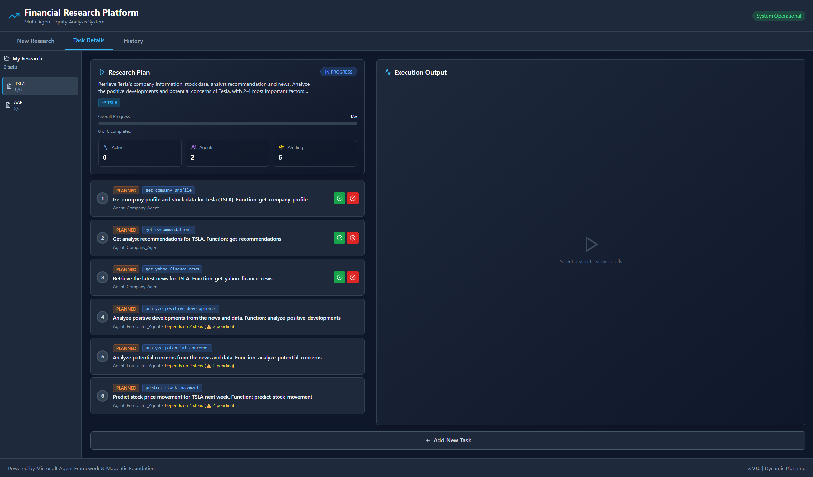
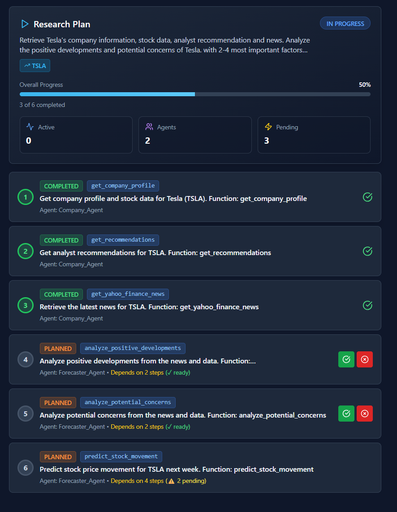
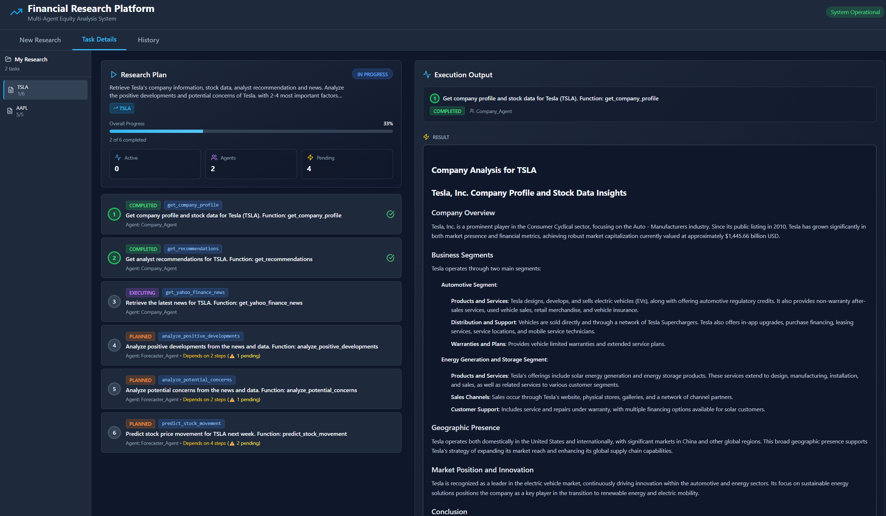
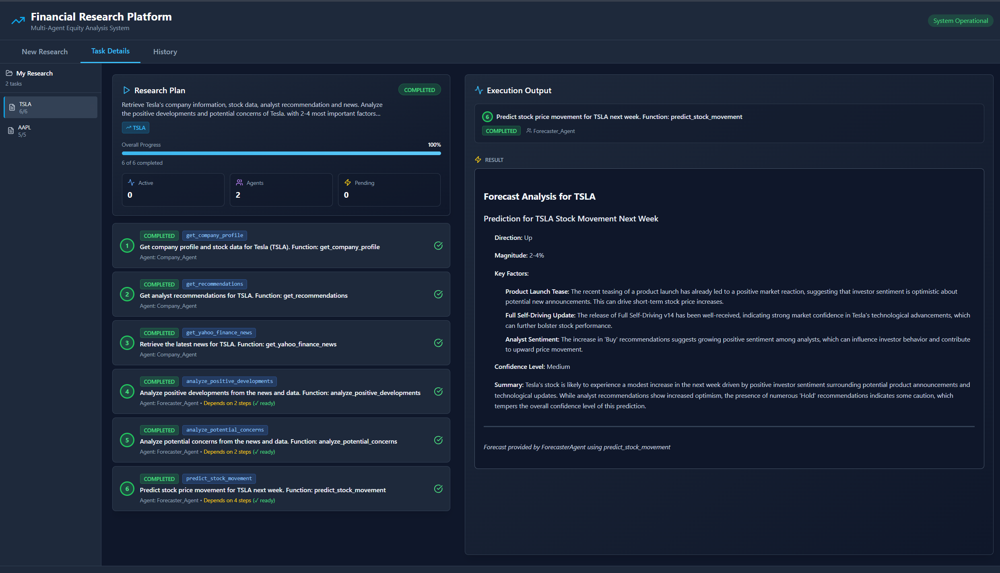
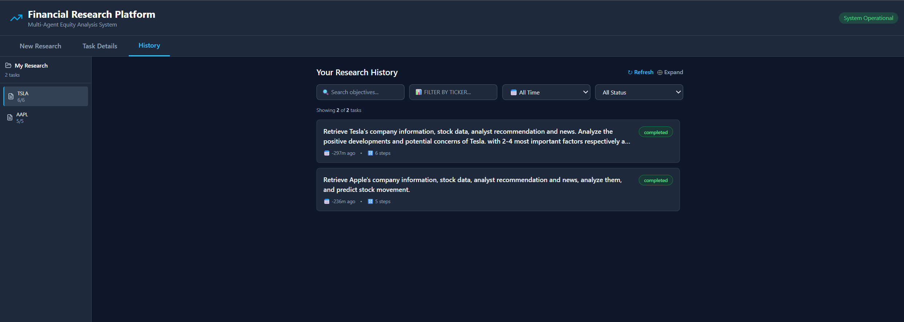

# Financial Research Multi-Agent Application

> **AI-powered financial research system** with dynamic planning, human-in-the-loop approval, and multi-agent orchestration for comprehensive equity analysis.


## 🎯 Overview

A sophisticated financial research platform built on the **Microsoft Agent Framework**, combining the agent taxonomy from **finagentsk** with advanced orchestration patterns. The application provides intelligent equity research through coordinated AI agents, featuring dynamic planning, real-time execution, and comprehensive analysis across multiple financial data sources.

### Key Highlights

- 🤖 **Dynamic AI Planning** - ReAct-based planner creates optimal execution strategies
- 👥 **Human-in-the-Loop** - Approve, reject, or modify each step before execution
- 🔄 **Real-time Progress** - Live updates and step-by-step execution tracking
- 📊 **Multi-Source Integration** - Yahoo Finance MCP server, FMP API, SEC EDGAR
- 💾 **Persistent State** - CosmosDB-backed session management and conversation history
- 📱 **Modern UI** - Clean, responsive interface with comprehensive task visualization
- 🔌 **MCP Integration** - Model Context Protocol server for Yahoo Finance data

## 📸 Application Screenshots

### Homepage - Research Objective Input

*Enter your research objective and the system dynamically creates an execution plan*

### Dynamic Research Plan

*AI-generated execution plan with step dependencies and agent assignments*

### Task Dependencies Visualization

*Visual representation of step dependencies and execution order*

### Task Execution in Progress

*Real-time execution status with live progress updates*

### Completed Research with Details

*View comprehensive results from all executed agents*

### Task Detail View

*Detailed view of individual task results with formatted output*

### Research History

*Access and review past research sessions*

## 🏗️ Architecture

```
finagent_dynamic_app/
├── backend/                          # FastAPI Backend
│   ├── app/
│   │   ├── main.py                  # FastAPI application entry point
│   │   ├── agents/                  # Financial agent implementations
│   │   │   ├── company_agent.py     # Company intelligence & market data (MCP-enabled)
│   │   │   ├── sec_agent.py         # SEC filings analysis
│   │   │   ├── earnings_agent.py    # Earnings calls analysis
│   │   │   ├── fundamentals_agent.py # Financial statements & ratios
│   │   │   ├── technicals_agent.py  # Technical analysis
│   │   │   ├── summarizer_agent.py  # Multi-agent synthesis
│   │   │   └── planner_agent.py     # ReAct-based dynamic planner
│   │   ├── models/
│   │   │   └── task_models.py       # Plan, Step, Message models
│   │   ├── persistence/
│   │   │   ├── memory_store_base.py # Abstract persistence interface
│   │   │   └── cosmos_memory.py     # CosmosDB implementation
│   │   ├── services/
│   │   │   └── task_orchestrator.py # Bridges framework patterns & Cosmos
│   │   ├── routers/
│   │   │   └── orchestration.py     # REST API endpoints
│   │   ├── infra/
│   │   │   ├── settings.py          # Configuration management
│   │   │   └── telemetry.py         # Observability service
│   │   └── helpers/                 # Utility classes (FMP, data formatters)
│   ├── mcp_servers/                 # Yahoo Finance MCP Server
│   │   ├── main.py                  # MCP server FastAPI wrapper
│   │   ├── yahoo_finance_server.py  # MCP server implementation
│   │   └── Dockerfile               # Container configuration
│   ├── requirements.txt             # Python dependencies
│   ├── .env.template                # Environment configuration template
│   └── start.ps1                    # Backend startup script
│
├── frontend/                        # React + TypeScript + Vite Frontend
│   ├── src/
│   │   ├── App.tsx                  # Main application component
│   │   ├── main.tsx                 # React entry point
│   │   ├── lib/
│   │   │   └── api.ts               # API client for backend
│   │   └── components/
│   │       ├── TaskInput.tsx        # Research objective form
│   │       ├── PlanView.tsx         # Plan display with steps
│   │       ├── StepCard.tsx         # Step card with approve/reject
│   │       ├── ConversationView.tsx # Message timeline
│   │       └── HistoryView.tsx      # Session history browser
│   ├── package.json                 # Node dependencies
│   ├── .env                         # Frontend config
│   └── tailwind.config.js           # TailwindCSS configuration
│
├── docs/                            # Documentation
│   ├── images/                      # Screenshots
│   └── QUICKSTART.md               # Quick start guide
│
├── scripts/
│   ├── setup_backend.ps1            # Backend setup automation
│   ├── setup_frontend.ps1           # Frontend setup automation
│   └── dev.ps1                      # Development startup script
│
├── deploy.ps1                       # Azure deployment script (Web App + Container Apps)
├── deploy_mcp.ps1                   # MCP server deployment
├── Dockerfile                       # Multi-stage Docker build
└── README.md                        # This file
```

## 🤖 AI Agents

### Company Agent 🏢
**MCP-Enabled** - Connects to Yahoo Finance MCP Server for real-time data

- **Capabilities**:
  - Company profile and business description
  - Real-time stock quotes and historical prices
  - Latest company news and market sentiment
  - Analyst recommendations and price targets
  - Key financial metrics (Market Cap, P/E, Beta, etc.)
  
- **Tools** (via MCP):
  - `get_stock_info` - Company fundamentals
  - `get_historical_stock_prices` - Price history
  - `get_yahoo_finance_news` - Latest news
  - `get_recommendations` - Analyst ratings

- **Fallback**: If MCP unavailable, uses Azure OpenAI for general analysis

### SEC Agent 📄
Regulatory filings analysis specialist

- **Capabilities**:
  - 10-K/10-Q filing analysis
  - Business highlights extraction
  - Risk factor assessment
  - Management discussion & analysis (MD&A)
  - Financial statement parsing

- **Data Sources**:
  - FMP API for SEC filings
  - SEC EDGAR direct access

### Earnings Agent 📞
Earnings call transcripts analyst

- **Capabilities**:
  - Transcript retrieval and summarization
  - Positive/negative outlook extraction
  - Management guidance analysis
  - Growth opportunities identification
  - Guidance credibility assessment

### Fundamentals Agent 💰
Financial statement analysis expert

- **Capabilities**:
  - Multi-year financial statement analysis (3-5 years)
  - Key ratio computation (ROE, ROA, Profit Margins, etc.)
  - Altman Z-Score (bankruptcy risk prediction)
  - Piotroski F-Score (financial strength assessment)
  - Revenue and earnings trend analysis

### Technicals Agent 📈
Technical analysis and charting specialist

- **Capabilities**:
  - Technical indicators (EMA, RSI, MACD, Bollinger Bands)
  - Candlestick pattern detection
  - Support and resistance level identification
  - Overall technical rating (Buy/Sell/Hold)

### Summarizer Agent 📝
Multi-agent synthesis specialist

- **Capabilities**:
  - Synthesizes results from all agents
  - Generates investment thesis
  - Identifies key risks and opportunities
  - Creates actionable recommendations
  - Sentiment-aware summary generation

### Planner Agent (Dynamic Planning) 🧠
**ReAct Pattern Implementation**

- **Capabilities**:
  - Analyzes research objectives
  - Determines optimal agent sequence
  - Identifies task dependencies
  - Creates step-by-step execution plan
  - Adapts plan based on available tools

- **Planning Algorithm**:
  1. Parse user objective
  2. Identify required data points
  3. Match capabilities to agents
  4. Determine execution order
  5. Define dependencies
  6. Generate executable plan

## ✨ Key Features

### 1. Dynamic Planning with ReAct Pattern
- **Intelligent Planning**: AI analyzes your research objective and automatically creates an optimal execution plan
- **Step Dependencies**: Automatically identifies which steps depend on others
- **Agent Selection**: Matches the right agent to each task based on capabilities
- **Function Mapping**: Maps specific functions to agents (e.g., `get_yahoo_finance_news` → Company Agent)

### 2. Human-in-the-Loop Approval
- **Step-by-Step Approval**: Review and approve each step before execution
- **Reject & Modify**: Reject steps you don't want executed
- **Full Control**: Complete transparency and control over the research process
- **Plan Visibility**: See the entire plan before any execution begins

### 3. Real-Time Execution Tracking
- **Live Progress Updates**: Watch agents work in real-time
- **Status Indicators**: Visual status for each step (Pending, Executing, Completed, Failed, Rejected)
- **Detailed Logs**: View what each agent is doing as it works
- **Error Handling**: Clear error messages and recovery options

### 4. Yahoo Finance MCP Integration
- **Model Context Protocol**: Industry-standard protocol for tool integration
- **Real-Time Data**: Live stock quotes, news, and financial metrics
- **Containerized Deployment**: MCP server runs in Azure Container Apps
- **Fallback Mechanism**: Graceful degradation if MCP server unavailable

### 5. Persistent State Management
- **CosmosDB Backend**: All plans, steps, and messages stored in Cosmos DB
- **Session Continuity**: Resume research sessions across browser refreshes
- **History Access**: View and rerun past research sessions
- **Conversation Threading**: Complete message history for each session

### 6. Multi-Source Data Integration
- **Yahoo Finance (MCP)**: Real-time quotes, news, historical data
- **Financial Modeling Prep (FMP)**: Company financials, SEC filings, earnings
- **SEC EDGAR**: Direct regulatory filing access
- **Azure OpenAI**: GPT-4o for intelligent analysis and synthesis

### 7. Modern, Responsive UI
- **Clean Interface**: Intuitive design focused on research workflow
- **Task Cards**: Visual representation of steps with status indicators
- **Dependency Graph**: See how steps relate to each other
- **Mobile Responsive**: Works on desktop, tablet, and mobile devices
- **Dark/Light Mode Ready**: Theme-aware components

## 🚀 Getting Started

### Prerequisites

- **Python 3.11+**
- **Node.js 18+**
- **Azure OpenAI** account with GPT-4o deployment
- **Financial Modeling Prep (FMP)** API key ([Get Free Key](https://financialmodelingprep.com/))
- **Azure Cosmos DB** account (for state management)
- **(Optional)** Azure Container Apps for MCP server deployment

### Quick Start

#### 1. Backend Setup

```powershell
cd finagent_dynamic_app\backend
python -m venv venv
.\venv\Scripts\Activate.ps1
pip install -r requirements.txt
```

Create `.env` file from template:
```powershell
cp .env.template .env
```

Edit `.env` with your configuration:
```env
# Azure OpenAI
AZURE_OPENAI_ENDPOINT=https://your-resource.openai.azure.com
AZURE_OPENAI_API_KEY=your-api-key-here
AZURE_OPENAI_DEPLOYMENT=gpt-4o

# Financial Data
FMP_API_KEY=your-fmp-api-key
YAHOO_FINANCE_ENABLED=true
YAHOO_FINANCE_MCP_URL=http://localhost:8001/sse  # Local development

# CosmosDB
COSMOS_DB_ENDPOINT=https://your-cosmos.documents.azure.com:443/
COSMOS_DB_KEY=your-cosmos-key
COSMOS_DB_DATABASE=finagent
COSMOS_DB_CONTAINER=sessions
```

Run backend:
```powershell
.\start.ps1
```
Backend will be available at `http://localhost:8000`

#### 2. MCP Server Setup (Optional but Recommended)

In a separate terminal:
```powershell
cd finagent_dynamic_app\backend\mcp_servers
python start_server.py
```
MCP server will be available at `http://localhost:8001/sse`

#### 3. Frontend Setup

```powershell
cd finagent_dynamic_app\frontend
npm install
npm run dev
```
Frontend will be available at `http://localhost:5173`

## 🐳 Deployment

### Deploy to Azure (Automated)

The application can be deployed to Azure with a single script:

```powershell
.\deploy.ps1 `
  -ResourceGroup "your-rg-name" `
  -AcrName "yourregistry" `
  -AppServicePlanName "your-plan" `
  -WebAppName "your-webapp" `
  -McpContainerAppName "yahoo-finance-mcp" `
  -McpEnvironmentName "finagent-mcp-env" `
  -Location "eastus"
```

This will:
1. ✅ Deploy Yahoo Finance MCP Server to Azure Container Apps
2. ✅ Build and push Docker image to Azure Container Registry
3. ✅ Deploy Web App (backend + frontend) to Azure App Service
4. ✅ Configure all environment variables automatically
5. ✅ Set up HTTPS endpoints

### Environment Variables (Production)

The deployment script automatically configures:
- `YAHOO_FINANCE_MCP_URL` - Points to Container App HTTPS endpoint + /sse
- `YAHOO_FINANCE_ENABLED` - Set to `true`
- `MCP_SERVER_URL` - Same as YAHOO_FINANCE_MCP_URL
- All Azure service endpoints and keys from `.env` file

## 🛠️ Tech Stack

### Backend
- **FastAPI** - Modern Python web framework
- **Microsoft Agent Framework** - Agent orchestration and patterns
- **Azure OpenAI** - GPT-4o for intelligence
- **MCP Python SDK** - Model Context Protocol client
- **Pydantic** - Data validation
- **Structlog** - Structured logging
- **Azure Cosmos DB** - NoSQL database for state
- **httpx** - Async HTTP client

### Frontend
- **React 18** - UI framework
- **TypeScript** - Type safety
- **Vite** - Build tool and dev server
- **TailwindCSS** - Utility-first styling
- **Lucide React** - Icon library
- **Axios** - HTTP client

### MCP Server
- **FastAPI** - HTTP/SSE transport
- **MCP SDK** - Model Context Protocol implementation
- **yfinance** - Yahoo Finance data library
- **Uvicorn** - ASGI server

### Infrastructure
- **Azure Container Apps** - MCP server hosting
- **Azure App Service** - Web app hosting
- **Azure Container Registry** - Docker image storage
- **Azure Cosmos DB** - State persistence
- **Azure Application Insights** - Monitoring (optional)

## 📝 License

MIT License - See LICENSE file for details

## 🙏 Acknowledgments

Built with:
- [Microsoft Agent Framework](https://github.com/microsoft/agent-framework)
- [finagentsk](https://github.com/akshata29/finagentsk) - Agent taxonomy
- [Model Context Protocol (MCP)](https://modelcontextprotocol.io/)

## 📞 Support

- **Documentation**: See `/docs` folder
- **Issues**: [GitHub Issues](https://github.com/akshata29/agents/issues)
- **Discussions**: [GitHub Discussions](https://github.com/akshata29/agents/discussions)

---

**Made with ❤️ using Microsoft Agent Framework**
