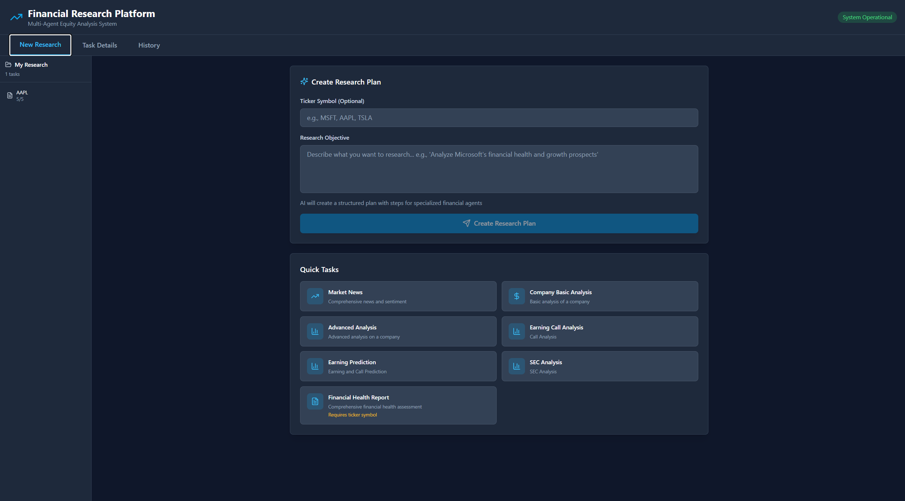

# FinAgent Dynamic App

## Overview

FinAgent Dynamic App is a Microsoft Agent Framework (MAF) reference solution for equity research. The FastAPI backend, React + Vite frontend, and a set of financial specialists cooperate through dynamic planning and human approvals to deliver explainable insights sourced from market data, SEC filings, earnings calls, and technical indicators.

## Key Capabilities

- ReAct-inspired planner assembles tailored research workflows and enforces human approval checkpoints before execution.
- Multi-source data integration across Yahoo Finance (MCP server), Financial Modeling Prep (FMP), SEC EDGAR, and Azure OpenAI reasoning.
- Cosmos DB-backed persistence that preserves plans, steps, artifacts, and searchable history with resume support.
- Modern dashboard with plan visualization, dependency graph, live execution monitor, and past session explorer.
- Extensible agent taxonomy based on `finagentsk`, including synthesis agents that leverage dual-context patterns for comprehensive summaries.

## Screenshots




## Architecture

```
React UI ─REST/WebSocket──> FastAPI Backend ──> Task Orchestrator (MAF patterns)
                                               │
                                               ├─ Financial Agents (Company, SEC, Earnings, Fundamentals, Technicals, Summarizer)
                                               ├─ Cosmos DB persistence (plans, steps, artifacts)
                                               ├─ Azure OpenAI (reasoning, synthesis)
                                               └─ Yahoo Finance MCP Server + FMP/EDGAR APIs
```

- **Frontend (`frontend/`)** – React + TypeScript + Tailwind with research form, plan viewer, approval controls, execution timeline, and history.
- **Backend (`backend/app/`)** – FastAPI REST + WebSocket endpoints, task orchestrator, agent registry, Cosmos persistence, telemetry hooks, and helper services.
- **MCP Server (`backend/mcp_servers/`)** – Yahoo Finance Model Context Protocol server packaged for local or Azure Container Apps hosting.
- **Docs (`docs/`)** – Quickstart guide, synthesis agent pattern deep dive, and screenshot library.

## Agent Lineup

| Agent | Focus | Highlights |
| --- | --- | --- |
| Planner | Dynamic planning | ReAct reasoning, dependency mapping, tool selection, approval checkpoints |
| Company | Market intelligence | Yahoo Finance MCP data, real-time quotes, analyst recommendations, market sentiment |
| SEC | Regulatory analysis | 10-K/10-Q parsing, risk factor extraction, MD&A summarization |
| Earnings | Call insight | Transcript retrieval, outlook extraction, tone analysis |
| Fundamentals | Financial health | Ratio computation, Altman Z-Score, Piotroski F-Score, multi-year trends |
| Technicals | Chart signals | Indicator suite (EMA, RSI, MACD, Bollinger), support/resistance, rating synthesis |
| Summarizer | Synthesis | Investment thesis, risks/opportunities, actionable recommendations |

## Execution Flow

1. User captures the research objective and selects tickers/modules from the dashboard.
2. Planner evaluates the request, available tools, and dependency graph before presenting a plan for approval.
3. User approves, reorders, or removes steps; orchestrator executes agents sequentially while streaming updates.
4. Agents call Yahoo Finance MCP, FMP, and SEC APIs, aggregate insights through Azure OpenAI, and persist artifacts in Cosmos DB.
5. Summarizer produces the final equity brief; history view exposes past sessions for review or rerun.

## Local Setup

### Backend

```powershell
cd finagent_dynamic_app/backend
python -m venv .venv
.venv\Scripts\Activate.ps1
pip install -r requirements.txt
copy .env.template .env
# Populate .env with Azure OpenAI, FMP, Cosmos DB, and optional telemetry values
uvicorn app.main:app --reload --port 8000
```

### Yahoo Finance MCP Server

```powershell
cd finagent_dynamic_app/backend/mcp_servers
python -m venv .venv
.venv\Scripts\Activate.ps1
pip install -r requirements.txt
python start_server.py
```

Server listens on `http://localhost:8001/sse` by default; align `YAHOO_FINANCE_MCP_URL` in backend `.env` accordingly.

### Frontend

```powershell
cd finagent_dynamic_app/frontend
npm install
echo "VITE_API_BASE_URL=http://localhost:8000" > .env
npm run dev -- --port 5173
```

Browse to `http://localhost:5173` to launch the research experience.

## Environment Variables

Configure `backend/.env` with the following keys:

```
AZURE_OPENAI_ENDPOINT=https://<resource>.openai.azure.com
AZURE_OPENAI_API_KEY=<key>
AZURE_OPENAI_DEPLOYMENT=gpt-4o
AZURE_OPENAI_API_VERSION=2024-08-01-preview
AZURE_OPENAI_CHAT_DEPLOYMENT_NAME=gpt-4o

FMP_API_KEY=<fmp-api-key>
YAHOO_FINANCE_ENABLED=true
YAHOO_FINANCE_MCP_URL=http://localhost:8001/sse
MCP_ENABLED=true

SEC_API_KEY=<optional-sec-key>
SEC_USER_AGENT=your-company contact@example.com

COSMOS_DB_ENDPOINT=https://<account>.documents.azure.com:443/
COSMOS_DB_KEY=<cosmos-key>
COSMOS_DB_DATABASE=finagent
COSMOS_DB_CONTAINER=sessions

AZURE_STORAGE_CONNECTION_STRING=<storage-connection-string>
AZURE_STORAGE_CONTAINER=financial-reports

APPLICATIONINSIGHTS_CONNECTION_STRING=<optional-app-insights-connection-string>
CORS_ORIGINS=http://localhost:5173,http://localhost:3000
```

## Testing

```powershell
# Backend tests
cd finagent_dynamic_app/backend
pytest

# Frontend tests
cd ../frontend
npm run test
```

## Deployment Notes

- `deploy.ps1` builds containers, pushes to Azure Container Registry, and provisions App Service and Container Apps for the MCP server.
- `deploy_mcp.ps1` targets only the Yahoo Finance MCP workload when you want to update the tool layer independently.
- Environment variables for production are derived from `.env` and ARM parameters; ensure Cosmos DB network rules and Application Insights connections are configured before invoking the scripts.

## Documentation

- [Docs Hub](docs/README.md)
- [Quickstart](docs/QUICKSTART.md)
- [Synthesis Agent Pattern](docs/SYNTHESIS_AGENT_PATTERN.md)

---

FinAgent Dynamic App demonstrates how Microsoft Agent Framework, Azure AI, and Model Context Protocol primitives combine to deliver auditable, human-in-the-loop financial research.
