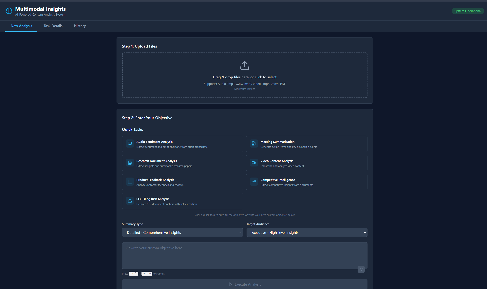
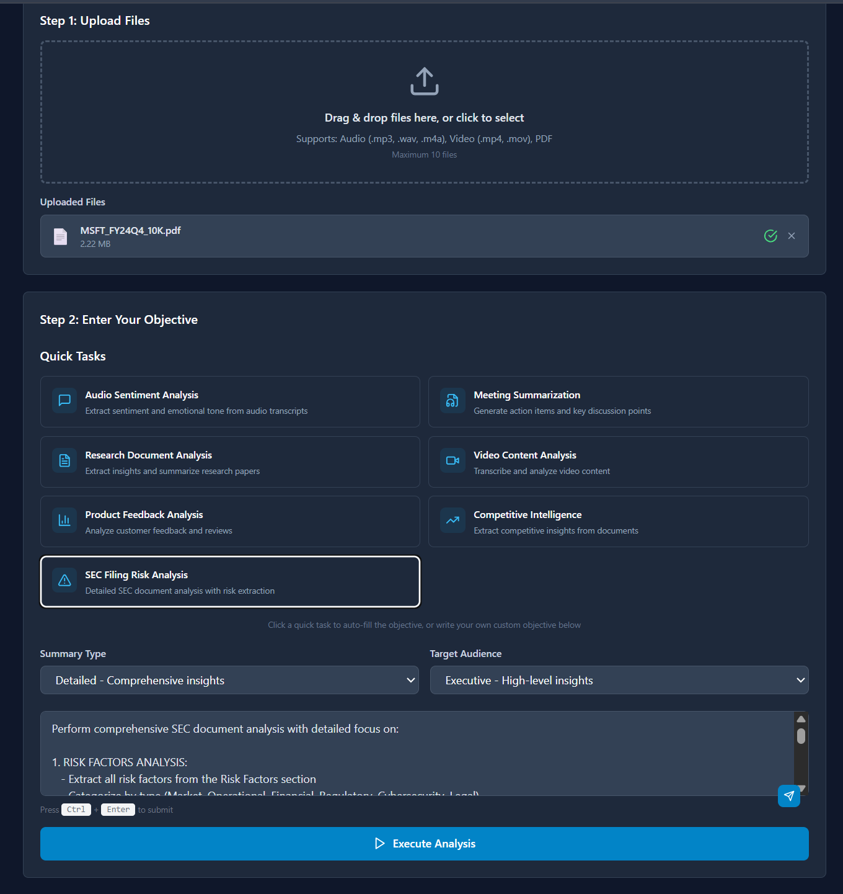
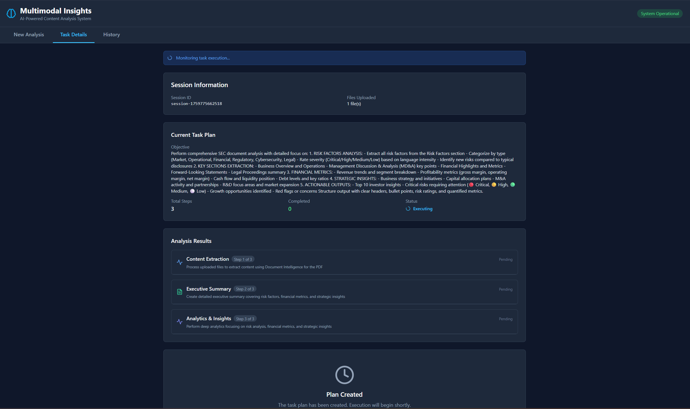
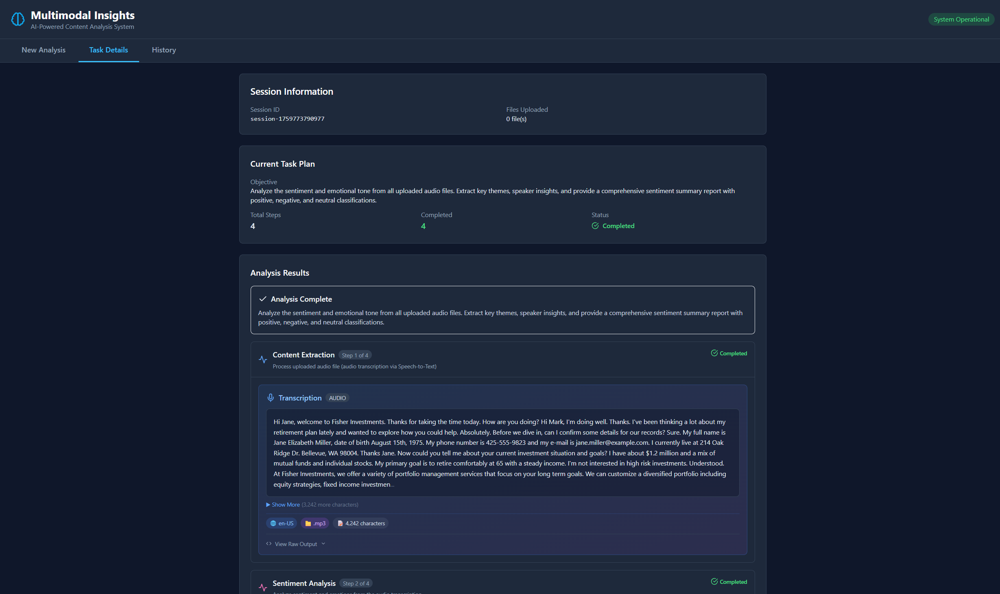
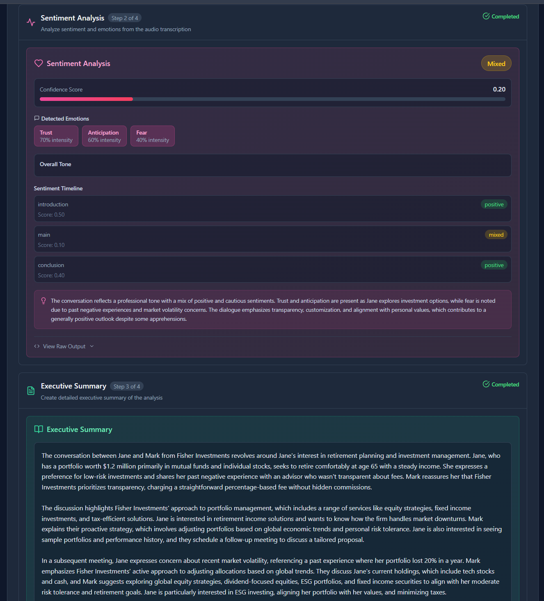
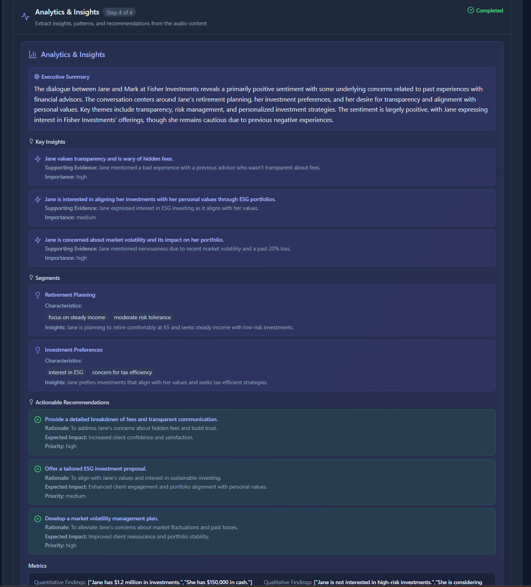
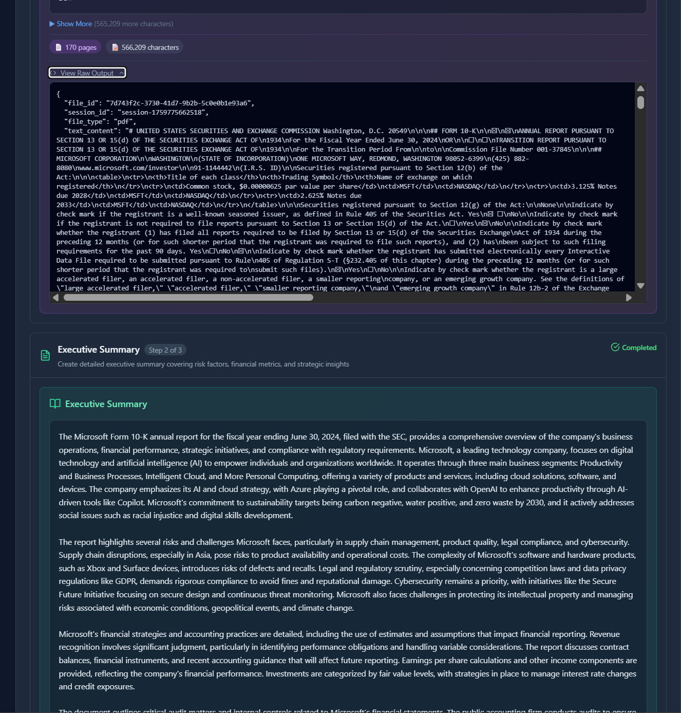
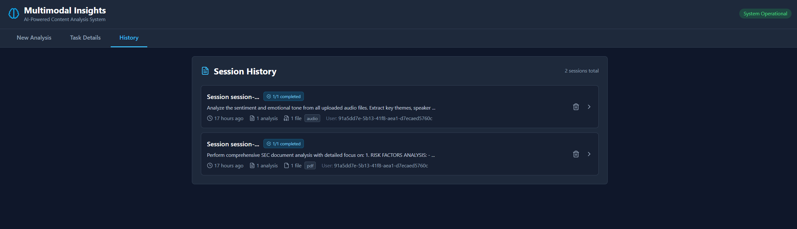

# Multimodal Insights App

## Overview

Multimodal Insights App is a Microsoft Agent Framework (MAF) reference solution that orchestrates audio, video, and document analysis through coordinated agents. A FastAPI backend, React + Vite frontend, and Azure AI services work together to produce sentiment, summaries, and analytics while keeping humans in the loop for approvals and review.

## Key Capabilities

- Multimodal ingestion covering audio/video transcription and PDF extraction via Azure Speech and Document Intelligence.
- ReAct-inspired planner that builds executable plans, tracks dependencies, and surfaces human approval checkpoints.
- Sentiment, summarization, and analytics agents that generate persona-specific reports and actionable recommendations.
- Cosmos DB-backed history and export service for Markdown, PDF, and JSON artifacts.
- Responsive dashboard with file uploads, step-by-step execution monitor, and session history browser.

## Screenshots





## Architecture Highlights

```
React UI ──REST──> FastAPI Backend ──> Task Orchestrator (MAF patterns)
                                 │
                                 ├─ Multimodal Processor (Speech, Doc Intelligence)
                                 ├─ Sentiment / Summarizer / Analytics Agents (Azure OpenAI)
                                 └─ Cosmos DB (sessions, plans, outputs) & Export Service
```

- **Frontend (`frontend/`)**: React + TypeScript with Tailwind styling, file uploader, plan viewer, execution monitor, and history view.
- **Backend (`backend/app/`)**: FastAPI REST + WebSocket endpoints, task orchestrator, agent registry, Cosmos persistence, Application Insights telemetry hooks.
- **Agents (`backend/app/agents/`)**: Planner, multimodal processor, sentiment, summarizer, analytics, plus shared tool adapters.
- **Docs (`docs/`)**: Architecture diagrams, quickstart, and MAF pattern integration notes.

## Agent Lineup

| Agent | Responsibilities |
| --- | --- |
| Planner | Generates execution plans using ReAct reasoning and available file metadata. |
| Multimodal Processor | Transcribes audio/video with Azure Speech, extracts PDFs via Document Intelligence, and stores normalized content. |
| Sentiment | Scores sentiment, emotions, and tone; produces timelines per speaker or section. |
| Summarizer | Delivers persona-aware summaries (executive, technical, general) at multiple detail levels. |
| Analytics | Surfaces patterns, trends, recommendations, and structured insights ready for visualization. |

## Execution Flow

1. User uploads files and provides an analysis objective.
2. Planner evaluates content and assembles a step-by-step plan.
3. User approves steps; orchestrator executes agents sequentially while streaming progress.
4. Agents write outputs to storage; final insights, summaries, and exports become available.
5. History view loads past sessions from Cosmos DB for replay and audit.

## Getting Started

### Backend

```powershell
cd multimodal_insights_app/backend
python -m venv .venv
.venv\Scripts\Activate.ps1
pip install -r requirements.txt
copy .env.example .env
# Fill .env with Azure OpenAI, Speech, Document Intelligence, and optional Cosmos/App Insights values
uvicorn app.main:app --reload --port 8000
```

### Frontend

```powershell
cd multimodal_insights_app/frontend
npm install
echo "VITE_API_BASE_URL=http://localhost:8000" > .env
npm run dev -- --port 5173
```

Browse to `http://localhost:5173` to launch the dashboard.

## Environment Variables

Configure `backend/.env` using these keys:

```
AZURE_OPENAI_ENDPOINT=...
AZURE_OPENAI_API_KEY=...
AZURE_OPENAI_DEPLOYMENT=gpt-4o
AZURE_OPENAI_API_VERSION=2024-08-01-preview

AZURE_SPEECH_KEY=...
AZURE_SPEECH_REGION=eastus

AZURE_DOCUMENT_INTELLIGENCE_ENDPOINT=https://<resource>.cognitiveservices.azure.com/
AZURE_DOCUMENT_INTELLIGENCE_KEY=...

COSMOSDB_ENDPOINT=https://<account>.documents.azure.com:443/   # optional
COSMOSDB_DATABASE=multimodal_insights
COSMOSDB_CONTAINER=tasks
# COSMOSDB_KEY=... or TENANT_ID/CLIENT_ID/CLIENT_SECRET for managed identity

APPLICATIONINSIGHTS_CONNECTION_STRING=...                      # optional
MAX_UPLOAD_SIZE=104857600
CORS_ORIGINS=http://localhost:5173,http://localhost:3000
```

## Testing

```powershell
# Backend tests
cd multimodal_insights_app/backend
pytest

# Frontend tests
cd ../frontend
npm run test
```

## Deployment Notes

- Use `deploy.ps1` or the Dockerfile as a base for Azure App Service or Container Apps deployments.
- Enable Azure Easy Auth to forward user identity headers when enterprise authentication is required.
- Configure Application Insights and OTLP exporters to observe agent execution timelines.
- Cosmos DB persistence is optional but recommended for shared environments and compliance reporting.

## Documentation

- [Docs Overview](docs/README.md)
- [Architecture](docs/ARCHITECTURE.md)
- [Quickstart](docs/QUICKSTART.md)
- [MAF Pattern Integration](docs/MAF_PATTERN_INTEGRATION.md)

---

Multimodal Insights App showcases how Microsoft Agent Framework, Azure AI services, and modern web tooling can deliver rich, explainable insights across mixed media.
# Multimodal Insights Multi-Agent Application

> **AI-powered multimodal content analysis system** with dynamic planning, human-in-the-loop approval, and specialized agents for audio, video, and PDF processing.


## 🎯 Overview

A sophisticated multimodal content analysis platform built on the **Microsoft Agent Framework**. The application processes and analyzes audio, video, and PDF files through coordinated AI agents, featuring dynamic planning, real-time execution, and comprehensive insights extraction. Designed with a Custom Copilot-style experience for intelligent, context-aware analysis.

### Key Highlights

- 🎤 **Multimodal Processing** - Audio, video, and PDF file support with Azure AI Services
- 🤖 **Dynamic AI Planning** - ReAct-based planner creates optimal analysis strategies
- 👥 **Human-in-the-Loop** - Approve, reject, or modify each step before execution
- 📊 **Intelligent Analytics** - Context-aware insights with pattern recognition
- 💭 **Sentiment Analysis** - Multi-dimensional emotion and tone detection
- 📝 **Flexible Summarization** - Persona-based summaries (executive, technical, general)
- 💾 **Persistent State** - CosmosDB-backed session management
- 📱 **Modern UI** - Clean, responsive interface with file upload and task visualization

## 📸 Application Screenshots

### Homepage - File Upload and Objective Input

*Upload multimodal files and describe your analysis objective*

### Dynamic Analysis Plan

*AI-generated execution plan with step dependencies for multimodal content*

### Analysis in Progress

*Real-time execution status with live progress updates across agents*

### Completed Task Details - Audio Processing

*Detailed view of audio transcription results*

### Completed Task Details - Sentiment Analysis

*Multi-dimensional sentiment analysis with emotion detection*

### Completed Task Details - Summarization

*Flexible summarization with different detail levels*

### Completed Task Details - Analytics Insights

*Context-aware analytics with actionable insights*

### Analysis History

*Access and review past analysis sessions*

## 🏗️ Architecture

```
multimodal_insights_app/
├── backend/                          # FastAPI Backend
│   ├── app/
│   │   ├── main.py                  # FastAPI application entry point
│   │   ├── agents/                  # Agent implementations
│   │   │   ├── multimodal_processor_agent.py  # Audio/Video/PDF processing
│   │   │   ├── sentiment_agent.py              # Sentiment analysis
│   │   │   ├── summarizer_agent.py            # Flexible summarization
│   │   │   ├── analytics_agent.py             # Dynamic analytics
│   │   │   └── planner_agent.py               # ReAct-based planner
│   │   ├── models/
│   │   │   └── task_models.py       # Plan, Step, Message models
│   │   ├── persistence/
│   │   │   ├── memory_store_base.py # Abstract persistence interface
│   │   │   └── cosmos_memory.py     # CosmosDB implementation
│   │   ├── services/
│   │   │   ├── task_orchestrator.py # Bridges framework patterns & Cosmos
│   │   │   └── file_handler.py      # File upload and processing
│   │   ├── routers/
│   │   │   └── orchestration.py     # REST API endpoints
│   │   ├── infra/
│   │   │   ├── settings.py          # Configuration management
│   │   │   └── telemetry.py         # Observability service
│   │   ├── auth/                    # Authentication (Azure AD)
│   │   └── tools/                   # Agent tools and utilities
│   ├── data/                        # Extracted content storage (JSON)
│   ├── uploads/                     # Temporary file uploads
│   ├── requirements.txt             # Python dependencies
│   ├── .env.example                 # Environment configuration template
│   └── start.ps1                    # Backend startup script
│
├── frontend/                        # React + TypeScript + Vite Frontend
│   ├── src/
│   │   ├── App.tsx                  # Main application component
│   │   ├── main.tsx                 # React entry point
│   │   ├── lib/
│   │   │   └── api.ts               # API client for backend
│   │   └── components/
│   │       ├── FileUpload.tsx       # File upload component
│   │       ├── TaskInput.tsx        # Analysis objective form
│   │       ├── PlanView.tsx         # Plan display with steps
│   │       ├── StepCard.tsx         # Step card with approve/reject
│   │       ├── ConversationView.tsx # Message timeline
│   │       └── HistoryView.tsx      # Session history browser
│   ├── package.json                 # Node dependencies
│   ├── .env                         # Frontend config
│   └── tailwind.config.js           # TailwindCSS configuration
│
├── docs/                            # Documentation
│   ├── images/                      # Screenshots
│   └── QUICKSTART.md               # Quick start guide
│
├── scripts/
│   ├── setup_backend.ps1            # Backend setup automation
│   ├── setup_frontend.ps1           # Frontend setup automation
│   └── dev.ps1                      # Development startup script
│
├── deploy.ps1                       # Azure deployment script
├── Dockerfile                       # Multi-stage Docker build
└── README.md                        # This file
```

## 🤖 AI Agents

### Multimodal Processor Agent 🎬
**Azure AI Services Integration** - Audio, Video, and PDF processing

- **Audio Processing**:
  - Transcription via Azure Speech-to-Text
  - Speaker diarization
  - Timestamp extraction
  - Metadata preservation (duration, format, quality)
  
- **Video Processing**:
  - Audio track extraction and transcription
  - Frame analysis (optional)
  - Scene detection
  - Metadata extraction (resolution, duration, codec)

- **PDF Processing**:
  - Content extraction via Azure Document Intelligence
  - Table and figure detection
  - Layout preservation
  - Metadata extraction (pages, author, creation date)

- **Storage**:
  - Extracted content saved as JSON
  - Local file system storage
  - Session-based organization
  - Metadata preservation

### Sentiment Analysis Agent 💭
Multi-dimensional sentiment and emotion detection

- **Capabilities**:
  - Overall sentiment classification (Positive/Negative/Neutral)
  - Emotion detection (Joy, Anger, Sadness, Fear, Surprise)
  - Tone classification (Professional, Casual, Formal, etc.)
  - Intent identification
  - Speaker/section-based sentiment tracking
  - Confidence scoring for all classifications

- **Analysis Levels**:
  - Document-level sentiment
  - Paragraph/section sentiment
  - Sentence-level sentiment
  - Speaker-based sentiment (for audio/video)

- **Output**:
  - Sentiment scores and labels
  - Emotional breakdown
  - Tone analysis
  - Sentiment timeline (for time-based content)

### Summarizer Agent 📝
Flexible, persona-based summarization

- **Summarization Levels**:
  - **Brief**: 1-2 paragraph high-level overview
  - **Detailed**: Comprehensive summary with key points
  - **Comprehensive**: In-depth analysis with supporting details

- **Persona-Based Summaries**:
  - **Executive**: Business-focused, high-level insights
  - **Technical**: Detailed technical analysis and specifications
  - **General Audience**: Easy-to-understand language

- **Capabilities**:
  - Multi-document synthesis
  - Key points extraction with priority ranking
  - Action items identification
  - Decision recommendations
  - Customizable summary formats (bullets, paragraphs, tables)

- **Features**:
  - Context-aware summarization
  - Preservation of critical information
  - Citation of source documents
  - Length control (word/character count)

### Analytics Agent 📊
Context-aware intelligent analytics

- **Dynamic Insights**:
  - Pattern recognition across content
  - Trend analysis
  - Anomaly detection
  - Correlation identification

- **Domain-Specific Analysis**:
  - Product/service mentions
  - Feature requests and feedback
  - Customer pain points
  - Competitive intelligence
  - Market trends

- **Recommendations**:
  - Next-best-action suggestions
  - Improvement opportunities
  - Risk identification
  - Priority ranking

- **Visualization Ready**:
  - Structured data output
  - Metrics and KPIs
  - Categorical breakdowns
  - Time-series data

### Planner Agent (Dynamic Planning) 🧠
**ReAct Pattern Implementation**

- **Capabilities**:
  - Analyzes analysis objectives
  - Assesses uploaded files (type, count, size)
  - Determines optimal agent sequence
  - Identifies task dependencies
  - Creates step-by-step execution plan

- **Planning Algorithm**:
  1. Parse user objective
  2. Analyze uploaded files
  3. Determine required processing steps
  4. Match capabilities to agents
  5. Identify dependencies
  6. Generate executable plan with tool mappings

- **Adaptive Planning**:
  - Adjusts plan based on file types
  - Optimizes for parallel execution where possible
  - Handles multi-document scenarios
  - Considers user-specified constraints

## ✨ Key Features

### 1. Multimodal File Processing
- **Audio Files**: MP3, WAV, M4A, OGG with Azure Speech-to-Text
- **Video Files**: MP4, AVI, MOV with audio extraction and transcription
- **PDF Files**: Document Intelligence for layout-preserving extraction
- **File Management**: Upload multiple files, track processing status
- **Metadata Preservation**: Comprehensive metadata capture and storage

### 2. Dynamic Planning with ReAct
- **Intelligent Analysis**: AI analyzes objective and files to create optimal plan
- **Multi-File Handling**: Processes multiple files with coordinated steps
- **Dependency Management**: Automatically identifies step dependencies
- **Agent Orchestration**: Selects and sequences agents based on requirements

### 3. Human-in-the-Loop Approval
- **Plan Review**: See complete analysis plan before execution
- **Step Control**: Approve, reject, or skip individual steps
- **Execution Control**: Start, pause, or cancel analysis
- **Transparency**: Full visibility into agent actions and reasoning

### 4. Azure AI Services Integration
- **Azure Speech Services**: High-quality transcription with diarization
- **Azure Document Intelligence**: Advanced PDF extraction with layout
- **Azure OpenAI**: GPT-4 for analysis, sentiment, and insights
- **Managed Identity**: Secure, credential-less Azure service access

### 5. Flexible Summarization
- **Multiple Levels**: Brief, detailed, comprehensive summaries
- **Persona-Based**: Tailor summaries for different audiences
- **Multi-Document**: Synthesize insights across multiple files
- **Customizable**: Control length, format, and focus areas

### 6. Context-Aware Analytics
- **Intelligent Insights**: Pattern and trend recognition
- **Domain Adaptation**: Adjusts analysis based on content type
- **Actionable Recommendations**: Next steps and improvement suggestions
- **Visualization Ready**: Structured output for charts and graphs

### 7. Persistent State Management
- **CosmosDB Backend**: All plans, steps, and messages stored
- **Session Continuity**: Resume analysis across sessions
- **History Access**: Review past analyses and results
- **Export Capabilities**: Markdown, PDF, JSON export

### 8. Modern, Responsive UI
- **File Upload**: Drag-and-drop or click to upload
- **Real-Time Progress**: Live updates during processing
- **Result Visualization**: Clean display of insights and summaries
- **Mobile Friendly**: Works on desktop, tablet, and mobile

## 🚀 Getting Started

### Prerequisites

- **Python 3.11+**
- **Node.js 18+**
- **Azure OpenAI** account with GPT-4 deployment
- **Azure Speech Services** (for audio/video transcription)
- **Azure Document Intelligence** (for PDF processing)
- **Azure Cosmos DB** account (for state management)

### Quick Start

#### 1. Backend Setup

```powershell
cd multimodal_insights_app\backend
python -m venv venv
.\venv\Scripts\Activate.ps1
pip install -r requirements.txt
```

Create `.env` file from template:
```powershell
cp .env.example .env
```

Edit `.env` with your configuration:
```env
# Azure OpenAI
AZURE_OPENAI_ENDPOINT=https://your-resource.openai.azure.com/
AZURE_OPENAI_API_KEY=your-api-key
AZURE_OPENAI_DEPLOYMENT_NAME=gpt-4
AZURE_OPENAI_API_VERSION=2024-02-15-preview

# Azure Speech
AZURE_SPEECH_KEY=your-speech-key
AZURE_SPEECH_REGION=eastus

# Azure Document Intelligence
AZURE_DOCUMENT_INTELLIGENCE_ENDPOINT=https://your-resource.cognitiveservices.azure.com/
AZURE_DOCUMENT_INTELLIGENCE_KEY=your-doc-intel-key

# Azure CosmosDB
COSMOS_ENDPOINT=https://your-cosmos.documents.azure.com:443/
COSMOS_KEY=your-cosmos-key
COSMOS_DATABASE=multimodal_insights
COSMOS_CONTAINER=tasks

# Application
CORS_ORIGINS=http://localhost:5173,http://localhost:3000
MAX_UPLOAD_SIZE=104857600  # 100MB
```

Run backend:
```powershell
.\start.ps1
```
Backend will be available at `http://localhost:8000`

#### 2. Frontend Setup

```powershell
cd multimodal_insights_app\frontend
npm install
npm run dev
```
Frontend will be available at `http://localhost:5173`

### Using the Application

1. **Upload Files**: 
   - Drag and drop or click to upload audio, video, or PDF files
   - Multiple files supported
   - See file list with processing status

2. **Enter Objective**:
   - Type: "Analyze sentiment and create executive summary"
   - The AI planner creates an optimal execution plan

3. **Review Generated Plan**:
   - See which agents will be used
   - Review step dependencies
   - Understand the execution order

4. **Approve Steps**:
   - Click "Approve" on each step
   - Or click "Reject" to skip steps

5. **Monitor Execution**:
   - Watch real-time progress
   - See agent outputs as they complete
   - View extracted content and insights

6. **Review Results**:
   - Access transcriptions, summaries, sentiment analysis
   - View analytics and recommendations
   - Export results in preferred format

## 🐳 Deployment

### Deploy to Azure (Automated)

```powershell
.\deploy.ps1 `
  -ResourceGroup "your-rg-name" `
  -Location "eastus" `
  -AppServicePlanName "your-plan" `
  -WebAppName "your-webapp"
```

This will:
1. ✅ Build and push Docker image to Azure Container Registry
2. ✅ Deploy Web App (backend + frontend) to Azure App Service
3. ✅ Configure all environment variables
4. ✅ Set up Azure service connections

## 🛠️ Tech Stack

### Backend
- **FastAPI** - Modern Python web framework
- **Microsoft Agent Framework** - Agent orchestration and patterns
- **Azure OpenAI** - GPT-4 for intelligence
- **Azure Speech Services** - Audio transcription
- **Azure Document Intelligence** - PDF extraction
- **Azure Cosmos DB** - NoSQL database for state
- **Pydantic** - Data validation
- **Structlog** - Structured logging

### Frontend
- **React 18** - UI framework
- **TypeScript** - Type safety
- **Vite** - Build tool and dev server
- **TailwindCSS** - Utility-first styling
- **Lucide React** - Icon library
- **Axios** - HTTP client

### Infrastructure
- **Azure App Service** - Web app hosting
- **Azure Container Registry** - Docker image storage
- **Azure Cosmos DB** - State persistence
- **Azure Storage** - File storage (optional)
- **Azure Application Insights** - Monitoring (optional)

## 📚 Example Use Cases

### Customer Call Analysis
```
Files: customer_call.mp3
Objective: "Analyze this customer call for sentiment, products discussed, and action items"
Agents: Processor → Sentiment → Analytics → Summarizer
Result: Sentiment scores, product mentions, recommendations, executive summary
```

### Multi-Document Research
```
Files: research_paper.pdf, webinar_recording.mp4, interview.mp3
Objective: "Synthesize key insights and create technical summary"
Agents: Processor (3x) → Summarizer (persona: technical) → Analytics
Result: Combined insights, technical summary, trend analysis
```

### Video Content Analysis
```
Files: marketing_video.mp4
Objective: "Analyze tone, key messages, and audience sentiment"
Agents: Processor → Sentiment → Analytics
Result: Tone classification, message extraction, sentiment timeline
```

### PDF Report Analysis
```
Files: quarterly_report.pdf, presentation.pdf
Objective: "Extract key metrics and generate executive summary"
Agents: Processor (2x) → Analytics → Summarizer (persona: executive)
Result: Key metrics, trends, executive summary
```

## 📝 License

MIT License - See LICENSE file for details

## 🙏 Acknowledgments

Built with:
- [Microsoft Agent Framework](https://github.com/microsoft/agent-framework)
- [Azure AI Services](https://azure.microsoft.com/en-us/products/ai-services/)
- Inspired by [finagent_dynamic_app](../finagent_dynamic_app)

## 📞 Support

- **Documentation**: See `/docs` folder
- **Issues**: [GitHub Issues](https://github.com/akshata29/agents/issues)
- **Discussions**: [GitHub Discussions](https://github.com/akshata29/agents/discussions)

---

**Made with ❤️ using Microsoft Agent Framework and Azure AI Services**
