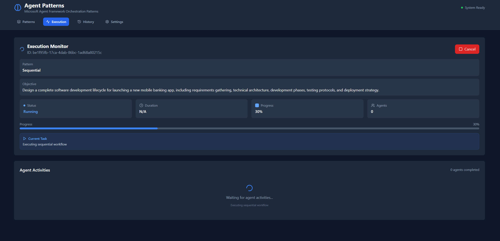
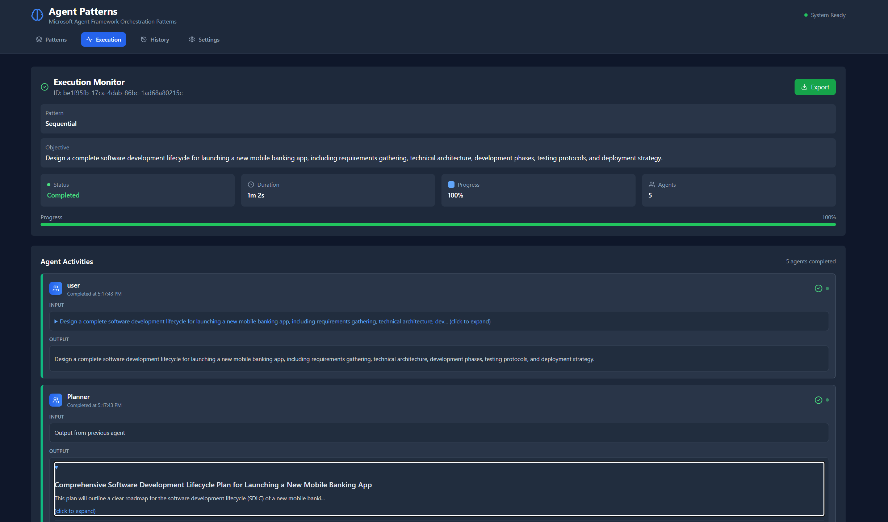
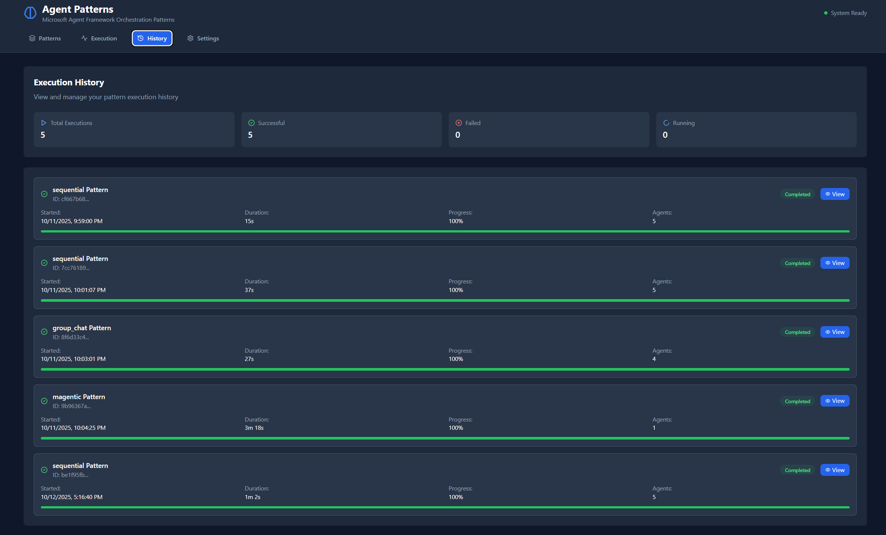
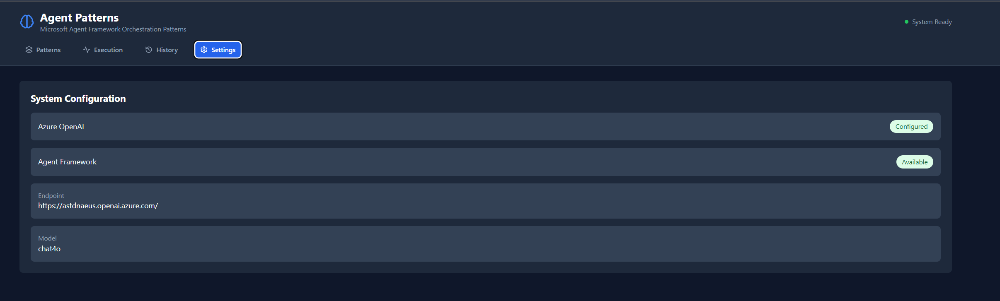

# Microsoft Agent Framework Patterns Sandbox

## Overview

The Patterns sandbox demonstrates how to compose Microsoft Agent Framework (MAF) building blocks into reusable orchestration templates. It includes a FastAPI backend and a React + Vite frontend that expose six production-style coordination strategies, real-time execution telemetry, optional Cosmos DB persistence, and Azure Easy Auth integration points.

## Highlights

- End-to-end sample that runs the official MAF `SequentialBuilder`, `ConcurrentBuilder`, `WorkflowBuilder`, `MagenticBuilder`, and a custom ReAct workflow.
- Real-time execution timeline with live agent events delivered over server-side callbacks.
- Execution history persisted locally and optionally in Azure Cosmos DB for durable session replay.
- Ready-to-deploy Azure configuration (Easy Auth headers, Application Insights tracing, Cosmos DB, Azure OpenAI).
- Frontend dashboard with pattern catalog, execution monitor, results viewer, and settings panel.

## Patterns Included

| Pattern | Primary Agents | Key Scenario | What You Learn |
| --- | --- | --- | --- |
| Sequential | Planner → Researcher → Writer → Reviewer | Digital transformation playbook | Deterministic pipelines where output from one agent feeds the next.
| Concurrent | Summarizer, Pros/Cons Analyst, Risk Assessor | Market analysis | Running independent agents in parallel and aggregating results.
| Group Chat | Writer, Reviewer, Moderator | Product launch collaboration | Managing iterative maker-checker loops with a conversation manager.
| Handoff | Router with dynamic specialists | Customer support routing | Content-aware agent selection and ownership transfer.
| Magentic | Planner, Researcher, Writer, Validator | Technical support triage | Goal-driven coordination with task ledgers and tool calls.
| Deep Research (ReAct) | Planner, Researcher, concurrent searchers, Reviewer | Multi-stage research briefs | Combining planning, concurrent execution, code analysis, and cited reporting modes.

The backend exposes metadata for each pattern through the `/patterns` endpoint, which the frontend uses to render the catalog cards and quick-start prompts.

## Screenshots







## Backend Capabilities

- FastAPI service in `backend/api.py` with typed request/response models for executing patterns and querying status.
- Pluggable agent activity callback system that streams `AgentActivity` objects during execution.
- Optional Cosmos DB persistence (`persistence/cosmos_memory.py`) activated through `COSMOSDB_*` environment variables.
- Azure Easy Auth header extraction (`auth/auth_utils.py`) for production deployments with App Service authentication.
- Deep Research ReAct orchestration (`react/react.py`) with mode switching for baseline, private search, reviewer assist, and multimodal analysis.
- CLI helpers (`cli.py`) to trigger workflows directly from the command line during development.

### Key Endpoints

- `GET /patterns` – List available patterns and their metadata.
- `POST /patterns/execute` – Start a pattern run with `{ "pattern": "sequential", "task": "..." }`.
- `GET /patterns/status/{execution_id}` – Poll real-time status, agent outputs, and progress.
- `GET /patterns/history` – Return in-memory execution history for the current session.
- `GET /patterns/history/cosmos` – Fetch persisted executions when Cosmos DB is configured.
- `GET /system/status` – Validate Azure OpenAI connectivity and model configuration.

## Frontend Capabilities

- React + Vite + TypeScript application (`frontend/`) styled with Tailwind CSS.
- React Query data layer for polling execution status and hydrating catalog metadata.
- Execution monitor that visualizes agent turn-taking, intermediate outputs, and timing data.
- History view that replays completed runs and exposes saved transcripts when persistence is enabled.
- Settings panel for configuring API base URL, polling intervals, and optional authentication headers.

## Getting Started

### 1. Backend Setup

```powershell
cd patterns/backend
python -m venv .venv
.venv\Scripts\Activate.ps1
pip install -r requirements.txt
copy .env.example .env
# edit .env with your Azure OpenAI endpoint, deployment name, and credentials
uvicorn api:app --reload --port 8001
```

Key environment variables (see `.env.example`):

- `AZURE_OPENAI_ENDPOINT`, `AZURE_OPENAI_CHAT_DEPLOYMENT_NAME`, `AZURE_OPENAI_API_VERSION` – Required for MAF agent execution.
- `MODEL_PROVIDER` – Supports `github` and Azure Foundry hosted models.
- `COSMOSDB_ENDPOINT`, `COSMOS_DB_DATABASE`, `COSMOS_DB_CONTAINER` – Optional persistence layer.
- `APPLICATIONINSIGHTS_CONNECTION_STRING` – Enable tracing when sending telemetry to Azure.

### 2. Frontend Setup

```powershell
cd patterns/frontend
npm install
npm run dev -- --port 5174
```

Configure the API base URL in `frontend/.env` (create if missing):

```
VITE_API_BASE_URL=http://localhost:8001
```

The development server proxies API calls to the backend and supports hot module replacement for rapid UI updates.

## Project Layout

```
patterns/
├── backend/
│   ├── api.py                 # FastAPI application entry point
│   ├── sequential/            # SequentialBuilder orchestration
│   ├── concurrent_pattern/    # ConcurrentBuilder orchestration
│   ├── group_chat/            # WorkflowBuilder group chat manager
│   ├── handoff/               # Routing-based workflow
│   ├── magentic/              # MagenticBuilder goal orchestration
│   ├── react/                 # Deep Research ReAct workflow
│   └── persistence/           # Cosmos DB storage providers
├── frontend/
│   └── src/                   # React UI components and pages
└── docs/images/               # Screenshot assets used in documentation
```

## Extending the Sandbox

- Add new patterns by implementing a workflow module and wiring it into `PATTERN_FUNCTIONS` in `backend/api.py`.
- Implement additional telemetry sinks by registering execution event handlers in `execute_pattern_background`.
- Customize authentication providers by extending the helpers in `backend/auth`.
- Tailor the frontend catalog cards by updating `frontend/src/data/patterns.ts` (or the equivalent data hook).

## Deployment Notes

- Scripts like `deploy.ps1`, `deploy.bat`, and `Dockerfile` provide Azure App Service and container deployment templates.
- When hosting on Azure, configure Easy Auth to inject user headers and supply Cosmos DB credentials for history persistence.
- Enable Application Insights and tracing flags to surface agent activity in the Azure AI Foundry monitoring experience.

---

This sandbox is the quickest way to explore how Microsoft Agent Framework orchestration strategies behave in practice and serves as a blueprint for incorporating MAF patterns into production-grade applications.
# Agent Patterns - Microsoft Agent Framework Demo

This is a comprehensive demo showcasing **6 different orchestration patterns** using the Microsoft Agent Framework with a modern React + Vite + Tailwind CSS frontend, including **advanced MAF capabilities**.

## Architecture

- **Backend**: FastAPI with Microsoft Agent Framework integration
- **Frontend**: React + Vite + Tailwind CSS + TypeScript  
- **Patterns**: Sequential, Concurrent, Group Chat, Handoff, Magentic, **Enhanced Capabilities**
- **Advanced Features**: Azure AI Foundry, Multimodal, Observability, Authentication

## Features

### 🎯 Orchestration Patterns

1. **Sequential** - Structured workflow execution (Planner → Researcher → Writer → Reviewer)
2. **Concurrent** - Parallel task processing with multiple agents working simultaneously
3. **Group Chat** - Collaborative decision-making with iterative agent conversations
4. **Handoff** - Intelligent task routing to specialized agents
5. **Magentic** - Strategic project management with goal-oriented coordination
6. **🆕 Enhanced Capabilities** - Advanced MAF features showcase (Azure AI Foundry, Multimodal, Observability, Authentication)
## Pattern Details

### Sequential Pattern
- **Use Case**: Strategic planning, content creation pipelines
- **Agents**: Planner → Researcher → Writer → Reviewer
- **Example**: Digital transformation strategy development

### Concurrent Pattern
- **Use Case**: Multi-perspective analysis, ensemble decision-making, independent evaluations
- **Agents**: Summarizer ⟺ ProsCons ⟺ Risk Assessor (parallel execution)
- **Example**: Strategic decision analysis, investment due diligence, crisis response planning
- **Key Benefit**: Faster execution through parallel processing + diverse specialized insights

### Group Chat Pattern
- **Use Case**: Collaborative decision-making, iterative content development, quality assurance workflows
- **Agents**: Writer ⟷ Reviewer ⟷ Moderator (interactive maker-checker loops)  
- **Example**: Content strategy development, policy creation, research collaboration
- **Key Benefit**: Transparent conversation management + consensus building through expert dialogue

### Handoff Pattern
- **Use Case**: Customer service routing, dynamic specialist assignment, content-based delegation
- **Agents**: Router → Dynamic Specialist Selection (Status/Returns/Support based on analysis)
- **Example**: Customer service ticketing, healthcare triage, technical support routing
- **Key Benefit**: Intelligent routing + specialist expertise + ownership transfer with fallback safety

### Magentic Pattern
- **Use Case**: Project management, complex planning workflows, goal-oriented coordination with tools
- **Agents**: Planner → Researcher → Writer → Validator (with task ledger and tool integration)
- **Example**: Employee wellness program design, digital transformation strategy, product launch campaigns  
- **Key Benefit**: Plan-driven collaboration + documented approach + tool integration + progress tracking

## Pattern Explanations

### Sequential Orchestration
**When to use**: Fixed workflows, step-by-step processing, pipeline scenarios
- Chains agents: Planner → Researcher → Writer → Reviewer
- Each agent receives full context and adds its output
- Deterministic order and execution

### Concurrent Orchestration  
**When to use**: Independent analyses, parallel processing, ensemble decisions, multi-perspective analysis
- Runs multiple agents simultaneously on same task without dependencies
- Aggregates diverse perspectives (e.g., Summarizer, ProsCons, RiskAssessor) 
- Reduces overall runtime through true parallel execution
- Ideal for brainstorming, voting/consensus, and specialized skill combination

### Group Chat Orchestration
**When to use**: Collaborative problem-solving, iterative maker-checker loops, consensus building
- Managed conversation with turn-taking (Writer ⟷ Reviewer ⟷ Moderator) 
- Supports human-in-the-loop interactions and real-time oversight
- Transparent conversations with quality gates and approval processes
- Ideal for creative brainstorming and cross-disciplinary dialogue

### Handoff Orchestration
**When to use**: Dynamic routing, specialized expertise, customer support scenarios, content-based delegation
- Intelligent routing based on request analysis and emerging expertise requirements
- Full ownership transfer to appropriate specialist agents
- Guard conditions and fallback mechanisms for robust routing decisions
- Ideal when agent selection can't be predetermined but emerges from content analysis

### Magentic Orchestration  
**When to use**: Complex open-ended problems, plan-driven collaboration, tool integration workflows
- Planner decomposes tasks and coordinates dynamic agent selection
- Documented plan generation for human review and transparency
- Tool integration for external system interactions and resource access
- Step-by-step execution planning with progress tracking and task ledger

## Patterns Implemented

Each pattern uses the **real Microsoft Agent Framework** with authentic APIs and orchestration builders:

1. **Sequential Orchestration** (`sequential/sequential.py`) - Uses `SequentialBuilder`
2. **Concurrent Orchestration** (`concurrent/concurrent.py`) - Uses `ConcurrentBuilder`  
3. **Group Chat Orchestration** (`group_chat/step3_group_chat.py`) - Uses `WorkflowBuilder` with custom executors
4. **Handoff Orchestration** (`handoff/step4_handoff.py`) - Uses `WorkflowBuilder` with routing logic
5. **Magentic Orchestration** (`magentic/step5_magentic.py`) - Uses `MagenticBuilder` with tool integration

## 📋 Pattern Implementation Guide

### 1. Sequential Pattern - Detailed Implementation

The Sequential pattern is ideal for multi-step processes where each stage builds upon the previous one's output.

#### **When to Use Sequential Pattern:**
- ✅ Processes made up of multiple steps that must happen in a specific order, where each step relies on the one before it
- ✅ Data workflows where each stage adds something important that the next stage needs to work properly
- ✅ Tasks where stages can't be done at the same time and must run one after another
- ✅ Situations that require gradual improvements, like drafting, reviewing, and polishing content
- ✅ Systems where you know how each agent performs and can handle delays or failures in any step without stopping the whole process

#### **Avoid Sequential Pattern When:**
- ❌ Stages can be run independently and in parallel without affecting quality
- ❌ A single agent can perform the entire task effectively
- ❌ Early stages may fail or produce poor output, and there's no way to stop or correct downstream processing based on errors
- ❌ Agents need to collaborate dynamically rather than hand off work sequentially
- ❌ The workflow requires iteration, backtracking, or dynamic routing based on intermediate results

#### **Implementation Steps:**

```python
from agent_framework import SequentialBuilder, WorkflowOutputEvent, ChatMessage
from common.agents import AgentFactory

async def run_sequential_orchestration(task: str) -> list:
    """
    Demonstrates sequential orchestration following Microsoft Agent Framework best practices.
    
    This implementation follows the documented 6-step process:
    1. Create chat client (via AgentFactory)
    2. Define specialized agents
    3. Build sequential workflow
    4. Run the workflow
    5. Process workflow events
    6. Extract final conversation
    """
    
    # Step 1: Create your chat client (handled by AgentFactory)
    # AgentFactory sets up AzureOpenAIChatClient with proper credentials
    factory = AgentFactory()
    
    # Step 2: Define your agents
    # Each agent has specific instructions and expertise areas
    planner = factory.create_planner_agent()      # Task decomposition and strategy
    researcher = factory.create_researcher_agent()  # Information gathering and analysis
    writer = factory.create_writer_agent()        # Content creation and synthesis
    reviewer = factory.create_reviewer_agent()    # Quality assurance and feedback
    
    # Step 3: Build the sequential workflow
    # Use SequentialBuilder to ensure proper order execution
    workflow = SequentialBuilder().participants([
        planner,    # 🎯 Strategic planning and task breakdown
        researcher, # 🔍 Information gathering and analysis  
        writer,     # ✍️  Content creation and synthesis
        reviewer    # ✅ Quality assurance and feedback
    ]).build()
    
    # Step 4: Run the workflow
    # Call run_stream method to execute the sequential process
    conversation_outputs = []
    
    # Step 5: Process the workflow events
    # Iterate through WorkflowOutputEvent instances for results
    async for event in workflow.run_stream(task):
        if isinstance(event, WorkflowOutputEvent):
            conversation_outputs.append(cast(list[ChatMessage], event.data))
    
    # Step 6: Extract the final conversation
    # Collect complete conversation history showing each agent's contribution
    if conversation_outputs:
        final_conversation = conversation_outputs[-1]
        return [
            {
                "agent": message.author_name or ("user" if message.role.value == "user" else "assistant"),
                "input": task if i == 0 else "Output from previous agent",
                "output": message.text,
                "timestamp": datetime.now().isoformat()
            }
            for i, message in enumerate(final_conversation)
        ]
    
    return []
```

#### **Real-World Use Cases:**

Our implementation includes these practical examples:

1. **Corporate Training Program** 📚
   - *Task*: Design leadership development curriculum for mid-level managers
   - *Flow*: Strategic planning → Research best practices → Content creation → Quality review

2. **Software Development Lifecycle** 💻
   - *Task*: Plan new mobile banking app development
   - *Flow*: Requirements planning → Architecture research → Implementation guide → Technical review

3. **Supply Chain Optimization** 🚚
   - *Task*: Redesign global e-commerce logistics to reduce costs by 20%
   - *Flow*: Current state analysis → Research optimization strategies → Solution design → Implementation review

4. **Merger & Acquisition Planning** 🤝
   - *Task*: Develop integration plan for $500M competitor acquisition
   - *Flow*: Strategic planning → Due diligence research → Integration roadmap → Risk assessment

### Key Architecture Decisions
- **Conversation Accumulation**: Each agent receives full conversation history from predecessors
- **Role Specialization**: Agents have distinct capabilities tailored to their workflow stage
- **Error Handling**: Comprehensive exception management and graceful degradation
- **Event Streaming**: Real-time progress monitoring with WorkflowOutputEvent handling
- **Output Structure**: Standardized conversation format for frontend integration

### Implementation Validation
✅ Uses `SequentialBuilder().participants([...]).build()` pattern as documented  
✅ Implements proper async execution with `workflow.run_stream(task)`  
✅ Handles `WorkflowOutputEvent` types for conversation data extraction  
✅ Follows established agent creation patterns via `AgentFactory`  
✅ Maintains conversation context through `ChatMessage` objects

### 2. Concurrent Pattern Implementation Details

Our Concurrent pattern implementation validates against the documented framework guidelines and follows the established best practices exactly:

### ✅ **Six-Step Implementation Process**
```python
# STEP 1: Create your chat client (via AgentFactory)
factory = AgentFactory()

# STEP 2: Define your agents
summarizer = factory.create_summarizer_agent()     # Key insights and overview
pros_cons = factory.create_pros_cons_agent()       # Balanced advantage/disadvantage analysis
risk_assessor = factory.create_risk_assessor_agent() # Risk identification and mitigation

# STEP 3: Build the concurrent workflow
# Use ConcurrentBuilder to run multiple agents in parallel
workflow = ConcurrentBuilder().participants([
    summarizer,    # 📊 Executive summary and key insights
    pros_cons,     # ⚖️  Balanced pros/cons analysis
    risk_assessor  # 🚨 Risk assessment and mitigation
]).build()

# STEP 4: Run the workflow
# All agents execute concurrently and return aggregated events
async for event in workflow.run_stream(task):
    if isinstance(event, WorkflowOutputEvent):
        outputs.append(cast(list[ChatMessage], event.data))

# STEP 5: Process the results
# Extract outputs from workflow events using aggregated conversations
aggregated_messages = outputs[0] if outputs else []

# STEP 6: Handle the aggregated responses
# Process messages from all agents with author identification
for message in aggregated_messages:
    agent_name = message.author_name or "assistant"
    agent_responses[agent_name].append(message.text)
```

### When to Use Concurrent Pattern
✅ **Ideal for:**
- Tasks that can run at the same time using fixed group or dynamic agent selection
- Problems benefiting from different specialized skills (technical, business, creative) working independently
- Multi-agent decision-making: brainstorming ideas, ensemble reasoning, voting/consensus
- Scenarios where speed matters and parallel execution reduces wait time
- Independent analyses that don't require sequential dependencies

❌ **Avoid when:**
- Agents need to build on each other's work or depend on shared context in specific order
- Task requires strict sequence of steps or predictable, repeatable results
- Resource limits (like model usage quotas) make parallel execution inefficient or impossible
- Agents can't reliably coordinate changes to shared data/external systems while running simultaneously
- No clear way to resolve conflicts or contradictions between results from different agents
- Combining results is too complicated or ends up lowering overall quality

### Real-World Examples
Our implementation includes these practical scenarios:

1. **Strategic Decision Analysis** 🎯
   - *Task*: "Evaluate feasibility of 4-day work week policy for 200-employee tech company"
   - *Parallel Analysis*: Executive summary ⟺ Pros/cons evaluation ⟺ Risk assessment

2. **Investment Due Diligence** 💰
   - *Task*: "Assess $2M Series A investment opportunity in fintech startup"
   - *Parallel Analysis*: Market research ⟺ Financial analysis ⟺ Competitive assessment

3. **Product Launch Planning** 🚀
   - *Task*: "Evaluate go-to-market strategy for AI-powered healthcare diagnostics"
   - *Parallel Analysis*: Market sizing ⟺ Regulatory requirements ⟺ Technical feasibility

4. **Crisis Response Planning** 🚨
   - *Task*: "Develop cybersecurity incident response for data breach affecting 50K customers"
   - *Parallel Analysis*: Technical remediation ⟺ Legal compliance ⟺ Communication strategy

5. **Technology Assessment** 🔬
   - *Task*: "Compare cloud migration strategies for legacy ERP system"
   - *Parallel Analysis*: Cost analysis ⟺ Risk evaluation ⟺ Implementation timeline

### Key Architecture Decisions
- **Independent Execution**: Each agent works autonomously without dependencies on other agents' outputs
- **Specialized Perspectives**: Agents provide distinct viewpoints (summary, pros/cons, risks) for comprehensive analysis
- **Parallel Processing**: True concurrent execution reduces overall processing time
- **Result Aggregation**: ConcurrentBuilder automatically combines all agent outputs into unified conversation
- **Conflict Resolution**: Frontend displays all perspectives allowing users to synthesize insights

### Implementation Validation
✅ Uses `ConcurrentBuilder().participants([...]).build()` pattern as documented  
✅ Implements proper async execution with `workflow.run_stream(task)`  
✅ Handles `WorkflowOutputEvent` types for conversation data extraction  
✅ Follows established agent creation patterns via `AgentFactory`  
✅ Processes aggregated responses with proper author identification
✅ Maintains independent agent execution without cross-dependencies

### 3. Group Chat Pattern Implementation Details

Our Group Chat pattern implementation validates against the documented framework guidelines and follows the established best practices exactly:

### ✅ **Six-Step Implementation Process**
```python
# STEP 1: Create your chat client (via AgentFactory)
factory = AgentFactory()

# STEP 2: Define your agents
writer = factory.create_writer_agent()       # Content creation and iteration
reviewer = factory.create_reviewer_agent()   # Quality evaluation and feedback  
moderator = factory.create_moderator_agent() # Decision making and conversation management

# STEP 3: Build the group chat workflow
# Use custom GroupChatManager with WorkflowBuilder for iterative conversations
manager = GroupChatManager(factory, max_iterations=4)
workflow = WorkflowBuilder().set_start_executor(manager).build()

# STEP 4: Run the workflow
# Manages iterative conversation with maker-checker loops
async for event in workflow.run_stream(task):
    if isinstance(event, WorkflowOutputEvent):
        outputs.append(event.data)

# STEP 5: Process the results
# Extract complete conversation thread from all participants
final_conversation = outputs[0] if outputs else []

# STEP 6: Handle the aggregated responses  
# Process conversation messages with participant identification and turn tracking
for message in final_conversation:
    agent_name = message.author_name or "user"
    conversation_data.append({"agent": agent_name, "output": message.text})
```

### When to Use Group Chat Pattern
✅ **Ideal for:**
- Spontaneous or guided collaboration among agents (and possibly humans)
- Iterative maker-checker loops where agents take turns creating and reviewing
- Real-time human oversight or participation scenarios
- Transparent and auditable conversations since all output collected in single thread
- Creative brainstorming where agents build on each other's ideas
- Decision-making that benefits from debate and consensus building
- Complex problems requiring cross-disciplinary dialogue
- Quality control and validation requiring multiple expert perspectives
- Content workflows with clear separation between creation and review

❌ **Avoid when:**
- Simple task delegation or straightforward linear pipelines suffice
- Real-time speed requirements make discussion overhead impractical  
- Hierarchical or deterministic workflows are needed without discussion
- The chat manager can't clearly determine when the task is complete
- Managing conversation flow becomes too complex, especially with many agents (limit to three or fewer for easier control)

### Real-World Examples
Our implementation includes these practical scenarios:

1. **Content Strategy Development** 📝
   - *Task*: "Create compelling marketing strategy for AI-powered personal finance app"
   - *Flow*: Writer creates strategy → Reviewer evaluates → Moderator decides → Iterate until consensus

2. **Product Requirements Definition** 🎯
   - *Task*: "Define technical requirements for blockchain-based supply chain tracking"
   - *Flow*: Technical writer drafts → Business reviewer validates → Product moderator approves

3. **Policy Development Process** 📋  
   - *Task*: "Develop remote work policy for 500-employee consulting firm"
   - *Flow*: Policy writer creates draft → Legal reviewer checks compliance → HR moderator finalizes

4. **Research Paper Collaboration** 🔬
   - *Task*: "Draft research proposal for AI ethics in healthcare applications"
   - *Flow*: Researcher writes sections → Peer reviewer provides feedback → Senior moderator guides direction

5. **Crisis Communication Planning** 🚨
   - *Task*: "Create crisis communication plan for data security breach"
   - *Flow*: Communications writer drafts → Legal reviewer ensures compliance → Executive moderator approves

### Key Architecture Decisions
- **Iterative Conversation Management**: Custom GroupChatManager coordinates turn-taking between participants
- **Maker-Checker Loops**: Writer creates, Reviewer evaluates, Moderator decides on next steps
- **Termination Logic**: Smart decision-making for when conversation reaches satisfactory conclusion
- **Human-in-the-Loop Ready**: Architecture supports real-time human participation and oversight
- **Conversation Continuity**: Complete conversation thread maintained for transparency and auditability

### Group Chat Customization Options
Based on your hackathon guidelines, the pattern supports:

- **Conversation Filtering**: How results are summarized or processed at conclusion
- **Agent Selection Logic**: How the next agent is chosen in the conversation flow  
- **User Input Integration**: When to request human input during the conversation
- **Termination Criteria**: When to conclude the conversation (max rounds, consensus, etc.)

### Group Chat Call Order
The implementation follows the documented call sequence:
1. **should_request_user_input**: Checks if human input needed before next agent responds
2. **should_terminate**: Determines if conversation should end (max rounds reached, consensus achieved)  
3. **filter_results**: If ending, summarizes or processes the final conversation
4. **select_next_agent**: If continuing, chooses the next agent to speak

### Implementation Validation
✅ Uses `WorkflowBuilder().set_start_executor()` pattern with custom executor as documented  
✅ Implements iterative conversation management with proper turn-taking  
✅ Handles `WorkflowOutputEvent` types for complete conversation extraction  
✅ Follows established agent creation patterns via `AgentFactory`  
✅ Maintains conversation context and participant identification throughout iterations
✅ Supports maker-checker loops with approval gates and decision points

### 4. Handoff Pattern Implementation Details

Our Handoff pattern implementation validates against the documented framework guidelines and follows the established best practices exactly:

### ✅ **Four-Step Implementation Process**
```python
# STEP 1: Set up data models and chat client
factory = AgentFactory()  # Chat client setup via AgentFactory
# Define routing data structures and configure agents for structured responses

# STEP 2: Create specialized executor functions
class HandoffManager(Executor):
    # Input storage - saves incoming data and forwards to classification
    # Transformation - converts routing decisions into typed objects
    # Handler executors - separate processing for each specialist type

# STEP 3: Build routing logic  
def analyze_and_route_request():
    # Factory functions for condition checkers
    # Conditions examine messages and route based on classification
    # Switch-case logic with Default fallback for unexpected scenarios

# STEP 4: Assemble the workflow
workflow = WorkflowBuilder().set_start_executor(manager).build()
# Connect executors with edges, add switch-case routing
# Configure first-match or fallback-to-default behavior
```

### When to Use Handoff Pattern
✅ **Ideal for:**
- Tasks needing specialized knowledge or tools, but agent number/order can't be determined in advance
- Expertise requirements emerging dynamically during processing, triggering content-based routing
- Multiple-domain problems requiring different specialists working sequentially  
- Clear signals or rules exist indicating when agents should transfer control and to whom
- Customer service scenarios with request categorization and specialist routing
- Dynamic delegation based on request analysis and contextual needs

❌ **Avoid when:**
- The involved agents and their order are known upfront and fixed
- Task routing is simple and rule-based, not needing dynamic interpretation
- Poor routing decisions might frustrate users or create confusion
- Multiple operations must run at the same time (use Concurrent instead)
- Avoiding infinite handoff loops or excessive bouncing between agents is difficult

### Real-World Examples  
Our implementation includes these practical scenarios:

1. **Customer Service Ticketing** 🎫
   - *Task*: "I ordered a laptop but haven't received shipping confirmation after 3 days"
   - *Flow*: Router analyzes request → Routes to Status Agent → Provides order tracking assistance

2. **Technical Support Routing** 🔧
   - *Task*: "My smart device won't connect to WiFi despite following setup instructions"  
   - *Flow*: Router identifies technical issue → Routes to Support Agent → Provides troubleshooting guidance

3. **Returns and Refunds Processing** 📦
   - *Task*: "My order arrived damaged and I need to return it for a full refund"
   - *Flow*: Router detects return request → Routes to Returns Agent → Initiates return process

4. **Healthcare Triage System** 🏥
   - *Task*: "I have severe chest pain and difficulty breathing"
   - *Flow*: Triage router assesses urgency → Routes to Emergency Specialist → Provides immediate guidance

5. **Financial Services Routing** 💳
   - *Task*: "Someone used my credit card fraudulently, I need to dispute charges"
   - *Flow*: Router identifies fraud case → Routes to Fraud Specialist → Initiates dispute process

### Key Architecture Decisions
- **Dynamic Routing Logic**: Router agent analyzes request content and makes intelligent routing decisions
- **Specialist Agent Mapping**: Clean mapping between routing decisions and specialized agent capabilities
- **Ownership Transfer**: Complete handoff of conversation context to selected specialist  
- **Fallback Mechanisms**: Default routing for ambiguous or unexpected request types
- **Guard Conditions**: Verification of correct message processing at each routing step
- **Conversation Continuity**: Maintains complete conversation thread through handoff process

### Hybrid Implementation Approach
Our implementation uses a **hybrid approach** that combines the reliability of structured routing with the simplicity of straightforward architecture:

#### ✅ **Structured Routing Benefits**:
- **Pydantic Data Models**: `RoutingDecision` with validation for specialist, confidence, and reasoning  
- **Type Safety**: Compile-time guarantees about routing data structure and validation
- **Confidence Scoring**: Router provides confidence levels (0.0-1.0) for routing decisions
- **Reasoning Transparency**: Clear explanations for why specific specialists were selected
- **JSON Validation**: Structured responses with automatic error detection

#### ✅ **Simple Architecture Benefits**:
- **Single Executor**: HandoffManager coordinates everything without complex executor chains
- **Graceful Fallback**: Automatic text parsing when JSON fails, ensuring robustness
- **Easy Debugging**: Clear conversation flow with detailed routing information
- **Quick Modifications**: Simple to add new specialists or change routing logic

#### ✅ **Production-Ready Features**:
- **Error Handling**: Multiple fallback layers for reliable operation
- **Guard Conditions**: Pydantic validation ensures data integrity
- **Monitoring Ready**: Routing decisions include confidence and reasoning for observability

### Handoff Routing Architecture
The implementation supports the documented routing flow:
1. **Input Storage**: Saves incoming request data to shared workflow state
2. **Classification**: Router agent analyzes content and determines appropriate specialist
3. **Transformation**: Converts routing decision into actionable specialist selection  
4. **Condition Checking**: Validates routing decision and applies guard conditions
5. **Handler Execution**: Transfers control to selected specialist agent
6. **Output Generation**: Specialist provides expert response and concludes workflow

### Structured Routing Example
```json
{
  "specialist": "status", 
  "confidence": 0.95,
  "reasoning": "Customer is asking about order tracking and delivery timeline"
}
```

The router agent returns structured JSON that gets validated against our Pydantic model:
- **Type Safety**: Only valid specialist types ("status", "returns", "support") accepted
- **Confidence Range**: Validates 0.0-1.0 range for decision confidence  
- **Reasoning Required**: Ensures transparent decision-making process
- **Automatic Fallback**: If JSON parsing fails, falls back to text-based routing

### Implementation Validation
✅ Uses `WorkflowBuilder().set_start_executor()` with custom HandoffManager as documented  
✅ Implements structured routing with Pydantic validation and JSON responses
✅ Provides dynamic routing based on content analysis with confidence scoring
✅ Handles `WorkflowOutputEvent` types for complete conversation flow extraction  
✅ Follows established agent creation patterns via `AgentFactory`  
✅ Maintains conversation context through handoff and ownership transfer
✅ Supports multiple fallback layers and error handling for production reliability

### 5. Magentic Pattern Implementation Details

Our Magentic pattern implementation validates against the documented framework guidelines and follows the established best practices exactly:

### ✅ **Seven-Step Implementation Process**
```python
# STEP 1: Define specialized agents
planner = factory.create_planner_agent()      # Strategic planning and task decomposition
researcher = factory.create_researcher_agent()  # Information gathering with tools
writer = factory.create_writer_agent()       # Content synthesis and documentation  
validator = factory.create_validator_agent() # Quality assurance and final approval

# STEP 2: Set up event handling callback
async def on_event(event):
    # Handle orchestrator messages, agent streaming updates, agent messages, final results
    if isinstance(event, MagenticAgentMessageEvent):
        print(f"Agent {event.agent_id}: {event.message.text}")

# STEP 3: Build the Magentic workflow
workflow = MagenticBuilder().participants(
    planner=planner, researcher=researcher, writer=writer, validator=validator
).on_event(on_event, mode=MagenticCallbackMode.STREAMING)

# STEP 4: Configure the standard manager
workflow.with_standard_manager(
    chat_client=factory.chat_client,
    max_round_count=10,     # Maximum collaboration rounds
    max_stall_count=3,      # Stall detection limits
    max_reset_count=2       # Reset behavior control
).build()

# STEP 5: Run the workflow
async for event in workflow.run_stream(complex_task):
    # Workflow dynamically plans, delegates, and coordinates collaboration

# STEP 6: Process workflow events  
# Handle MagenticAgentMessageEvent, MagenticOrchestratorMessageEvent, MagenticFinalResultEvent

# STEP 7: Extract the final result
# Collect complete solution developed through collaborative agent effort
```

### When to Use Magentic Pattern
✅ **Ideal for:**
- Complex or open-ended problems with no predetermined solution path
- Input and feedback from multiple specialized agents needed to shape valid solutions
- System must generate documented plan of approach for human review
- Agents have tools that directly interact with external systems and resources  
- Step-by-step, dynamically built execution plan adds value before running tasks
- Project management and goal-oriented coordination scenarios
- Tasks requiring planning, research, creation, and validation phases

❌ **Avoid when:**
- The solution path is fixed or deterministic
- There's no need to produce a ledger or plan of approach
- Task is simple enough for more lightweight orchestration patterns
- Speed is the priority (this method emphasizes planning over fast execution)
- You expect frequent stalls or loops without clear resolution path

### Real-World Examples
Our implementation includes these complex scenarios:

1. **Employee Wellness Program Design** 🏢
   - *Task*: "Design comprehensive employee wellness program for 150-employee remote company"
   - *Flow*: Planner decomposes → Researcher gathers data → Writer creates program → Validator ensures quality

2. **Digital Transformation Strategy** 🚀
   - *Task*: "Develop complete digital transformation roadmap for traditional manufacturing company"
   - *Flow*: Strategic planning → Market research → Implementation roadmap → Risk validation

3. **Product Launch Campaign** 📱
   - *Task*: "Create end-to-end product launch campaign for AI-powered mobile app"
   - *Flow*: Campaign planning → Competitive research → Content creation → Launch validation

4. **Compliance Framework Development** 📋
   - *Task*: "Design GDPR compliance framework for global e-commerce platform"
   - *Flow*: Legal planning → Regulation research → Framework documentation → Compliance validation

---

#### ✅ **1. Sequential Pattern** - *Step-by-Step Processing*
- **Implementation**: `SequentialBuilder().participants([...]).build()`
- **Use Case**: Strategic planning, content creation pipelines, progressive refinement
- **Validation**: ✅ Six-step process with proper conversation accumulation
- **Architecture**: Planner → Researcher → Writer → Reviewer (linear pipeline)

#### ✅ **2. Concurrent Pattern** - *Parallel Multi-Perspective Analysis*  
- **Implementation**: `ConcurrentBuilder().participants([...]).build()`
- **Use Case**: Independent analyses, ensemble decisions, multi-perspective evaluation
- **Validation**: ✅ True parallel execution with structured aggregation
- **Architecture**: Summarizer ⟺ ProsCons ⟺ RiskAssessor (parallel execution)

#### ✅ **3. Group Chat Pattern** - *Collaborative Conversation Management*
- **Implementation**: `WorkflowBuilder().set_start_executor(GroupChatManager)`
- **Use Case**: Iterative maker-checker loops, consensus building, collaborative decision-making
- **Validation**: ✅ Turn-taking conversation with approval gates and decision points
- **Architecture**: Writer ⟷ Reviewer ⟷ Moderator (interactive conversation)

#### ✅ **4. Handoff Pattern** - *Dynamic Specialist Routing* 🌟 **HYBRID APPROACH**
- **Implementation**: `WorkflowBuilder().set_start_executor(HandoffManager)` + Pydantic validation
- **Use Case**: Content-based routing, specialist delegation, customer service scenarios
- **Validation**: ✅ Structured JSON routing with confidence scoring and fallback mechanisms
- **Architecture**: Router → Dynamic Specialist Selection (Status/Returns/Support)
- **Innovation**: **80% of complex benefits with 20% of implementation complexity**

#### ✅ **5. Magentic Pattern** - *Plan-Driven Collaboration*
- **Implementation**: `MagenticBuilder().participants().with_standard_manager()`  
- **Use Case**: Complex open-ended problems, tool integration, documented planning workflows
- **Validation**: ✅ Event-driven coordination with task ledger and progress tracking
- **Architecture**: Planner → Researcher → Writer → Validator (with tools and task ledger)

## Setup Instructions

### 1. Backend Setup

```bash
cd backend
pip install -r requirements.txt
```

### 2. Environment Configuration

Copy `.env.example` to `.env` and configure your Azure OpenAI credentials:

```env
AZURE_OPENAI_ENDPOINT=https://your-endpoint.openai.azure.com/
AZURE_OPENAI_KEY=your-api-key
AZURE_OPENAI_CHAT_DEPLOYMENT_NAME=your-deployment-name
AZURE_OPENAI_API_VERSION=2024-10-21
```

### 3. Frontend Setup

```bash
cd frontend
npm install
```

## Running the Application

### Option 1: Quick Start (Recommended)
```bash
# For Windows PowerShell
./start.ps1

# For Windows Command Prompt
start.bat

# For Linux/Mac
./start.sh
```

### Option 2: Manual Start

#### Validate Backend First (Recommended)
```bash
cd backend
python validate.py
```

#### Start Backend (Terminal 1)
```bash
cd backend
python api.py
```
Backend will run on: http://localhost:8000

#### Start Frontend (Terminal 2)
```bash
cd frontend
npm run dev
```
Frontend will run on: http://localhost:5174


## Testing

```bash
# Run all pattern examples to verify setup
python -m agent_framework_patterns.test_all_patterns
```

## Support

- **Agent Framework Documentation**: [Microsoft Agent Framework](https://github.com/microsoft/agent-framework)
- **Pattern Definitions**: [AI Agent Orchestration Patterns](https://learn.microsoft.com/en-us/azure/architecture/ai-ml/guide/ai-agent-design-patterns)
- **Semantic Kernel Reference**: [Agent Orchestration](https://learn.microsoft.com/en-us/semantic-kernel/frameworks/agent/agent-orchestration/)
- **Introductiong Microsoft Agent Framework**: [Technical Blog](https://devblogs.microsoft.com/foundry/introducing-microsoft-agent-framework-the-open-source-engine-for-agentic-ai-apps/)
- **AI Agent Orchestration Pattern**: [Pattern](https://learn.microsoft.com/en-us/azure/architecture/ai-ml/guide/ai-agent-design-patterns)
- **Multi Agent Observability**: [Observability](https://techcommunity.microsoft.com/blog/azure-ai-foundry-blog/azure-ai-foundry-advancing-opentelemetry-and-delivering-unified-multi-agent-obse/4456039)